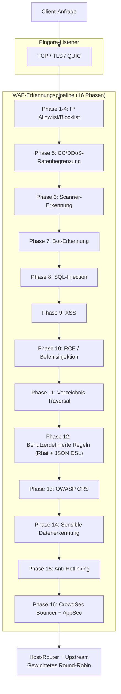

# PRX-WAF

**PRX-WAF** ist eine produktionsbereite Web Application Firewall-Proxy, die auf [Pingora](https://github.com/cloudflare/pingora) (Cloudflares Rust-HTTP-Proxy-Bibliothek) aufgebaut ist. Sie kombiniert eine 16-Phasen-Angriffserkennung, eine Rhai-Scripting-Engine, OWASP CRS-Unterstützung, ModSecurity-Regelimport, CrowdSec-Integration, WASM-Plugins und eine Vue 3 Admin-UI in einer einzigen bereitstellbaren Binärdatei.

PRX-WAF ist für DevOps-Ingenieure, Sicherheitsteams und Plattformbetreiber konzipiert, die eine schnelle, transparente und erweiterbare WAF benötigen -- eine, die Millionen von Anfragen proxyen, OWASP Top 10-Angriffe erkennen, TLS-Zertifikate automatisch erneuern, horizontal mit dem Cluster-Modus skalieren und mit externen Bedrohungsgeheimdienst-Feeds integrieren kann -- alles ohne auf proprietäre Cloud-WAF-Dienste angewiesen zu sein.

## Warum PRX-WAF?

Traditionelle WAF-Produkte sind proprietär, teuer und schwer anzupassen. PRX-WAF verfolgt einen anderen Ansatz:

- **Offen und prüfbar.** Jede Erkennungsregel, Schwellenwert und Bewertungsmechanismus ist im Quellcode sichtbar. Keine versteckte Datensammlung, keine Anbieterbindung.
- **Mehrstufige Verteidigung.** 16 sequenzielle Erkennungsphasen stellen sicher, dass wenn eine Prüfung einen Angriff verpasst, nachfolgende Phasen ihn erfassen.
- **Rust-First-Leistung.** Aufgebaut auf Pingora erreicht PRX-WAF nahezu Linienrate-Durchsatz mit minimalem Latenz-Overhead auf Standard-Hardware.
- **Von Grund auf erweiterbar.** YAML-Regeln, Rhai-Skripte, WASM-Plugins und ModSecurity-Regelimport machen PRX-WAF leicht an jeden Anwendungs-Stack anpassbar.

## Hauptfunktionen

<div class="vp-features">

- **Pingora Reverse-Proxy** -- HTTP/1.1, HTTP/2 und HTTP/3 via QUIC (Quinn). Gewichteter Round-Robin-Load-Balancing über mehrere Upstream-Backends.

- **16-Phasen-Erkennungspipeline** -- IP-Allowlist/Blocklist, CC/DDoS-Ratenbegrenzung, Scanner-Erkennung, Bot-Erkennung, SQLi, XSS, RCE, Verzeichnis-Traversal, benutzerdefinierte Regeln, OWASP CRS, sensible Datenerkennung, Anti-Hotlinking und CrowdSec-Integration.

- **YAML-Regel-Engine** -- Deklarative YAML-Regeln mit 11 Operatoren, 12 Anfragefeldern, Paranoia-Stufen 1-4 und Hot-Reload ohne Ausfallzeiten.

- **OWASP CRS-Unterstützung** -- 310+ Regeln, konvertiert aus dem OWASP ModSecurity Core Rule Set v4, die SQLi, XSS, RCE, LFI, RFI, Scanner-Erkennung und mehr abdecken.

- **CrowdSec-Integration** -- Bouncer-Modus (Entscheidungscache von LAPI), AppSec-Modus (Remote-HTTP-Inspektion) und Log-Pusher für Community-Bedrohungsgeheimdienst.

- **Cluster-Modus** -- QUIC-basierte Interknoten-Kommunikation, Raft-inspirierte Leader-Wahl, automatische Regel-/Konfig-/Ereignissynchronisierung und mTLS-Zertifikatsverwaltung.

- **Vue 3 Admin-UI** -- JWT + TOTP-Authentifizierung, Echtzeit-WebSocket-Überwachung, Host-Verwaltung, Regelmanagement und Sicherheitsereignis-Dashboards.

- **SSL/TLS-Automatisierung** -- Let's Encrypt via ACME v2 (instant-acme), automatische Zertifikatserneuerung und HTTP/3 QUIC-Unterstützung.

</div>

## Architektur

PRX-WAF ist als 7-Crate Cargo-Workspace organisiert:

| Crate | Rolle |
|-------|-------|
| `prx-waf` | Binärdatei: CLI-Einstiegspunkt, Server-Bootstrap |
| `gateway` | Pingora-Proxy, HTTP/3, SSL-Automatisierung, Caching, Tunnel |
| `waf-engine` | Erkennungspipeline, Regel-Engine, Prüfungen, Plugins, CrowdSec |
| `waf-storage` | PostgreSQL-Schicht (sqlx), Migrationen, Modelle |
| `waf-api` | Axum REST API, JWT/TOTP-Auth, WebSocket, statische UI |
| `waf-common` | Gemeinsame Typen: RequestCtx, WafDecision, HostConfig, config |
| `waf-cluster` | Cluster-Konsensus, QUIC-Transport, Regel-Sync, Zertifikatsverwaltung |

### Anfrage-Ablauf



## Schnellinstallation

```bash
git clone https://github.com/openprx/prx-waf
cd prx-waf
docker compose up -d
```

Admin-UI: `http://localhost:9527` (Standard-Anmeldedaten: `admin` / `admin`)

Weitere Methoden, einschließlich Cargo-Installation und Erstellen aus dem Quellcode, finden Sie im [Installationsleitfaden](./getting-started/installation).

## Dokumentations-Abschnitte

| Abschnitt | Beschreibung |
|-----------|-------------|
| [Installation](./getting-started/installation) | PRX-WAF via Docker, Cargo oder Quellcode installieren |
| [Schnellstart](./getting-started/quickstart) | PRX-WAF in 5 Minuten zum Schutz Ihrer App bringen |
| [Regel-Engine](./rules/) | Funktionsweise der YAML-Regel-Engine |
| [YAML-Syntax](./rules/yaml-syntax) | Vollständige YAML-Regelschema-Referenz |
| [Eingebaute Regeln](./rules/builtin-rules) | OWASP CRS, ModSecurity, CVE-Patches |
| [Benutzerdefinierte Regeln](./rules/custom-rules) | Eigene Erkennungsregeln schreiben |
| [Gateway](./gateway/) | Pingora Reverse-Proxy-Übersicht |
| [Reverse-Proxy](./gateway/reverse-proxy) | Backend-Routing und Load-Balancing |
| [SSL/TLS](./gateway/ssl-tls) | HTTPS, Let's Encrypt, HTTP/3 |
| [Cluster-Modus](./cluster/) | Multi-Knoten-Bereitstellungsübersicht |
| [Cluster-Bereitstellung](./cluster/deployment) | Schritt-für-Schritt-Cluster-Einrichtung |
| [Admin-UI](./admin-ui/) | Vue 3 Management-Dashboard |
| [Konfiguration](./configuration/) | Konfigurationsübersicht |
| [Konfigurationsreferenz](./configuration/reference) | Jeder TOML-Schlüssel dokumentiert |
| [CLI-Referenz](./cli/) | Alle CLI-Befehle und Unterbefehle |
| [Fehlerbehebung](./troubleshooting/) | Häufige Probleme und Lösungen |

## Projektinformationen

- **Lizenz:** MIT OR Apache-2.0
- **Sprache:** Rust (2024-Edition)
- **Repository:** [github.com/openprx/prx-waf](https://github.com/openprx/prx-waf)
- **Mindest-Rust:** 1.82.0
- **Admin-UI:** Vue 3 + Tailwind CSS
- **Datenbank:** PostgreSQL 16+
