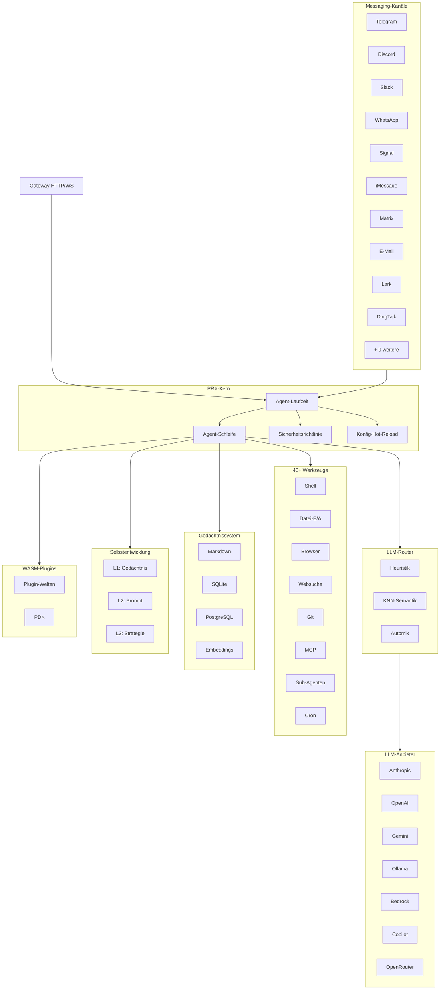

# PRX

**PRX** ist eine hochperformante, selbstentwickelnde KI-Agent-Laufzeitumgebung in Rust. Sie verbindet große Sprachmodelle mit 19 Messaging-Plattformen, bietet 46+ integrierte Werkzeuge, unterstützt WASM-Plugin-Erweiterungen und verbessert ihr eigenes Verhalten autonom durch ein 3-stufiges Selbstentwicklungssystem.

PRX richtet sich an Entwickler und Teams, die einen einzigen, einheitlichen Agenten benötigen, der über alle genutzten Messaging-Plattformen hinweg funktioniert -- von Telegram und Discord bis hin zu Slack, WhatsApp, Signal, iMessage, DingTalk, Lark und mehr -- bei gleichzeitiger produktionsreifer Sicherheit, Beobachtbarkeit und Zuverlässigkeit.

## Warum PRX?

Die meisten KI-Agent-Frameworks konzentrieren sich auf einen einzelnen Integrationspunkt oder erfordern umfangreichen Verbindungscode, um verschiedene Dienste zusammenzuführen. PRX verfolgt einen anderen Ansatz:

- **Eine Binärdatei, jeder Kanal.** Eine einzige `prx`-Binärdatei verbindet sich gleichzeitig mit allen 19 Messaging-Plattformen. Keine separaten Bots, kein Microservice-Wildwuchs.
- **Selbstentwickelnd.** PRX verfeinert autonom sein Gedächtnis, seine Prompts und Strategien basierend auf Interaktionsfeedback -- mit Sicherheits-Rollback auf jeder Ebene.
- **Rust-First-Performance.** 177K Zeilen Rust liefern niedrige Latenz, minimalen Speicherverbrauch und keine GC-Pausen. Der Daemon läuft komfortabel auf einem Raspberry Pi.
- **Erweiterbar durch Design.** WASM-Plugins, MCP-Werkzeugintegration und eine trait-basierte Architektur machen PRX einfach erweiterbar, ohne zu forken.

## Hauptmerkmale

<div class="vp-features">

- **19 Messaging-Kanäle** -- Telegram, Discord, Slack, WhatsApp, Signal, iMessage, Matrix, E-Mail, Lark, DingTalk, QQ, IRC, Mattermost, Nextcloud Talk, LINQ, CLI und weitere.

- **9 LLM-Anbieter** -- Anthropic Claude, OpenAI, Google Gemini, GitHub Copilot, Ollama, AWS Bedrock, GLM (Zhipu), OpenAI Codex, OpenRouter sowie jeder OpenAI-kompatible Endpunkt.

- **46+ integrierte Werkzeuge** -- Shell-Ausführung, Datei-Ein-/Ausgabe, Browser-Automatisierung, Websuche, HTTP-Anfragen, Git-Operationen, Gedächtnisverwaltung, Cron-Planung, MCP-Integration, Sub-Agenten und mehr.

- **3-stufige Selbstentwicklung** -- L1 Gedächtnis-Evolution, L2 Prompt-Evolution, L3 Strategie-Evolution -- jeweils mit Sicherheitsgrenzen und automatischem Rollback.

- **WASM-Plugin-System** -- Erweitern Sie PRX mit WebAssembly-Komponenten über 6 Plugin-Welten: Tool, Middleware, Hook, Cron, Provider und Storage. Vollständiges PDK mit 47 Host-Funktionen.

- **LLM-Router** -- Intelligente Modellauswahl über heuristisches Scoring (Fähigkeit, Elo, Kosten, Latenz), KNN-semantisches Routing und Automix-konfidenzbasierte Eskalation.

- **Produktionssicherheit** -- 4-stufige Autonomiekontrolle, Policy-Engine, Sandbox-Isolation (Docker/Firejail/Bubblewrap/Landlock), ChaCha20-Schlüsselspeicher, Pairing-Authentifizierung.

- **Beobachtbarkeit** -- OpenTelemetry-Tracing, Prometheus-Metriken, strukturiertes Logging und eine integrierte Webkonsole.

</div>

## Architektur



## Schnellinstallation

```bash
curl -fsSL https://openprx.dev/install.sh | bash
```

Oder Installation über Cargo:

```bash
cargo install openprx
```

Dann den Einrichtungsassistenten starten:

```bash
prx onboard
```

Alle Methoden einschließlich Docker und Kompilierung aus dem Quellcode finden Sie im [Installationsleitfaden](./getting-started/installation).

## Dokumentationsabschnitte

| Abschnitt | Beschreibung |
|-----------|-------------|
| [Installation](./getting-started/installation) | PRX unter Linux, macOS oder Windows WSL2 installieren |
| [Schnellstart](./getting-started/quickstart) | PRX in 5 Minuten zum Laufen bringen |
| [Einrichtungsassistent](./getting-started/onboarding) | LLM-Anbieter und Grundeinstellungen konfigurieren |
| [Kanäle](./channels/) | Verbindung zu Telegram, Discord, Slack und 16 weiteren Plattformen |
| [Anbieter](./providers/) | Anthropic, OpenAI, Gemini, Ollama und weitere konfigurieren |
| [Werkzeuge](./tools/) | 46+ integrierte Werkzeuge für Shell, Browser, Git, Gedächtnis und mehr |
| [Selbstentwicklung](./self-evolution/) | L1/L2/L3 autonomes Verbesserungssystem |
| [Plugins (WASM)](./plugins/) | PRX mit WebAssembly-Komponenten erweitern |
| [Konfiguration](./config/) | Vollständige Konfigurationsreferenz und Hot-Reload |
| [Sicherheit](./security/) | Policy-Engine, Sandbox, Schlüssel, Bedrohungsmodell |
| [CLI-Referenz](./cli/) | Vollständige Befehlsreferenz für die `prx`-Binärdatei |

## Projektinformationen

- **Lizenz:** MIT OR Apache-2.0
- **Sprache:** Rust (Edition 2024)
- **Repository:** [github.com/openprx/prx](https://github.com/openprx/prx)
- **Minimale Rust-Version:** 1.92.0
