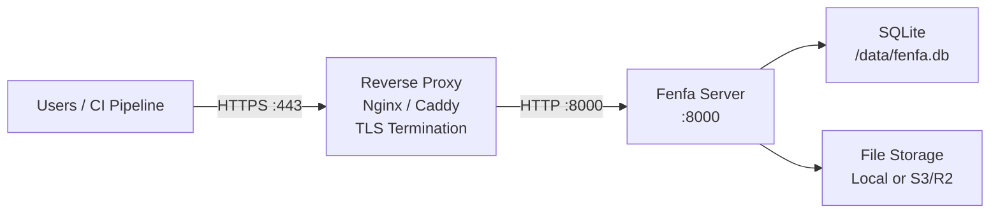

# Production Deployment

This guide covers everything needed to run Fenfa in a production environment: reverse proxy with TLS, secure token configuration, backup strategy, and monitoring.

## Architecture



## Reverse Proxy Setup

### Caddy (Recommended)

Caddy automatically obtains and renews TLS certificates from Let's Encrypt:

```
dist.example.com {
    reverse_proxy localhost:8000
}
```

That's it. Caddy handles HTTPS, HTTP/2, and certificate management automatically.

### Nginx

```nginx
server {
    listen 443 ssl http2;
    server_name dist.example.com;

    ssl_certificate /etc/letsencrypt/live/dist.example.com/fullchain.pem;
    ssl_certificate_key /etc/letsencrypt/live/dist.example.com/privkey.pem;

    client_max_body_size 2G;

    location / {
        proxy_pass http://127.0.0.1:8000;
        proxy_set_header Host $host;
        proxy_set_header X-Real-IP $remote_addr;
        proxy_set_header X-Forwarded-For $proxy_add_x_forwarded_for;
        proxy_set_header X-Forwarded-Proto $scheme;

        # Large file uploads
        proxy_request_buffering off;
        proxy_read_timeout 600s;
    }
}

server {
    listen 80;
    server_name dist.example.com;
    return 301 https://$host$request_uri;
}
```

::: warning client_max_body_size
Set `client_max_body_size` large enough for your biggest builds. IPA and APK files can be hundreds of megabytes. The example above allows up to 2 GB.
:::

### Obtain TLS Certificate

Using Certbot with Nginx:

```bash
sudo certbot --nginx -d dist.example.com
```

Using Certbot standalone:

```bash
sudo certbot certonly --standalone -d dist.example.com
```

## Security Checklist

### 1. Change Default Tokens

Generate secure random tokens:

```bash
# Generate a random 32-character token
openssl rand -hex 16
```

Set them via environment variables or config:

```bash
FENFA_ADMIN_TOKEN=$(openssl rand -hex 16)
FENFA_UPLOAD_TOKEN=$(openssl rand -hex 16)
```

### 2. Bind to Localhost

Only expose Fenfa through the reverse proxy:

```yaml
ports:
  - "127.0.0.1:8000:8000"  # Not 0.0.0.0:8000
```

### 3. Set Primary Domain

Configure the correct public domain for iOS manifests and callbacks:

```bash
FENFA_PRIMARY_DOMAIN=https://dist.example.com
```

::: danger iOS Manifests
If `primary_domain` is wrong, iOS OTA installation will fail. The manifest plist contains download URLs that iOS uses to fetch the IPA file. These URLs must be reachable from the user's device.
:::

### 4. Separate Upload Tokens

Issue different upload tokens for different CI/CD pipelines or team members:

```json
{
  "auth": {
    "upload_tokens": [
      "token-for-ios-pipeline",
      "token-for-android-pipeline",
      "token-for-desktop-pipeline"
    ],
    "admin_tokens": [
      "admin-token-for-ops-team"
    ]
  }
}
```

This allows revoking individual tokens without disrupting other pipelines.

## Backup Strategy

### What to Back Up

| Component | Path | Size | Frequency |
|-----------|------|------|-----------|
| SQLite database | `/data/fenfa.db` | Small (< 100 MB typically) | Daily |
| Uploaded files | `/app/uploads/` | Can be large | After each upload (or use S3) |
| Config file | `config.json` | Tiny | On change |

### SQLite Backup

```bash
# Copy the database file (safe while Fenfa is running -- SQLite uses WAL mode)
cp /data/fenfa.db /backups/fenfa-$(date +%Y%m%d).db
```

### Automated Backup Script

```bash
#!/bin/bash
BACKUP_DIR="/backups/fenfa"
DATE=$(date +%Y%m%d-%H%M)

mkdir -p "$BACKUP_DIR"

# Database
cp /path/to/data/fenfa.db "$BACKUP_DIR/fenfa-$DATE.db"

# Uploads (if using local storage)
tar czf "$BACKUP_DIR/uploads-$DATE.tar.gz" /path/to/uploads/

# Cleanup old backups (keep 30 days)
find "$BACKUP_DIR" -name "*.db" -mtime +30 -delete
find "$BACKUP_DIR" -name "*.tar.gz" -mtime +30 -delete
```

::: tip S3 Storage
If you use S3-compatible storage (R2, AWS S3, MinIO), uploaded files are already on a redundant storage backend. You only need to back up the SQLite database.
:::

## Monitoring

### Health Check

Monitor the `/healthz` endpoint:

```bash
curl -sf http://localhost:8000/healthz || echo "Fenfa is down"
```

### With Uptime Monitoring

Point your uptime monitoring service (UptimeRobot, Hetrix, etc.) at:

```
https://dist.example.com/healthz
```

Expected response: `{"ok": true}` with HTTP 200.

### Log Monitoring

Fenfa logs to stdout. Use your container runtime's log driver to forward logs to your aggregation system:

```yaml
services:
  fenfa:
    logging:
      driver: "json-file"
      options:
        max-size: "10m"
        max-file: "3"
```

## Full Production Docker Compose

```yaml
version: "3.8"

services:
  fenfa:
    image: fenfa/fenfa:latest
    container_name: fenfa
    restart: unless-stopped
    ports:
      - "127.0.0.1:8000:8000"
    environment:
      FENFA_ADMIN_TOKEN: ${FENFA_ADMIN_TOKEN}
      FENFA_UPLOAD_TOKEN: ${FENFA_UPLOAD_TOKEN}
      FENFA_PRIMARY_DOMAIN: https://dist.example.com
    volumes:
      - fenfa-data:/data
      - fenfa-uploads:/app/uploads
    healthcheck:
      test: ["CMD", "wget", "-q", "--spider", "http://localhost:8000/healthz"]
      interval: 30s
      timeout: 5s
      retries: 3
      start_period: 10s
    logging:
      driver: "json-file"
      options:
        max-size: "10m"
        max-file: "3"
    deploy:
      resources:
        limits:
          memory: 512M

volumes:
  fenfa-data:
  fenfa-uploads:
```

## Next Steps

- [Docker Deployment](./docker) -- Docker basics and configuration
- [Configuration Reference](../configuration/) -- All settings
- [Troubleshooting](../troubleshooting/) -- Common production issues
