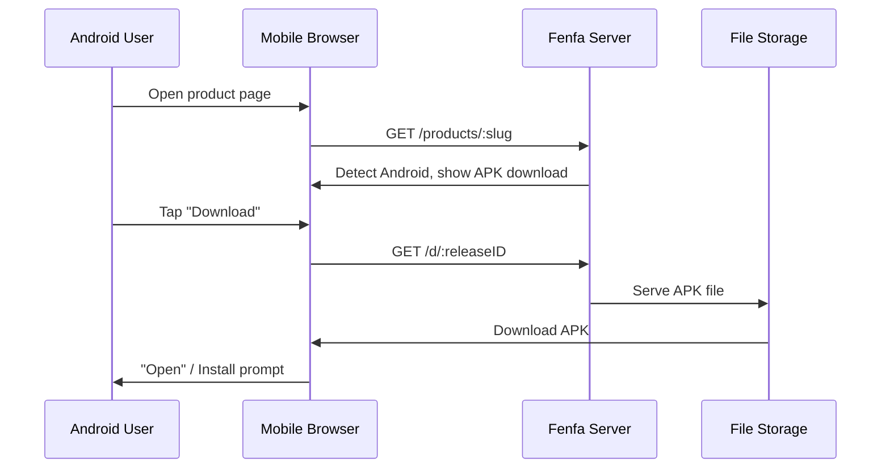

# Android Distribution

Android distribution in Fenfa is straightforward: upload an APK file, and users download it directly from the product page. Fenfa auto-detects Android devices and shows the appropriate download button.

## How It Works



Unlike iOS, Android does not require a special protocol for installation. The APK file is downloaded directly via HTTP(S), and the user installs it using the system package installer.

## Setting Up an Android Variant

Create an Android variant for your product:

```bash
curl -X POST http://localhost:8000/admin/api/products/prd_abc123/variants \
  -H "X-Auth-Token: YOUR_ADMIN_TOKEN" \
  -H "Content-Type: application/json" \
  -d '{
    "platform": "android",
    "display_name": "Android",
    "identifier": "com.example.myapp",
    "arch": "universal",
    "installer_type": "apk"
  }'
```

::: tip Architecture Variants
If you build separate APKs per architecture, create multiple variants:
- `Android ARM64` (arch: `arm64-v8a`)
- `Android ARM` (arch: `armeabi-v7a`)
- `Android x86_64` (arch: `x86_64`)

If you ship a universal APK or AAB, a single variant with `universal` architecture is sufficient.
:::

## Uploading APK Files

### Standard Upload

```bash
curl -X POST http://localhost:8000/upload \
  -H "X-Auth-Token: YOUR_UPLOAD_TOKEN" \
  -F "variant_id=var_android" \
  -F "app_file=@app-release.apk" \
  -F "version=2.1.0" \
  -F "build=210" \
  -F "changelog=Added dark mode support"
```

### Smart Upload

Smart upload auto-extracts metadata from APK files:

```bash
curl -X POST http://localhost:8000/admin/api/smart-upload \
  -H "X-Auth-Token: YOUR_ADMIN_TOKEN" \
  -F "variant_id=var_android" \
  -F "app_file=@app-release.apk"
```

Extracted metadata includes:
- Package name (`com.example.myapp`)
- Version name (`2.1.0`)
- Version code (`210`)
- App icon
- Minimum SDK version

## User Installation

When a user visits the product page on an Android device:

1. The page auto-detects the Android platform.
2. The user taps the **Download** button.
3. The browser downloads the APK file.
4. Android prompts the user to install the APK.

::: warning Unknown Sources
Users must enable "Install from unknown sources" (or "Install unknown apps" on newer Android versions) in their device settings before installing APKs from Fenfa. This is a standard Android requirement for sideloaded apps.
:::

## Direct Download Link

Each release has a direct download URL that works with any HTTP client:

```bash
# Download via curl
curl -LO http://localhost:8000/d/rel_xxx

# Download via wget
wget http://localhost:8000/d/rel_xxx
```

This URL supports HTTP Range requests for resumable downloads over slow connections.

## Next Steps

- [Desktop Distribution](./desktop) -- macOS, Windows, and Linux distribution
- [Release Management](../products/releases) -- Version and manage your APK releases
- [Upload API](../api/upload) -- Automate APK uploads from CI/CD
