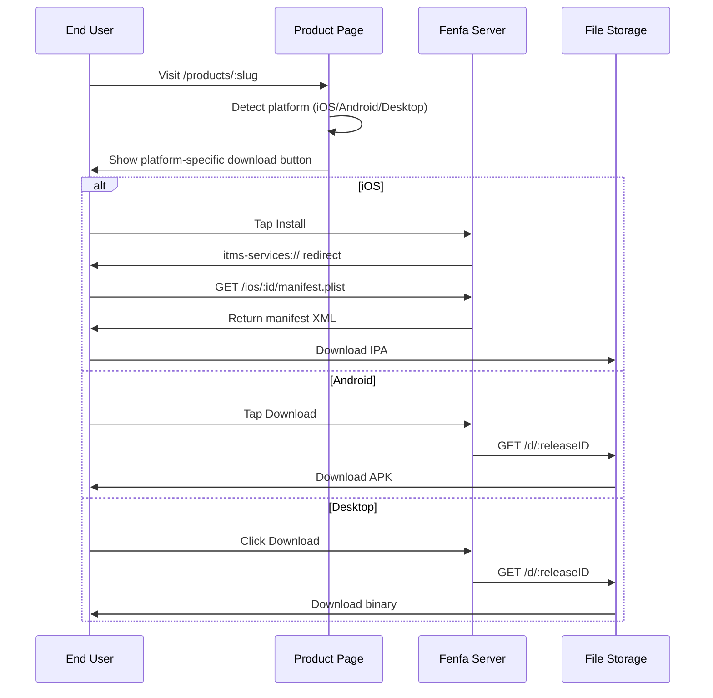

# Distribution Overview

Fenfa provides a unified distribution experience for all platforms. Each product gets a public download page that automatically detects the visitor's platform and shows the appropriate download button.

## How Distribution Works



## Product Download Page

Each published product has a public page at `/products/:slug`. The page includes:

- **App icon and name** from the product configuration
- **Platform detection** -- The page uses the browser's User-Agent to show the right download button first
- **QR code** -- Generated automatically for easy mobile scanning
- **Release history** -- All releases for the selected variant, newest first
- **Changelogs** -- Per-release notes displayed inline
- **Multiple variants** -- If a product has variants for multiple platforms, users can switch between them

## Platform-Specific Distribution

| Platform | Method | Details |
|----------|--------|---------|
| iOS | OTA via `itms-services://` | Manifest plist + direct IPA download. Requires HTTPS. |
| Android | Direct APK download | Browser downloads the APK. User enables "Install from unknown sources". |
| macOS | Direct download | DMG, PKG, or ZIP files downloaded via browser. |
| Windows | Direct download | EXE, MSI, or ZIP files downloaded via browser. |
| Linux | Direct download | DEB, RPM, AppImage, or tar.gz files downloaded via browser. |

## Direct Download Links

Every release has a direct download URL:

```
https://your-domain.com/d/:releaseID
```

This URL:
- Returns the binary file with the correct `Content-Type` and `Content-Disposition` headers
- Supports HTTP Range requests for resumable downloads
- Increments the download counter
- Works with any HTTP client (curl, wget, browsers)

## Event Tracking

Fenfa tracks three types of events:

| Event | Trigger | Tracked Data |
|-------|---------|-------------|
| `visit` | User opens the product page | IP, User-Agent, variant |
| `click` | User clicks a download button | IP, User-Agent, release ID |
| `download` | File is actually downloaded | IP, User-Agent, release ID |

Events can be viewed in the admin panel or exported as CSV:

```bash
curl -o events.csv http://localhost:8000/admin/exports/events.csv \
  -H "X-Auth-Token: YOUR_ADMIN_TOKEN"
```

## HTTPS Requirement

::: warning iOS Requires HTTPS
iOS OTA installation via `itms-services://` requires the server to use HTTPS with a valid TLS certificate. For local testing, you can use tools like `ngrok` or `mkcert`. For production, use a reverse proxy with Let's Encrypt. See [Production Deployment](../deployment/production).
:::

## Platform Guides

- [iOS Distribution](./ios) -- OTA installation, manifest generation, UDID device binding
- [Android Distribution](./android) -- APK distribution and installation
- [Desktop Distribution](./desktop) -- macOS, Windows, and Linux distribution
