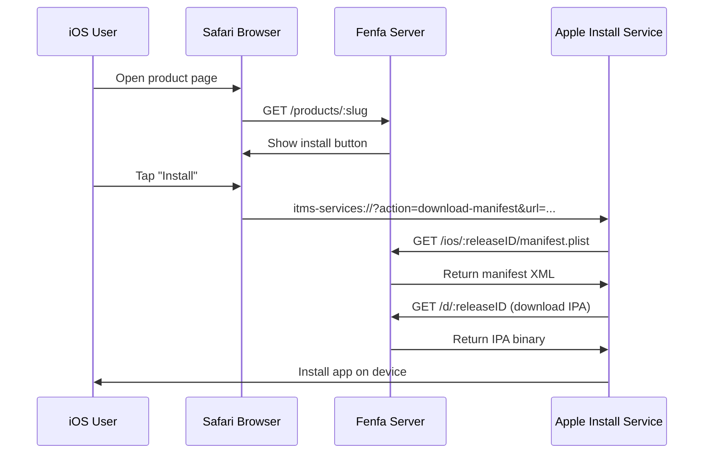
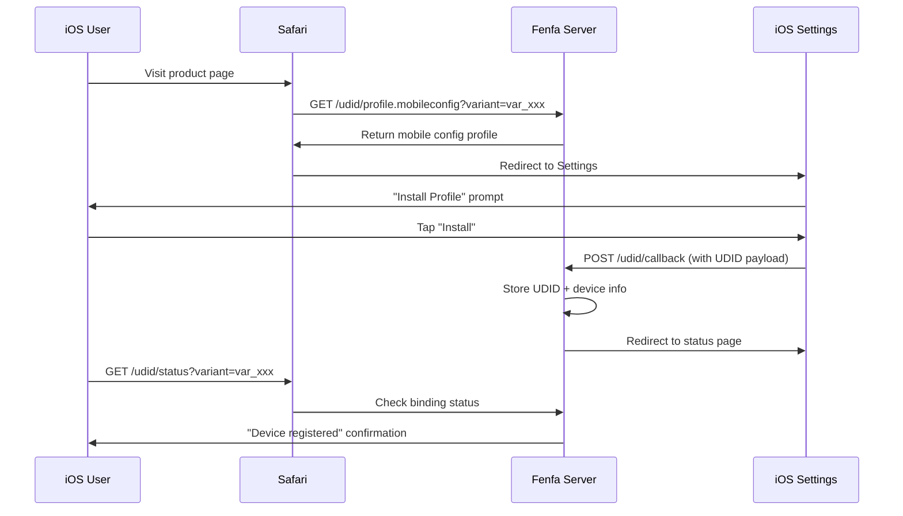

# iOS Distribution

Fenfa provides full iOS OTA (Over-The-Air) distribution support, including `itms-services://` manifest generation, UDID device binding for ad-hoc provisioning, and optional Apple Developer API integration for automatic device registration.

## How iOS OTA Works



iOS uses the `itms-services://` protocol to install apps directly from a web page. When a user taps the install button, Safari hands off to the system installer, which:

1. Fetches the manifest plist from Fenfa
2. Downloads the IPA file
3. Installs the app on the device

::: warning HTTPS Required
iOS OTA installation requires HTTPS with a valid TLS certificate. Self-signed certificates will not work. For local testing, use `ngrok` to create a temporary HTTPS tunnel.
:::

## Manifest Generation

Fenfa automatically generates the `manifest.plist` file for each iOS release. The manifest is served at:

```
GET /ios/:releaseID/manifest.plist
```

The manifest contains:
- Bundle identifier (from the variant's identifier field)
- Bundle version (from the release version)
- Download URL (pointing to `/d/:releaseID`)
- App title

The `itms-services://` install link is:

```
itms-services://?action=download-manifest&url=https://your-domain.com/ios/rel_xxx/manifest.plist
```

This link is automatically included in the upload API response and displayed on the product page.

## UDID Device Binding

For ad-hoc distribution, iOS devices must be registered in the app's provisioning profile. Fenfa provides a UDID binding flow that collects device identifiers from users.

### How UDID Binding Works



### UDID Endpoints

| Endpoint | Method | Description |
|----------|--------|-------------|
| `/udid/profile.mobileconfig?variant=:variantID` | GET | Download the mobile configuration profile |
| `/udid/callback` | POST | Callback from iOS after profile installation (contains UDID) |
| `/udid/status?variant=:variantID` | GET | Check if the current device is bound |

### Security

The UDID binding flow uses one-time nonces to prevent replay attacks:
- Each profile download generates a unique nonce
- The nonce is embedded in the callback URL
- Once used, the nonce cannot be reused
- Nonces expire after a configurable timeout

## Apple Developer API Integration

Fenfa can automatically register devices with your Apple Developer account, eliminating the manual step of adding UDIDs in the Apple Developer Portal.

### Setup

1. Go to **Admin Panel > Settings > Apple Developer API**.
2. Enter your App Store Connect API credentials:

| Field | Description |
|-------|-------------|
| Key ID | API Key ID (e.g., "ABC123DEF4") |
| Issuer ID | Issuer ID (UUID format) |
| Private Key | PEM-format private key content |
| Team ID | Your Apple Developer Team ID |

::: tip Creating API Keys
In the [Apple Developer Portal](https://developer.apple.com/account/resources/authkeys/list), create an API key with "Devices" permission. Download the `.p8` private key file -- it can only be downloaded once.
:::

### Registering Devices

Once configured, you can register devices with Apple from the admin panel:

**Single device:**

```bash
curl -X POST http://localhost:8000/admin/api/devices/DEVICE_ID/register-apple \
  -H "X-Auth-Token: YOUR_ADMIN_TOKEN"
```

**Batch registration:**

```bash
curl -X POST http://localhost:8000/admin/api/devices/register-apple \
  -H "X-Auth-Token: YOUR_ADMIN_TOKEN"
```

### Check Apple API Status

```bash
curl http://localhost:8000/admin/api/apple/status \
  -H "X-Auth-Token: YOUR_ADMIN_TOKEN"
```

### List Apple-Registered Devices

```bash
curl http://localhost:8000/admin/api/apple/devices \
  -H "X-Auth-Token: YOUR_ADMIN_TOKEN"
```

## Ad-Hoc Distribution Workflow

The complete workflow for iOS ad-hoc distribution:

1. **User binds device** -- Visits the product page, installs the mobileconfig profile, UDID is captured.
2. **Admin registers device** -- In the admin panel, register the device with Apple (or use batch registration).
3. **Developer re-signs IPA** -- Update the provisioning profile to include the new device, re-sign the IPA.
4. **Upload new build** -- Upload the re-signed IPA to Fenfa.
5. **User installs** -- The user can now install the app via the product page.

::: info Enterprise Distribution
If you have an Apple Enterprise Developer account, you can skip UDID binding entirely. Enterprise profiles allow installation on any device. Set the variant accordingly and upload enterprise-signed IPAs.
:::

## Managing iOS Devices

View all bound devices in the admin panel or via API:

```bash
curl http://localhost:8000/admin/api/ios_devices \
  -H "X-Auth-Token: YOUR_ADMIN_TOKEN"
```

Export devices as CSV:

```bash
curl -o devices.csv http://localhost:8000/admin/exports/ios_devices.csv \
  -H "X-Auth-Token: YOUR_ADMIN_TOKEN"
```

## Next Steps

- [Android Distribution](./android) -- Android APK distribution
- [Upload API](../api/upload) -- Automate iOS uploads from CI/CD
- [Production Deployment](../deployment/production) -- Set up HTTPS for iOS OTA
