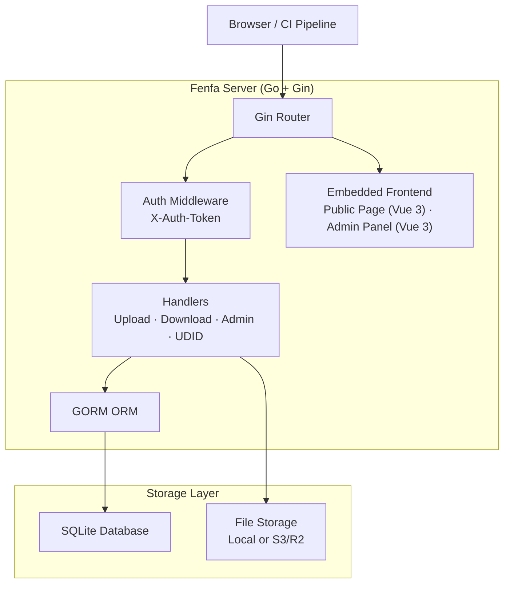
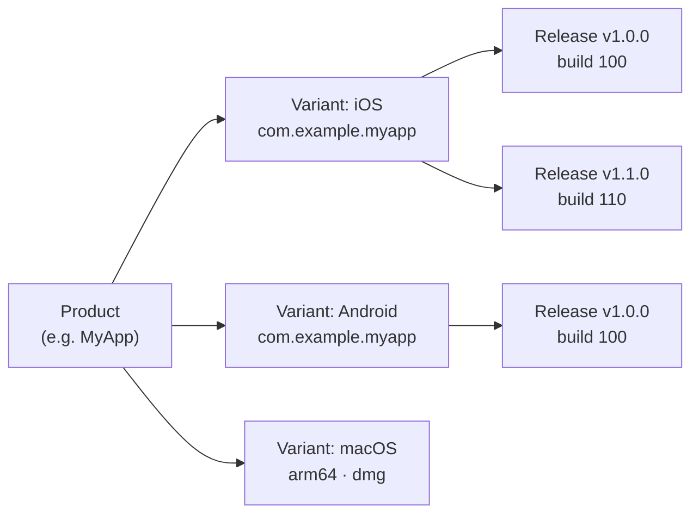

# Fenfa

**Fenfa** (分发, "distribute" in Chinese) is a self-hosted app distribution platform for iOS, Android, macOS, Windows, and Linux. Upload builds, get install pages with QR codes, and manage releases through a clean admin panel -- all from a single Go binary with embedded frontend and SQLite storage.

Fenfa is designed for development teams, QA engineers, and enterprise IT departments who need a private, controllable app distribution channel -- one that handles iOS OTA installation, Android APK distribution, and desktop app delivery without depending on public app stores or third-party services.

## Why Fenfa?

Public app stores impose review delays, content restrictions, and privacy concerns. Third-party distribution services charge per-download fees and control your data. Fenfa gives you full control:

- **Self-hosted.** Your builds, your server, your data. No vendor lock-in, no per-download fees.
- **Multi-platform.** A single product page serves iOS, Android, macOS, Windows, and Linux builds with automatic platform detection.
- **Zero dependencies.** A single Go binary with embedded SQLite. No Redis, no PostgreSQL, no message queue.
- **iOS OTA distribution.** Full support for `itms-services://` manifest generation, UDID device binding, and Apple Developer API integration for ad-hoc provisioning.

## Key Features

<div class="vp-features">

- **Smart Upload** -- Auto-detect app metadata (bundle ID, version, icon) from IPA and APK packages. Just upload the file and Fenfa handles the rest.

- **Product Pages** -- Public download pages with QR codes, platform detection, and per-release changelogs. Share a single URL for all platforms.

- **iOS UDID Binding** -- Device registration flow for ad-hoc distribution. Users bind their device UDID through a guided mobile config profile, and admins can auto-register devices via Apple Developer API.

- **S3/R2 Storage** -- Optional S3-compatible object storage (Cloudflare R2, AWS S3, MinIO) for scalable file hosting. Local storage works out of the box.

- **Admin Panel** -- Full-featured Vue 3 admin panel to manage products, variants, releases, devices, and system settings. Supports Chinese and English UI.

- **Token Authentication** -- Separate upload and admin token scopes. CI/CD pipelines use upload tokens; administrators use admin tokens for full control.

- **Event Tracking** -- Track page visits, download clicks, and file downloads per release. Export events as CSV for analytics.

</div>

## Architecture



## Data Model



- **Product**: A logical app with name, slug, icon, and description. A single product page serves all platforms.
- **Variant**: A platform-specific build target (iOS, Android, macOS, Windows, Linux) with its own identifier, architecture, and installer type.
- **Release**: A specific uploaded build with version, build number, changelog, and binary file.

## Quick Install

```bash
docker run -d --name fenfa -p 8000:8000 fenfa/fenfa:latest
```

Visit `http://localhost:8000/admin` and log in with token `dev-admin-token`.

See the [Installation Guide](./getting-started/installation) for Docker Compose, source builds, and production configuration.

## Documentation Sections

| Section | Description |
|---------|-------------|
| [Installation](./getting-started/installation) | Install Fenfa with Docker or build from source |
| [Quick Start](./getting-started/quickstart) | Get Fenfa running and upload your first build in 5 minutes |
| [Product Management](./products/) | Create and manage multi-platform products |
| [Platform Variants](./products/variants) | Configure iOS, Android, and desktop variants |
| [Release Management](./products/releases) | Upload, version, and manage releases |
| [Distribution Overview](./distribution/) | How Fenfa distributes apps to end users |
| [iOS Distribution](./distribution/ios) | iOS OTA install, manifest generation, UDID binding |
| [Android Distribution](./distribution/android) | Android APK distribution |
| [Desktop Distribution](./distribution/desktop) | macOS, Windows, and Linux distribution |
| [API Overview](./api/) | REST API reference |
| [Upload API](./api/upload) | Upload builds via API or CI/CD |
| [Admin API](./api/admin) | Full admin API reference |
| [Configuration](./configuration/) | All configuration options |
| [Docker Deployment](./deployment/docker) | Docker and Docker Compose deployment |
| [Production Deployment](./deployment/production) | Reverse proxy, TLS, backups, and monitoring |
| [Troubleshooting](./troubleshooting/) | Common issues and solutions |

## Project Info

- **License:** MIT
- **Language:** Go 1.25+ (backend), Vue 3 + Vite (frontend)
- **Database:** SQLite (via GORM)
- **Repository:** [github.com/openprx/fenfa](https://github.com/openprx/fenfa)
- **Organization:** [OpenPRX](https://github.com/openprx)
