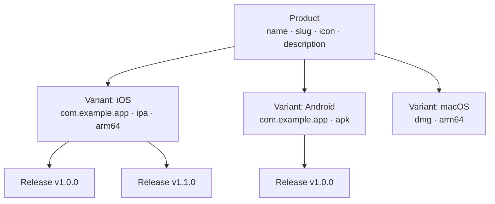

# Product Management

Products are the top-level organizational unit in Fenfa. Each product represents a single application and can contain multiple platform variants (iOS, Android, macOS, Windows, Linux). A product has its own public download page, icon, and slug URL.

## Concepts



- **Product**: The logical application. Has a unique slug that becomes the download page URL (`/products/:slug`).
- **Variant**: A platform-specific build target under a product. See [Platform Variants](./variants).
- **Release**: A specific uploaded build under a variant. See [Release Management](./releases).

## Creating a Product

### Via Admin Panel

1. Navigate to **Products** in the sidebar.
2. Click **Create Product**.
3. Fill in the fields:

| Field | Required | Description |
|-------|----------|-------------|
| Name | Yes | Display name (e.g., "MyApp") |
| Slug | Yes | URL identifier (e.g., "myapp"). Must be unique. |
| Description | No | Brief app description shown on the download page |
| Icon | No | App icon (uploaded as image file) |

4. Click **Save**.

### Via API

```bash
curl -X POST http://localhost:8000/admin/api/products \
  -H "X-Auth-Token: YOUR_ADMIN_TOKEN" \
  -H "Content-Type: application/json" \
  -d '{
    "name": "MyApp",
    "slug": "myapp",
    "description": "A cross-platform mobile app"
  }'
```

## Listing Products

### Via Admin Panel

The **Products** page in the admin panel shows all products with their variant count and total downloads.

### Via API

```bash
curl http://localhost:8000/admin/api/products \
  -H "X-Auth-Token: YOUR_ADMIN_TOKEN"
```

Response:

```json
{
  "ok": true,
  "data": [
    {
      "id": "prd_abc123",
      "name": "MyApp",
      "slug": "myapp",
      "description": "A cross-platform mobile app",
      "published": true,
      "created_at": "2025-01-15T10:30:00Z"
    }
  ]
}
```

## Updating a Product

```bash
curl -X PUT http://localhost:8000/admin/api/products/prd_abc123 \
  -H "X-Auth-Token: YOUR_ADMIN_TOKEN" \
  -H "Content-Type: application/json" \
  -d '{
    "name": "MyApp Pro",
    "description": "Updated description"
  }'
```

## Deleting a Product

::: danger Cascading Delete
Deleting a product removes all its variants, releases, and uploaded files permanently.
:::

```bash
curl -X DELETE http://localhost:8000/admin/api/products/prd_abc123 \
  -H "X-Auth-Token: YOUR_ADMIN_TOKEN"
```

## Publishing and Unpublishing

Products can be published or unpublished. Unpublished products return a 404 on their public download page.

```bash
# Unpublish
curl -X PUT http://localhost:8000/admin/api/apps/prd_abc123/unpublish \
  -H "X-Auth-Token: YOUR_ADMIN_TOKEN"

# Publish
curl -X PUT http://localhost:8000/admin/api/apps/prd_abc123/publish \
  -H "X-Auth-Token: YOUR_ADMIN_TOKEN"
```

## Public Download Page

Each published product has a public download page at:

```
https://your-domain.com/products/:slug
```

The page features:
- App icon, name, and description
- Platform-specific download buttons (auto-detected based on visitor's device)
- QR code for mobile scanning
- Release history with version numbers and changelogs
- iOS `itms-services://` links for OTA installation

## ID Format

Product IDs use the prefix `prd_` followed by a random string (e.g., `prd_abc123`). IDs are generated automatically and cannot be changed.

## Next Steps

- [Platform Variants](./variants) -- Add iOS, Android, and desktop variants to your product
- [Release Management](./releases) -- Upload and manage builds
- [Distribution Overview](../distribution/) -- How end users install your apps
