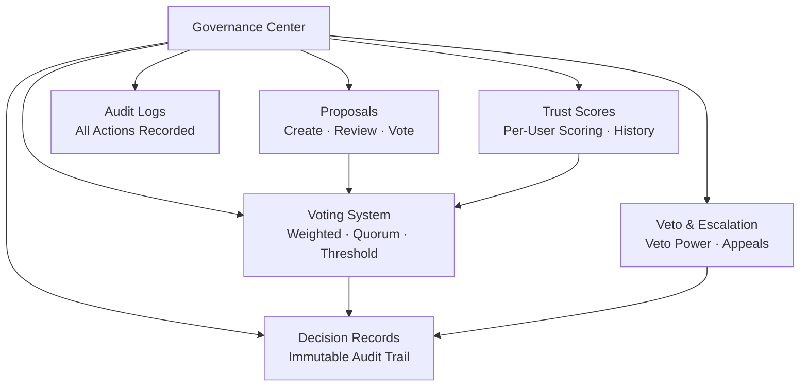

# Governance Center

The governance center is a core module in OpenPR that brings transparent, structured decision-making to project management. It provides proposals, voting, decision records, trust scores, veto mechanisms, and comprehensive audit trails.

## Why Governance?

Traditional project management tools focus on task tracking but leave decision-making unstructured. OpenPR's governance center ensures that:

- **Decisions are documented.** Every proposal, vote, and decision is recorded with full audit trails.
- **Processes are transparent.** Voting thresholds, quorum rules, and trust scores are visible to all members.
- **Power is distributed.** Veto mechanisms and escalation paths prevent unilateral decisions.
- **History is preserved.** Decision records create an immutable log of what was decided, by whom, and why.

## Governance Modules

| Module | Description |
|--------|-------------|
| [Proposals](./proposals) | Create, review, and vote on proposals |
| [Voting & Decisions](./voting) | Weighted voting with quorum and threshold rules |
| [Trust Scores](./trust-scores) | Per-user reputation scoring with history |
| Veto & Escalation | Veto power with escalation voting and appeals |
| Decision Domains | Categorize decisions by domain |
| Impact Reviews | Assess proposal impact with metrics |
| Audit Logs | Complete record of all governance actions |

## Database Schema

The governance module uses 20 dedicated tables:

| Table | Purpose |
|-------|---------|
| `proposals` | Proposal records |
| `proposal_templates` | Reusable proposal templates |
| `proposal_comments` | Discussion on proposals |
| `proposal_issue_links` | Link proposals to related issues |
| `votes` | Individual vote records |
| `decisions` | Finalized decision records |
| `decision_domains` | Decision categorization domains |
| `decision_audit_reports` | Audit reports on decisions |
| `governance_configs` | Workspace governance settings |
| `governance_audit_logs` | All governance action logs |
| `vetoers` | Users with veto power |
| `veto_events` | Veto action records |
| `appeals` | Appeals against decisions or vetoes |
| `trust_scores` | Current trust scores per user |
| `trust_score_logs` | Trust score change history |
| `impact_reviews` | Proposal impact assessments |
| `impact_metrics` | Quantitative impact measures |
| `review_participants` | Review assignment records |
| `feedback_loop_links` | Feedback loop connections |

## API Endpoints

| Category | Base Path | Operations |
|----------|-----------|------------|
| Proposals | `/api/proposals/*` | Create, vote, submit, archive |
| Governance | `/api/governance/*` | Config, audit logs |
| Decisions | `/api/decisions/*` | Decision records |
| Trust Scores | `/api/trust-scores/*` | Scores, history, appeals |
| Veto | `/api/veto/*` | Veto, escalation, voting |

## MCP Tools

| Tool | Params | Description |
|------|--------|-------------|
| `proposals.list` | `project_id` | List proposals with optional status filter |
| `proposals.get` | `proposal_id` | Get proposal details |
| `proposals.create` | `project_id`, `title`, `description` | Create a governance proposal |

## Next Steps

- [Proposals](./proposals) -- Create and manage governance proposals
- [Voting & Decisions](./voting) -- Configure voting rules and view decisions
- [Trust Scores](./trust-scores) -- Understand the trust scoring mechanism
