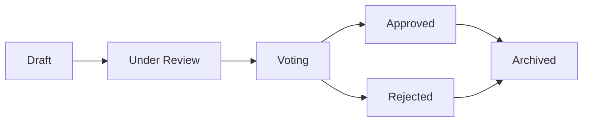

# Proposals

Proposals are the entry point for governance decisions in OpenPR. A proposal describes a change, improvement, or decision that needs team input, and it follows a structured lifecycle from creation through voting to a final decision.

## Proposal Lifecycle



1. **Draft** -- Author creates the proposal with title, description, and context.
2. **Under Review** -- Team members discuss and provide feedback through comments.
3. **Voting** -- Voting period opens. Members cast votes based on governance rules.
4. **Approved/Rejected** -- Voting closes. Result is determined by threshold and quorum.
5. **Archived** -- Decision is recorded and the proposal is archived.

## Creating a Proposal

### Via the Web UI

1. Navigate to your project.
2. Go to **Governance** > **Proposals**.
3. Click **New Proposal**.
4. Fill in the title, description, and any linked issues.
5. Click **Create**.

### Via the API

```bash
curl -X POST http://localhost:8080/api/proposals \
  -H "Content-Type: application/json" \
  -H "Authorization: Bearer <token>" \
  -d '{
    "project_id": "<project_uuid>",
    "title": "Adopt TypeScript for frontend modules",
    "description": "Proposal to migrate frontend modules from JavaScript to TypeScript for better type safety."
  }'
```

### Via MCP

```json
{
  "method": "tools/call",
  "params": {
    "name": "proposals.create",
    "arguments": {
      "project_id": "<project_uuid>",
      "title": "Adopt TypeScript for frontend modules",
      "description": "Proposal to migrate frontend modules from JavaScript to TypeScript."
    }
  }
}
```

## Proposal Templates

Workspace admins can create proposal templates to standardize the proposal format. Templates define:

- Title pattern
- Required sections in the description
- Default voting parameters

Templates are managed in **Workspace Settings** > **Governance** > **Templates**.

## Linking Proposals to Issues

Proposals can be linked to related issues through the `proposal_issue_links` table. This creates a bidirectional reference:

- From the proposal, you can see which issues are affected.
- From an issue, you can see which proposals reference it.

## Proposal Comments

Each proposal has its own discussion thread, separate from issue comments. Proposal comments support markdown formatting and are visible to all workspace members.

## MCP Tools

| Tool | Params | Description |
|------|--------|-------------|
| `proposals.list` | `project_id` | List proposals, optional `status` filter |
| `proposals.get` | `proposal_id` | Get full proposal details |
| `proposals.create` | `project_id`, `title`, `description` | Create a new proposal |

## Next Steps

- [Voting & Decisions](./voting) -- How votes are cast and decisions are made
- [Trust Scores](./trust-scores) -- How trust scores affect voting weight
- [Governance Overview](./index) -- Full governance module reference
