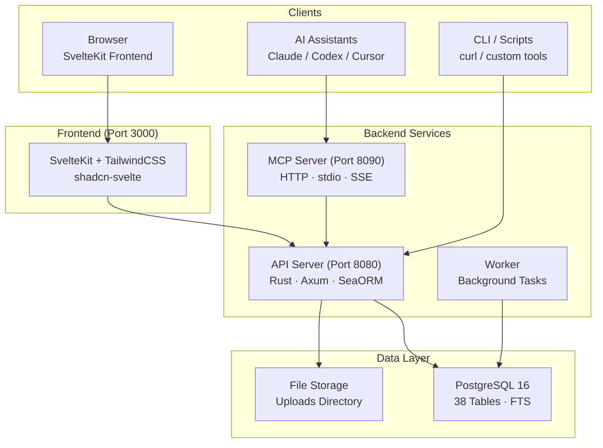

# OpenPR

**OpenPR** is an open-source project management platform designed for teams that need transparent governance, AI-assisted workflows, and full control over their project data. It combines issue tracking, sprint planning, kanban boards, and a complete governance center -- proposals, voting, trust scores, veto mechanisms -- into a single self-hosted platform.

OpenPR is built with **Rust** (Axum + SeaORM) on the backend and **SvelteKit** on the frontend, backed by **PostgreSQL**. It exposes a REST API and a built-in MCP server with 34 tools across three transport protocols, making it a first-class tool provider for AI assistants like Claude, Codex, and other MCP-compatible clients.

## Why OpenPR?

Most project management tools are either closed-source SaaS platforms with limited customization, or open-source alternatives that lack governance features. OpenPR takes a different approach:

- **Self-hosted and auditable.** Your project data stays on your infrastructure. Every feature, every decision record, every audit log is under your control.
- **Governance built in.** Proposals, voting, trust scores, veto power, and escalation are not afterthoughts -- they are core modules with full API support.
- **AI-native.** A built-in MCP server turns OpenPR into a tool provider for AI agents. Bot tokens, AI task assignment, and webhook callbacks enable fully automated workflows.
- **Rust performance.** The backend handles thousands of concurrent requests with minimal resource usage. PostgreSQL full-text search powers instant lookups across all entities.

## Key Features

| Category | Features |
|----------|----------|
| **Project Management** | Workspaces, projects, issues, kanban board, sprints, labels, comments, file attachments, activity feed, notifications, full-text search |
| **Governance Center** | Proposals, voting with quorum, decision records, veto and escalation, trust scores with history and appeals, proposal templates, impact reviews, audit logs |
| **AI Integration** | Bot tokens (`opr_` prefix), AI agent registration, AI task assignment with progress tracking, AI review on proposals, MCP server (34 tools, 3 transports), webhook callbacks |
| **Authentication** | JWT (access + refresh tokens), bot token authentication, role-based access (admin/user), workspace-scoped permissions (owner/admin/member) |
| **Deployment** | Docker Compose, Podman, Caddy/Nginx reverse proxy, PostgreSQL 15+ |

## Architecture



## Tech Stack

| Layer | Technology |
|-------|-----------|
| **Backend** | Rust, Axum, SeaORM, PostgreSQL |
| **Frontend** | SvelteKit, TailwindCSS, shadcn-svelte |
| **MCP** | JSON-RPC 2.0 (HTTP + stdio + SSE) |
| **Auth** | JWT (access + refresh) + Bot Tokens (`opr_`) |
| **Deployment** | Docker Compose, Podman, Caddy, Nginx |

## Quick Start

```bash
git clone https://github.com/openprx/openpr.git
cd openpr
cp .env.example .env
docker-compose up -d
```

Services start at:
- **Frontend**: http://localhost:3000
- **API**: http://localhost:8080
- **MCP Server**: http://localhost:8090

The first registered user automatically becomes admin.

See the [Installation Guide](./getting-started/installation) for all deployment methods, or the [Quick Start](./getting-started/quickstart) to get running in 5 minutes.

## Documentation Sections

| Section | Description |
|---------|-------------|
| [Installation](./getting-started/installation) | Docker Compose, source build, and deployment options |
| [Quick Start](./getting-started/quickstart) | Get OpenPR running in 5 minutes |
| [Workspace Management](./workspace/) | Workspaces, projects, and member roles |
| [Issues & Tracking](./issues/) | Issues, workflow states, sprints, and labels |
| [Governance Center](./governance/) | Proposals, voting, decisions, and trust scores |
| [REST API](./api/) | Authentication, endpoints, and response formats |
| [MCP Server](./mcp-server/) | AI integration with 34 tools and 3 transports |
| [Configuration](./configuration/) | Environment variables and settings |
| [Deployment](./deployment/docker) | Docker and production deployment guides |
| [Troubleshooting](./troubleshooting/) | Common issues and solutions |

## Related Projects

| Repository | Description |
|------------|-------------|
| [openpr](https://github.com/openprx/openpr) | Core platform (this project) |
| [openpr-webhook](https://github.com/openprx/openpr-webhook) | Webhook receiver for external integrations |
| [prx](https://github.com/openprx/prx) | AI assistant framework with built-in OpenPR MCP |
| [prx-memory](https://github.com/openprx/prx-memory) | Local-first MCP memory for coding agents |

## Project Info

- **License:** MIT OR Apache-2.0
- **Language:** Rust (2024 edition)
- **Repository:** [github.com/openprx/openpr](https://github.com/openprx/openpr)
- **Minimum Rust:** 1.75.0
- **Frontend:** SvelteKit
