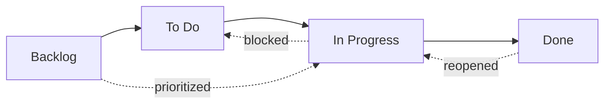

# Workflow States

Every issue in OpenPR has a **state** that represents its position in the workflow. The kanban board columns map directly to these states.

## States



| State | Value | Description |
|-------|-------|-------------|
| **Backlog** | `backlog` | Ideas, future work, and unplanned items. Not yet scheduled. |
| **To Do** | `todo` | Planned and prioritized. Ready to be picked up. |
| **In Progress** | `in_progress` | Actively being worked on by an assignee. |
| **Done** | `done` | Completed and verified. |

## State Transitions

OpenPR allows flexible state transitions. There are no enforced constraints -- any state can transition to any other state. Common patterns include:

| Transition | Trigger | Example |
|-----------|---------|---------|
| Backlog -> To Do | Sprint planning, prioritization | Issue pulled into upcoming sprint |
| To Do -> In Progress | Developer picks up work | Assignee starts implementation |
| In Progress -> Done | Work completed | Pull request merged |
| In Progress -> To Do | Work blocked or paused | Waiting on external dependency |
| Done -> In Progress | Issue reopened | Bug regression discovered |
| Backlog -> In Progress | Urgent hotfix | Critical production issue |

## Kanban Board

The board view displays issues as cards in four columns corresponding to the four states. Drag and drop a card between columns to change its state.

Each card shows:
- Issue identifier (e.g., `API-42`)
- Title
- Priority indicator
- Assignee avatar
- Label badges

## Updating State via API

```bash
# Move issue to "in_progress"
curl -X PATCH http://localhost:8080/api/issues/<issue_id> \
  -H "Content-Type: application/json" \
  -H "Authorization: Bearer <token>" \
  -d '{"state": "in_progress"}'
```

## Updating State via MCP

```json
{
  "method": "tools/call",
  "params": {
    "name": "work_items.update",
    "arguments": {
      "work_item_id": "<issue_uuid>",
      "state": "in_progress"
    }
  }
}
```

## Priority Levels

In addition to states, each issue can have a priority level:

| Priority | Value | Description |
|----------|-------|-------------|
| Low | `low` | Nice to have, no time pressure |
| Medium | `medium` | Standard priority, planned work |
| High | `high` | Important, should be addressed soon |
| Urgent | `urgent` | Critical, needs immediate attention |

## Activity Tracking

Every state change is recorded in the issue's activity feed with the actor, timestamp, and old/new values. This provides a complete audit trail.

## Next Steps

- [Sprint Planning](./sprints) -- Organize issues into time-boxed iterations
- [Labels](./labels) -- Add categorization to issues
- [Issues Overview](./index) -- Full issue field reference
