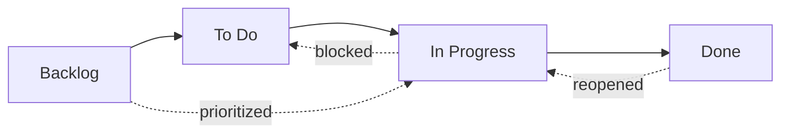
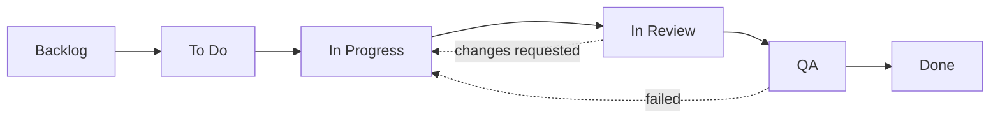

# Workflow States

Every issue in OpenPR has a **state** that represents its position in the workflow. The kanban board columns map directly to these states.

OpenPR ships with four default states, but supports fully **custom workflow states** through a 3-tier resolution system. You can define different workflows per project, per workspace, or rely on the system defaults.

## Default States



| State | Value | Description |
|-------|-------|-------------|
| **Backlog** | `backlog` | Ideas, future work, and unplanned items. Not yet scheduled. |
| **To Do** | `todo` | Planned and prioritized. Ready to be picked up. |
| **In Progress** | `in_progress` | Actively being worked on by an assignee. |
| **Done** | `done` | Completed and verified. |

These are the built-in states that every new workspace starts with. You can customize them or add additional states as described in [Custom Workflows](#custom-workflows) below.

## State Transitions

OpenPR allows flexible state transitions. There are no enforced constraints -- any state can transition to any other state. Common patterns include:

| Transition | Trigger | Example |
|-----------|---------|---------|
| Backlog -> To Do | Sprint planning, prioritization | Issue pulled into upcoming sprint |
| To Do -> In Progress | Developer picks up work | Assignee starts implementation |
| In Progress -> Done | Work completed | Pull request merged |
| In Progress -> To Do | Work blocked or paused | Waiting on external dependency |
| Done -> In Progress | Issue reopened | Bug regression discovered |
| Backlog -> In Progress | Urgent hotfix | Critical production issue |

## Custom Workflows

OpenPR supports custom workflow states through a **3-tier resolution** system. When the API validates a state for a work item, it resolves the effective workflow by checking three levels in order:

```
Project workflow  >  Workspace workflow  >  System defaults
```

If a project defines its own workflow, that takes precedence. Otherwise the workspace-level workflow is used. If neither exists, the four system default states apply.

### Database Schema

Custom workflows are stored in two tables (introduced in migration `0024_workflow_config.sql`):

- **`workflows`** -- Defines a named workflow attached to a project or workspace.
- **`workflow_states`** -- The individual states within a workflow.

Each state has the following properties:

| Field | Type | Description |
|-------|------|-------------|
| `key` | string | Machine-readable identifier (e.g. `in_review`) |
| `display_name` | string | Human-readable name (e.g. "In Review") |
| `category` | string | Grouping category for the state |
| `position` | integer | Display order on the kanban board |
| `color` | string | Hex color code for the state badge |
| `is_initial` | boolean | Whether this is the default state for new issues |
| `is_terminal` | boolean | Whether this state represents completion |

### Creating a Custom Workflow via API

**Step 1 -- Create a workflow for a project:**

```bash
curl -X POST http://localhost:8080/api/workflows \
  -H "Content-Type: application/json" \
  -H "Authorization: Bearer <token>" \
  -d '{
    "name": "Engineering Flow",
    "project_id": "<project_uuid>"
  }'
```

**Step 2 -- Add states to the workflow:**

```bash
curl -X POST http://localhost:8080/api/workflows/<workflow_id>/states \
  -H "Content-Type: application/json" \
  -H "Authorization: Bearer <token>" \
  -d '{
    "key": "in_review",
    "display_name": "In Review",
    "category": "active",
    "position": 3,
    "color": "#f59e0b",
    "is_initial": false,
    "is_terminal": false
  }'
```

### Example: 6-State Engineering Workflow



| State | Key | Category | Initial | Terminal |
|-------|-----|----------|---------|----------|
| Backlog | `backlog` | backlog | yes | no |
| To Do | `todo` | planned | no | no |
| In Progress | `in_progress` | active | no | no |
| In Review | `in_review` | active | no | no |
| QA | `qa` | active | no | no |
| Done | `done` | completed | no | yes |

### Dynamic Validation

When a work item's state is updated, the API validates the new state against the **effective workflow** for that project. If you set a state key that does not exist in the resolved workflow, the API returns a `422 Unprocessable Entity` error. States are not hardcoded -- they are looked up dynamically at request time.

## Kanban Board

The board view displays issues as cards in columns corresponding to the workflow states. Drag and drop a card between columns to change its state. When custom workflows are active, the board automatically reflects the custom states and their configured order.

Each card shows:
- Issue identifier (e.g., `API-42`)
- Title
- Priority indicator
- Assignee avatar
- Label badges

## Updating State via API

```bash
# Move issue to "in_progress"
curl -X PATCH http://localhost:8080/api/issues/<issue_id> \
  -H "Content-Type: application/json" \
  -H "Authorization: Bearer <token>" \
  -d '{"state": "in_progress"}'
```

## Updating State via MCP

```json
{
  "method": "tools/call",
  "params": {
    "name": "work_items.update",
    "arguments": {
      "work_item_id": "<issue_uuid>",
      "state": "in_progress"
    }
  }
}
```

## Priority Levels

In addition to states, each issue can have a priority level:

| Priority | Value | Description |
|----------|-------|-------------|
| Low | `low` | Nice to have, no time pressure |
| Medium | `medium` | Standard priority, planned work |
| High | `high` | Important, should be addressed soon |
| Urgent | `urgent` | Critical, needs immediate attention |

## Activity Tracking

Every state change is recorded in the issue's activity feed with the actor, timestamp, and old/new values. This provides a complete audit trail.

## Next Steps

- [Sprint Planning](./sprints) -- Organize issues into time-boxed iterations
- [Labels](./labels) -- Add categorization to issues
- [Issues Overview](./index) -- Full issue field reference
