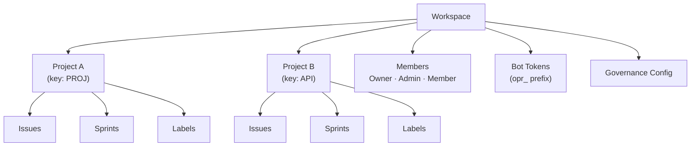

# Workspace Management

A **workspace** is the top-level organizational unit in OpenPR. It provides multi-tenant isolation -- each workspace has its own projects, members, labels, bot tokens, and governance settings. Users can belong to multiple workspaces.

## Creating a Workspace

After logging in, click **Create Workspace** on the dashboard or navigate to **Settings** > **Workspaces** > **New**.

Provide:

| Field | Required | Description |
|-------|----------|-------------|
| Name | Yes | Display name (e.g., "Engineering Team") |
| Slug | Yes | URL-friendly identifier (e.g., "engineering") |

The creating user is automatically assigned the **Owner** role.

## Workspace Structure



## Workspace Settings

Access workspace settings through the gear icon or **Settings** in the sidebar:

- **General** -- Update workspace name, slug, and description.
- **Members** -- Invite users, change roles, remove members. See [Members](./members).
- **Bot Tokens** -- Create and manage MCP bot tokens.
- **Governance** -- Configure voting thresholds, proposal templates, and trust score rules. See [Governance](../governance/).
- **Webhooks** -- Set up webhook endpoints for external integrations.

## API Access

```bash
# List workspaces
curl -H "Authorization: Bearer <token>" \
  http://localhost:8080/api/workspaces

# Get workspace details
curl -H "Authorization: Bearer <token>" \
  http://localhost:8080/api/workspaces/<workspace_id>
```

## MCP Access

Through the MCP server, AI assistants operate within the workspace specified by the `OPENPR_WORKSPACE_ID` environment variable. All MCP tools automatically scope operations to that workspace.

## Next Steps

- [Projects](./projects) -- Create and manage projects within a workspace
- [Members & Permissions](./members) -- Invite users and configure roles
