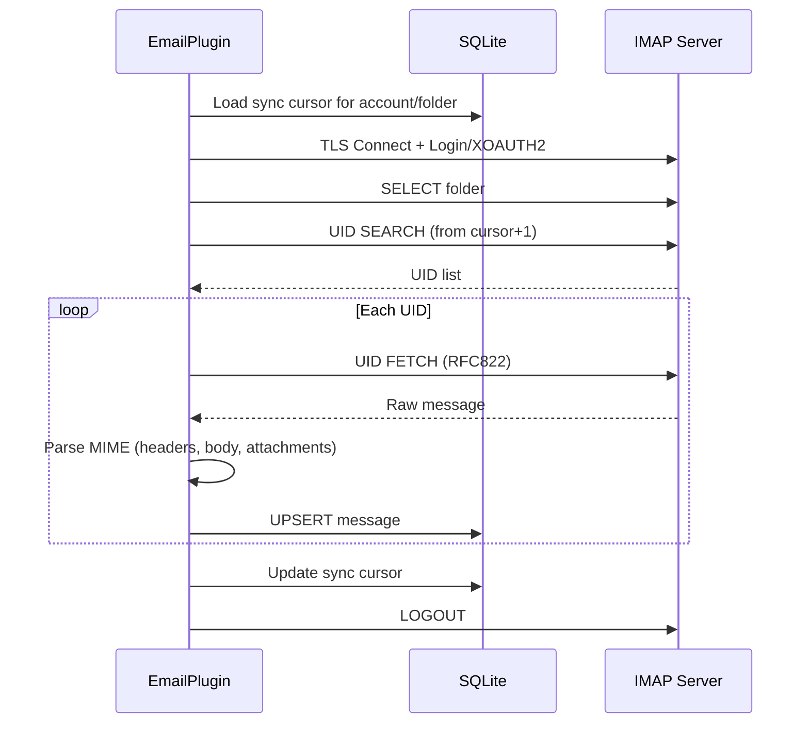

# IMAP Configuration

PRX-Email connects to IMAP servers over TLS using the `rustls` library. It supports password authentication and XOAUTH2 for Gmail and Outlook. Inbox sync is UID-based and incremental, with cursor persistence in the SQLite database.

## Basic IMAP Setup

```rust
use prx_email::plugin::{ImapConfig, AuthConfig};

let imap = ImapConfig {
    host: "imap.example.com".to_string(),
    port: 993,
    user: "you@example.com".to_string(),
    auth: AuthConfig {
        password: Some("your-app-password".to_string()),
        oauth_token: None,
    },
};
```

### Configuration Fields

| Field | Type | Required | Description |
|-------|------|----------|-------------|
| `host` | `String` | Yes | IMAP server hostname (must not be empty) |
| `port` | `u16` | Yes | IMAP server port (typically 993 for TLS) |
| `user` | `String` | Yes | IMAP username (usually the email address) |
| `auth.password` | `Option<String>` | One of | App password for IMAP LOGIN |
| `auth.oauth_token` | `Option<String>` | One of | OAuth access token for XOAUTH2 |

::: warning Authentication
Exactly one of `password` or `oauth_token` must be set. Setting both or neither will result in a validation error.
:::

## Common Provider Settings

| Provider | Host | Port | Auth Method |
|----------|------|------|-------------|
| Gmail | `imap.gmail.com` | 993 | App password or XOAUTH2 |
| Outlook / Office 365 | `outlook.office365.com` | 993 | XOAUTH2 (recommended) |
| Yahoo | `imap.mail.yahoo.com` | 993 | App password |
| Fastmail | `imap.fastmail.com` | 993 | App password |
| ProtonMail Bridge | `127.0.0.1` | 1143 | Bridge password |

## Syncing the Inbox

The `sync` method connects to the IMAP server, selects a folder, fetches new messages by UID, and stores them in SQLite:

```rust
use prx_email::plugin::SyncRequest;

plugin.sync(SyncRequest {
    account_id: 1,
    folder: Some("INBOX".to_string()),
    cursor: None,        // Resume from last saved cursor
    now_ts: now,
    max_messages: 100,   // Fetch at most 100 messages per sync
})?;
```

### Sync Flow



### Incremental Sync

PRX-Email uses UID-based cursors to avoid re-fetching messages. After each sync:

1. The highest UID seen is saved as the cursor
2. The next sync starts from `cursor + 1`
3. Messages with existing `(account_id, message_id)` pairs are updated (UPSERT)

The cursor is stored in the `sync_state` table with the compound key `(account_id, folder_id)`.

## Multi-Folder Sync

Sync multiple folders for the same account:

```rust
for folder in &["INBOX", "Sent", "Drafts", "Archive"] {
    plugin.sync(SyncRequest {
        account_id,
        folder: Some(folder.to_string()),
        cursor: None,
        now_ts: now,
        max_messages: 100,
    })?;
}
```

## Sync Scheduler

For periodic syncing, use the built-in sync runner:

```rust
use prx_email::plugin::{SyncJob, SyncRunnerConfig};

let jobs = vec![
    SyncJob { account_id: 1, folder: "INBOX".into(), max_messages: 100 },
    SyncJob { account_id: 1, folder: "Sent".into(), max_messages: 50 },
    SyncJob { account_id: 2, folder: "INBOX".into(), max_messages: 100 },
];

let config = SyncRunnerConfig {
    max_concurrency: 4,         // Max jobs per runner tick
    base_backoff_seconds: 10,   // Initial backoff on failure
    max_backoff_seconds: 300,   // Maximum backoff (5 minutes)
};

let report = plugin.run_sync_runner(&jobs, now, &config);
println!(
    "Run {}: attempted={}, succeeded={}, failed={}",
    report.run_id, report.attempted, report.succeeded, report.failed
);
```

### Scheduler Behavior

- **Concurrency cap**: At most `max_concurrency` jobs run per tick
- **Failure backoff**: Exponential backoff with `base * 2^failures` formula, capped at `max_backoff_seconds`
- **Due check**: Jobs are skipped if their backoff window has not elapsed
- **State tracking**: Per `account::folder` key, tracks `(next_allowed_at, failure_count)`

## Message Parsing

Incoming messages are parsed using the `mail-parser` crate with the following extraction:

| Field | Source | Notes |
|-------|--------|-------|
| `message_id` | `Message-ID` header | Falls back to SHA-256 of raw bytes |
| `subject` | `Subject` header | |
| `sender` | First address from `From` header | |
| `recipients` | All addresses from `To` header | Comma-separated |
| `body_text` | First `text/plain` part | |
| `body_html` | First `text/html` part | Fallback: raw section extraction |
| `snippet` | First 120 chars of body_text or body_html | |
| `references_header` | `References` header | For threading |
| `attachments` | MIME attachment parts | JSON-serialized metadata |

## TLS

All IMAP connections use TLS via `rustls` with the `webpki-roots` certificate bundle. There is no option to disable TLS or use STARTTLS -- connections are always encrypted from the start.

## Next Steps

- [SMTP Configuration](./smtp) -- Configure email sending
- [OAuth Authentication](./oauth) -- Set up XOAUTH2 for Gmail and Outlook
- [SQLite Storage](../storage/) -- Understand the database schema
