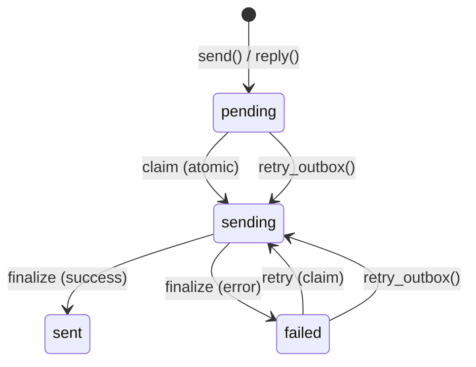

# SMTP Configuration

PRX-Email sends email through SMTP using the `lettre` crate with `rustls` TLS. The outbox pipeline uses an atomic claim-send-finalize workflow to prevent duplicate sends, with exponential backoff retry and deterministic Message-ID idempotency keys.

## Basic SMTP Setup

```rust
use prx_email::plugin::{SmtpConfig, AuthConfig};

let smtp = SmtpConfig {
    host: "smtp.example.com".to_string(),
    port: 465,
    user: "you@example.com".to_string(),
    auth: AuthConfig {
        password: Some("your-app-password".to_string()),
        oauth_token: None,
    },
};
```

### Configuration Fields

| Field | Type | Required | Description |
|-------|------|----------|-------------|
| `host` | `String` | Yes | SMTP server hostname (must not be empty) |
| `port` | `u16` | Yes | SMTP server port (465 for implicit TLS, 587 for STARTTLS) |
| `user` | `String` | Yes | SMTP username (usually the email address) |
| `auth.password` | `Option<String>` | One of | Password for SMTP AUTH PLAIN/LOGIN |
| `auth.oauth_token` | `Option<String>` | One of | OAuth access token for XOAUTH2 |

## Common Provider Settings

| Provider | Host | Port | Auth Method |
|----------|------|------|-------------|
| Gmail | `smtp.gmail.com` | 465 | App password or XOAUTH2 |
| Outlook / Office 365 | `smtp.office365.com` | 587 | XOAUTH2 |
| Yahoo | `smtp.mail.yahoo.com` | 465 | App password |
| Fastmail | `smtp.fastmail.com` | 465 | App password |

## Sending Email

### Basic Send

```rust
use prx_email::plugin::SendEmailRequest;

let response = plugin.send(SendEmailRequest {
    account_id: 1,
    to: "recipient@example.com".to_string(),
    subject: "Hello".to_string(),
    body_text: "Message body here.".to_string(),
    now_ts: now,
    attachment: None,
    failure_mode: None,
});
```

### Reply to a Message

```rust
use prx_email::plugin::ReplyEmailRequest;

let response = plugin.reply(ReplyEmailRequest {
    account_id: 1,
    in_reply_to_message_id: "<original-msg-id@example.com>".to_string(),
    body_text: "Thanks for your message!".to_string(),
    now_ts: now,
    attachment: None,
    failure_mode: None,
});
```

Replies automatically:
- Set the `In-Reply-To` header
- Build the `References` chain from the parent message
- Derive the recipient from the parent message's sender
- Prefix the subject with `Re:`

## Outbox Pipeline

The outbox pipeline ensures reliable email delivery through an atomic state machine:



### State Machine Rules

| Transition | Condition | Guard |
|-----------|-----------|-------|
| `pending` -> `sending` | `claim_outbox_for_send()` | `status IN ('pending','failed') AND next_attempt_at <= now` |
| `sending` -> `sent` | Provider accepted | `update_outbox_status_if_current(status='sending')` |
| `sending` -> `failed` | Provider rejected or network error | `update_outbox_status_if_current(status='sending')` |
| `failed` -> `sending` | `retry_outbox()` | `status IN ('pending','failed') AND next_attempt_at <= now` |

### Idempotency

Each outbox message gets a deterministic Message-ID:

```
<outbox-{id}-{retries}@prx-email.local>
```

This ensures that retries are distinguishable from the original send, and providers that de-duplicate by Message-ID will accept each retry.

### Retry Backoff

Failed sends use exponential backoff:

```
next_attempt_at = now + base_backoff * 2^retries
```

With a base backoff of 5 seconds:

| Retry | Backoff |
|-------|---------|
| 1 | 10s |
| 2 | 20s |
| 3 | 40s |
| 4 | 80s |
| 5 | 160s |
| 6 | 320s |
| 7 | 640s |
| 10 | 5,120s (~85 min) |

### Manual Retry

```rust
use prx_email::plugin::RetryOutboxRequest;

let response = plugin.retry_outbox(RetryOutboxRequest {
    outbox_id: 42,
    now_ts: now,
    failure_mode: None,
});
```

Retry is rejected if:
- The outbox status is `sent` or `sending` (non-retriable)
- The `next_attempt_at` has not been reached yet (`retry_not_due`)

## Attachments

### Sending with an Attachment

```rust
use prx_email::plugin::{SendEmailRequest, AttachmentInput};

let response = plugin.send(SendEmailRequest {
    account_id: 1,
    to: "recipient@example.com".to_string(),
    subject: "Report attached".to_string(),
    body_text: "Please find the report attached.".to_string(),
    now_ts: now,
    attachment: Some(AttachmentInput {
        filename: "report.pdf".to_string(),
        content_type: "application/pdf".to_string(),
        base64: Some(base64_encoded_content),
        path: None,
    }),
    failure_mode: None,
});
```

### Attachment Policy

The `AttachmentPolicy` enforces size and MIME type restrictions:

```rust
use prx_email::plugin::AttachmentPolicy;

let policy = AttachmentPolicy {
    max_size_bytes: 25 * 1024 * 1024,  // 25 MiB
    allowed_content_types: [
        "application/pdf",
        "image/jpeg",
        "image/png",
        "text/plain",
        "application/zip",
    ].into_iter().map(String::from).collect(),
};
```

| Rule | Behavior |
|------|----------|
| Size exceeds `max_size_bytes` | Rejected with `attachment exceeds size limit` |
| MIME type not in `allowed_content_types` | Rejected with `attachment content type is not allowed` |
| Path-based attachment without `attachment_store` | Rejected with `attachment store not configured` |
| Path escapes storage root (`../` traversal) | Rejected with `attachment path escapes storage root` |

### Path-Based Attachments

For attachments stored on disk, configure the attachment store:

```rust
use prx_email::plugin::AttachmentStoreConfig;

let store = AttachmentStoreConfig {
    enabled: true,
    dir: "/var/lib/prx-email/attachments".to_string(),
};
```

Path resolution includes directory traversal guards -- any path that resolves outside the configured storage root is rejected, including symlink-based escapes.

## API Response Format

All send operations return an `ApiResponse<SendResult>`:

```rust
pub struct SendResult {
    pub outbox_id: i64,
    pub status: String,          // "sent" or "failed"
    pub retries: i64,
    pub provider_message_id: Option<String>,
    pub next_attempt_at: i64,
}
```

## Next Steps

- [OAuth Authentication](./oauth) -- Set up XOAUTH2 for providers that require it
- [Configuration Reference](../configuration/) -- All settings and environment variables
- [Troubleshooting](../troubleshooting/) -- Common SMTP issues and solutions
