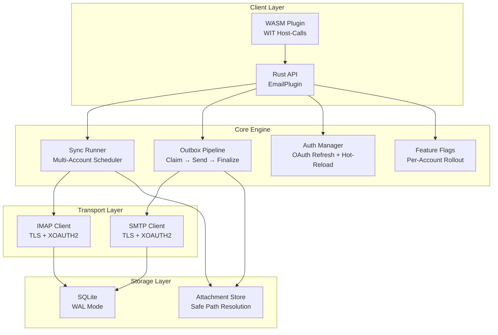

# PRX-Email

**PRX-Email** is a self-hosted email client plugin written in Rust with SQLite persistence and production-hardened primitives. It provides IMAP inbox sync, SMTP sending with an atomic outbox pipeline, OAuth 2.0 authentication for Gmail and Outlook, attachment governance, and a WASM plugin interface for integration into the PRX ecosystem.

PRX-Email is designed for developers and teams who need a reliable, embeddable email backend -- one that handles multi-account sync scheduling, safe outbox delivery with retry and backoff, OAuth token lifecycle management, and feature flag rollout -- all without depending on third-party SaaS email APIs.

## Why PRX-Email?

Most email integrations rely on vendor-specific APIs or fragile IMAP/SMTP wrappers that ignore production concerns like duplicate sends, token expiry, and attachment safety. PRX-Email takes a different approach:

- **Production-hardened outbox.** Atomic claim-and-finalize state machine prevents duplicate sends. Exponential backoff and deterministic Message-ID idempotency keys ensure safe retries.
- **OAuth-first authentication.** Native XOAUTH2 support for both IMAP and SMTP with token expiry tracking, pluggable refresh providers, and hot-reload from environment variables.
- **SQLite-native storage.** WAL mode, bounded checkpointing, and parameterized queries provide fast, reliable local persistence with zero external database dependencies.
- **Extensible via WASM.** The plugin compiles to WebAssembly and exposes email operations through WIT host-calls, with a network safety switch that disables real IMAP/SMTP by default.

## Key Features

<div class="vp-features">

- **IMAP Inbox Sync** -- Connect to any IMAP server with TLS. Sync multiple accounts and folders with UID-based incremental fetching and cursor persistence.

- **SMTP Outbox Pipeline** -- Atomic claim-send-finalize workflow prevents duplicate sends. Failed messages retry with exponential backoff and configurable limits.

- **OAuth 2.0 Authentication** -- XOAUTH2 for Gmail and Outlook. Token expiry tracking, pluggable refresh providers, and environment-based hot-reload without restarts.

- **Multi-Account Sync Scheduler** -- Periodic polling by account and folder with configurable concurrency, failure backoff, and per-run hard caps.

- **SQLite Persistence** -- WAL mode, NORMAL synchronous, 5s busy timeout. Full schema with accounts, folders, messages, outbox, sync state, and feature flags.

- **Attachment Governance** -- Max size limits, MIME whitelist enforcement, and directory traversal guards protect against oversized or malicious attachments.

- **Feature Flag Rollout** -- Per-account feature flags with percentage-based rollout. Control inbox read, search, send, reply, and retry capabilities independently.

- **WASM Plugin Interface** -- Compile to WebAssembly for sandboxed execution in the PRX runtime. Host-calls provide email.sync, list, get, search, send, and reply operations.

- **Observability** -- In-memory runtime metrics (sync attempts/success/failures, send failures, retry count) and structured log payloads with account, folder, message_id, run_id, and error_code.

</div>

## Architecture



## Quick Install

Clone the repository and build:

```bash
git clone https://github.com/openprx/prx_email.git
cd prx_email
cargo build --release
```

Or add as a dependency in your `Cargo.toml`:

```toml
[dependencies]
prx_email = { git = "https://github.com/openprx/prx_email.git" }
```

See the [Installation Guide](./getting-started/installation) for full setup instructions including WASM plugin compilation.

## Documentation Sections

| Section | Description |
|---------|-------------|
| [Installation](./getting-started/installation) | Install PRX-Email, configure dependencies, and build the WASM plugin |
| [Quick Start](./getting-started/quickstart) | Set up your first account and send an email in 5 minutes |
| [Account Management](./accounts/) | Add, configure, and manage email accounts |
| [IMAP Configuration](./accounts/imap) | IMAP server settings, TLS, and folder sync |
| [SMTP Configuration](./accounts/smtp) | SMTP server settings, TLS, and send pipeline |
| [OAuth Authentication](./accounts/oauth) | OAuth 2.0 setup for Gmail and Outlook |
| [SQLite Storage](./storage/) | Database schema, WAL mode, performance tuning, and maintenance |
| [WASM Plugins](./plugins/) | Build and deploy the WASM plugin with WIT host-calls |
| [Configuration Reference](./configuration/) | All environment variables, runtime settings, and policy options |
| [Troubleshooting](./troubleshooting/) | Common issues and solutions |

## Project Info

- **License:** MIT OR Apache-2.0
- **Language:** Rust (2024 edition)
- **Repository:** [github.com/openprx/prx_email](https://github.com/openprx/prx_email)
- **Storage:** SQLite (rusqlite with bundled feature)
- **IMAP:** `imap` crate with rustls TLS
- **SMTP:** `lettre` crate with rustls TLS
