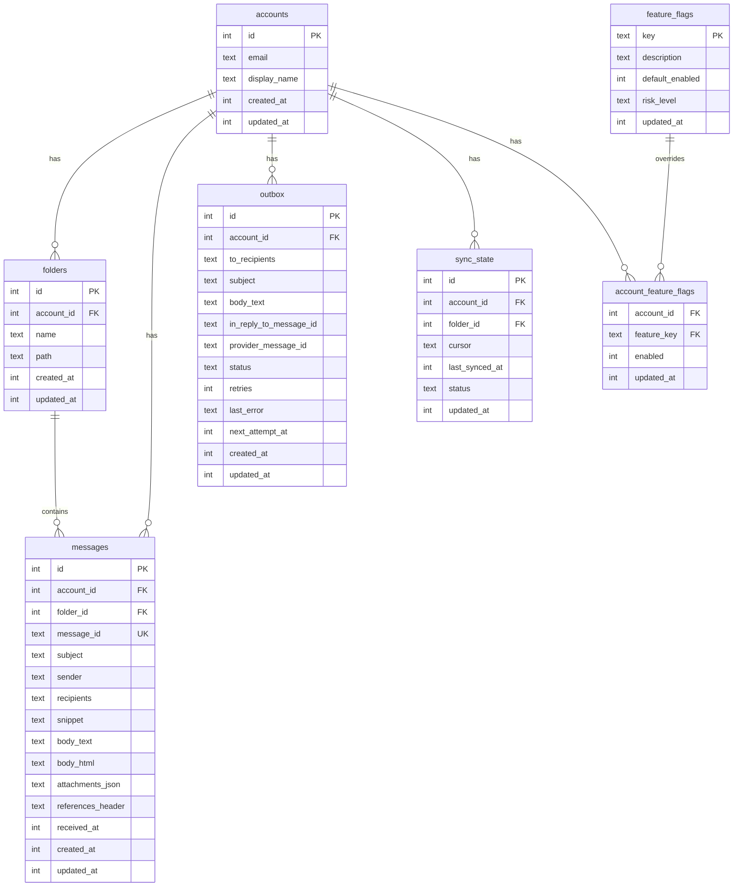

# SQLite Storage

PRX-Email uses SQLite as its sole storage backend, accessed through the `rusqlite` crate with the bundled SQLite compilation. The database runs in WAL mode with foreign keys enabled, providing fast concurrent reads and reliable write isolation.

## Database Configuration

### Default Settings

| Setting | Value | Description |
|---------|-------|-------------|
| `journal_mode` | WAL | Write-Ahead Logging for concurrent reads |
| `synchronous` | NORMAL | Balanced durability/performance |
| `foreign_keys` | ON | Enforce referential integrity |
| `busy_timeout` | 5000ms | Wait time for locked database |
| `wal_autocheckpoint` | 1000 pages | Automatic WAL checkpoint threshold |

### Custom Configuration

```rust
use prx_email::db::{EmailStore, StoreConfig, SynchronousMode};

let config = StoreConfig {
    enable_wal: true,
    busy_timeout_ms: 5_000,
    wal_autocheckpoint_pages: 1_000,
    synchronous: SynchronousMode::Normal,
};

let store = EmailStore::open_with_config("./email.db", &config)?;
```

### Synchronous Modes

| Mode | Durability | Performance | Use Case |
|------|-----------|-------------|----------|
| `Full` | Maximum | Slowest writes | Financial or compliance workloads |
| `Normal` | Good (default) | Balanced | General production use |
| `Off` | Minimal | Fastest writes | Development and testing only |

### In-Memory Database

For testing, use an in-memory database:

```rust
let store = EmailStore::open_in_memory()?;
store.migrate()?;
```

## Schema

The database schema is applied through incremental migrations. Running `store.migrate()` applies all pending migrations.

### Tables



### Indexes

| Table | Index | Purpose |
|-------|-------|---------|
| `messages` | `(account_id)` | Filter messages by account |
| `messages` | `(folder_id)` | Filter messages by folder |
| `messages` | `(subject)` | LIKE search on subjects |
| `messages` | `(account_id, message_id)` | Unique constraint for UPSERT |
| `outbox` | `(account_id)` | Filter outbox by account |
| `outbox` | `(status, next_attempt_at)` | Claim eligible outbox records |
| `sync_state` | `(account_id, folder_id)` | Unique constraint for UPSERT |
| `account_feature_flags` | `(account_id)` | Feature flag lookups |

## Migrations

Migrations are embedded in the binary and applied in order:

| Migration | Description |
|-----------|-------------|
| `0001_init.sql` | Accounts, folders, messages, sync_state tables |
| `0002_outbox.sql` | Outbox table for send pipeline |
| `0003_rollout.sql` | Feature flags and account feature flags |
| `0005_m41.sql` | M4.1 schema refinements |
| `0006_m42_perf.sql` | M4.2 performance indexes |

Additional columns (`body_html`, `attachments_json`, `references_header`) are added via `ALTER TABLE` if not present.

## Performance Tuning

### Read-Heavy Workloads

For applications that read much more than they write (typical email clients):

```rust
let config = StoreConfig {
    enable_wal: true,              // Concurrent reads
    busy_timeout_ms: 10_000,       // Higher timeout for contention
    wal_autocheckpoint_pages: 2_000, // Less frequent checkpoints
    synchronous: SynchronousMode::Normal,
};
```

### Write-Heavy Workloads

For high-volume sync operations:

```rust
let config = StoreConfig {
    enable_wal: true,
    busy_timeout_ms: 5_000,
    wal_autocheckpoint_pages: 500, // More frequent checkpoints
    synchronous: SynchronousMode::Normal,
};
```

### Query Plan Analysis

Check slow queries with `EXPLAIN QUERY PLAN`:

```sql
EXPLAIN QUERY PLAN
SELECT * FROM messages
WHERE account_id = 1 AND subject LIKE '%invoice%'
ORDER BY received_at DESC LIMIT 50;
```

## Capacity Planning

### Growth Drivers

| Table | Growth Pattern | Retention Strategy |
|-------|---------------|-------------------|
| `messages` | Dominant table; grows with each sync | Purge old messages periodically |
| `outbox` | Accumulates sent + failed history | Delete old sent records |
| WAL file | Spikes during write bursts | Automatic checkpoint |

### Monitoring Thresholds

- Track DB file size and WAL size independently
- Alert when WAL remains large over multiple checkpoints
- Alert when outbox failed backlog exceeds operational SLO

## Data Maintenance

### Cleanup Helpers

```rust
// Delete sent outbox records older than 30 days
let cutoff = now - 30 * 86400;
let deleted = repo.delete_sent_outbox_before(cutoff)?;
println!("Deleted {} old sent records", deleted);

// Delete messages older than 90 days
let cutoff = now - 90 * 86400;
let deleted = repo.delete_old_messages_before(cutoff)?;
println!("Deleted {} old messages", deleted);
```

### Maintenance SQL

Check outbox status distribution:

```sql
SELECT status, COUNT(*) FROM outbox GROUP BY status;
```

Message age distribution:

```sql
SELECT
  CASE
    WHEN received_at >= strftime('%s','now') - 86400 THEN 'lt_1d'
    WHEN received_at >= strftime('%s','now') - 604800 THEN 'lt_7d'
    ELSE 'ge_7d'
  END AS age_bucket,
  COUNT(*)
FROM messages
GROUP BY age_bucket;
```

WAL checkpoint and compaction:

```sql
PRAGMA wal_checkpoint(TRUNCATE);
VACUUM;
```

::: warning VACUUM
`VACUUM` rebuilds the entire database file and requires free disk space equal to the database size. Run it in a maintenance window after large deletes.
:::

## SQL Safety

All database queries use parameterized statements to prevent SQL injection:

```rust
// Safe: parameterized query
conn.execute(
    "SELECT * FROM messages WHERE account_id = ?1 AND message_id = ?2",
    params![account_id, message_id],
)?;
```

Dynamic identifiers (table names, column names) are validated against `^[a-zA-Z_][a-zA-Z0-9_]{0,62}$` before use in SQL strings.

## Next Steps

- [Configuration Reference](../configuration/) -- All runtime settings
- [Troubleshooting](../troubleshooting/) -- Database-related issues
- [IMAP Configuration](../accounts/imap) -- Understand sync data flow
