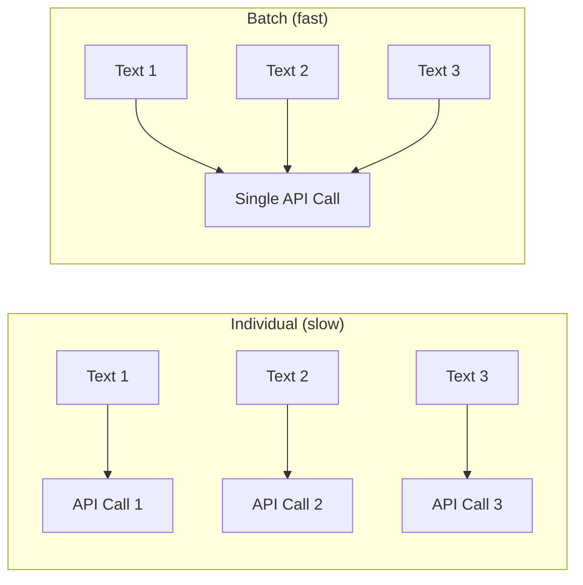

# Batch Processing

When working with large memory sets, embedding one text at a time is inefficient. PRX-Memory supports batch embedding to reduce API round trips and improve throughput.

## How Batch Embedding Works

Instead of making individual API calls for each memory, batch processing groups multiple texts into a single request. Most embedding providers support batch sizes of 100--2048 texts per call.



## Use Cases

### Initial Import

When importing a large set of existing knowledge, use `memory_import` to load memories and trigger batch embedding:

```json
{
  "jsonrpc": "2.0",
  "id": 1,
  "method": "tools/call",
  "params": {
    "name": "memory_import",
    "arguments": {
      "data": "... exported memory JSON ..."
    }
  }
}
```

### Re-embedding After Model Change

When switching to a new embedding model, the `memory_reembed` tool processes all stored memories in batches:

```json
{
  "jsonrpc": "2.0",
  "id": 1,
  "method": "tools/call",
  "params": {
    "name": "memory_reembed",
    "arguments": {}
  }
}
```

### Storage Compaction

The `memory_compact` tool optimizes storage and can trigger re-embedding for entries with outdated or missing vectors:

```json
{
  "jsonrpc": "2.0",
  "id": 1,
  "method": "tools/call",
  "params": {
    "name": "memory_compact",
    "arguments": {}
  }
}
```

## Performance Tips

| Tip | Description |
|-----|-------------|
| Use batch-friendly providers | Jina and OpenAI-compatible endpoints support large batch sizes |
| Schedule during low usage | Batch operations compete for the same API quota as real-time queries |
| Monitor via metrics | Use the `/metrics` endpoint to track embedding call counts and latencies |
| Choose efficient models | Smaller models (768 dimensions) embed faster than larger ones (3072 dimensions) |

## Rate Limiting

Most embedding providers enforce rate limits. PRX-Memory handles rate limit responses (HTTP 429) with automatic backoff. If you encounter persistent rate limiting:

- Reduce the batch size by processing fewer memories at a time.
- Use a provider with higher rate limits.
- Spread batch operations over a longer time window.

::: tip
For large-scale re-embedding operations, consider using a local inference server to avoid rate limits entirely. Set `PRX_EMBED_PROVIDER=openai-compatible` and point `PRX_EMBED_BASE_URL` to your local server.
:::

## Next Steps

- [Supported Models](./models) -- Choose the right embedding model
- [Storage Backends](../storage/) -- Where vectors are stored
- [Configuration Reference](../configuration/) -- All environment variables
