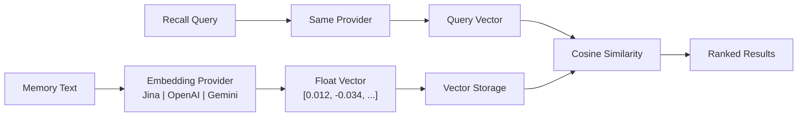

# Embedding Engine

The embedding engine is the foundation of PRX-Memory's semantic retrieval capability. It converts text memories into high-dimensional vectors that capture meaning, enabling similarity-based search that goes beyond keyword matching.

## How It Works

When a memory is stored with embedding enabled, PRX-Memory:

1. Sends the memory text to the configured embedding provider.
2. Receives a vector representation (typically 768--3072 dimensions).
3. Stores the vector alongside the memory metadata.
4. Uses the vector for cosine similarity search during recall.



## Provider Architecture

The `prx-memory-embed` crate defines a provider trait that all embedding backends implement. This design allows switching providers without changing application code.

Supported providers:

| Provider | Environment Key | Description |
|----------|----------------|-------------|
| OpenAI-compatible | `PRX_EMBED_PROVIDER=openai-compatible` | Any OpenAI-compatible API (OpenAI, Azure, local servers) |
| Jina | `PRX_EMBED_PROVIDER=jina` | Jina AI embedding models |
| Gemini | `PRX_EMBED_PROVIDER=gemini` | Google Gemini embedding models |

## Configuration

Set the provider and credentials through environment variables:

```bash
PRX_EMBED_PROVIDER=jina
PRX_EMBED_API_KEY=your_api_key
PRX_EMBED_MODEL=jina-embeddings-v3
PRX_EMBED_BASE_URL=https://api.jina.ai  # optional, for custom endpoints
```

::: tip Provider Fallback Keys
If `PRX_EMBED_API_KEY` is not set, the system falls back to provider-specific keys:
- Jina: `JINA_API_KEY`
- Gemini: `GEMINI_API_KEY`
:::

## When to Enable Embeddings

| Scenario | Embeddings Needed? |
|----------|--------------------|
| Small memory set (<100 entries) | Optional -- lexical search may suffice |
| Large memory set (1000+ entries) | Recommended -- vector similarity greatly improves recall |
| Natural language queries | Recommended -- captures semantic meaning |
| Exact tag/scope filtering | Not required -- lexical search handles this |
| Cross-language recall | Recommended -- multilingual models work across languages |

## Performance Characteristics

- **Latency:** 50--200ms per embedding call depending on provider and model.
- **Batch mode:** Group multiple texts in a single API call to reduce round trips.
- **Local caching:** Vectors are stored locally and reused; only new or changed memories require embedding calls.
- **100k benchmark:** p95 retrieval under 123ms for lexical+importance+recency recall on 100,000 entries (without network calls).

## Next Steps

- [Supported Models](./models) -- Detailed model comparison
- [Batch Processing](./batch-processing) -- Efficient bulk embedding
- [Reranking](../reranking/) -- Second-stage reranking for better precision
