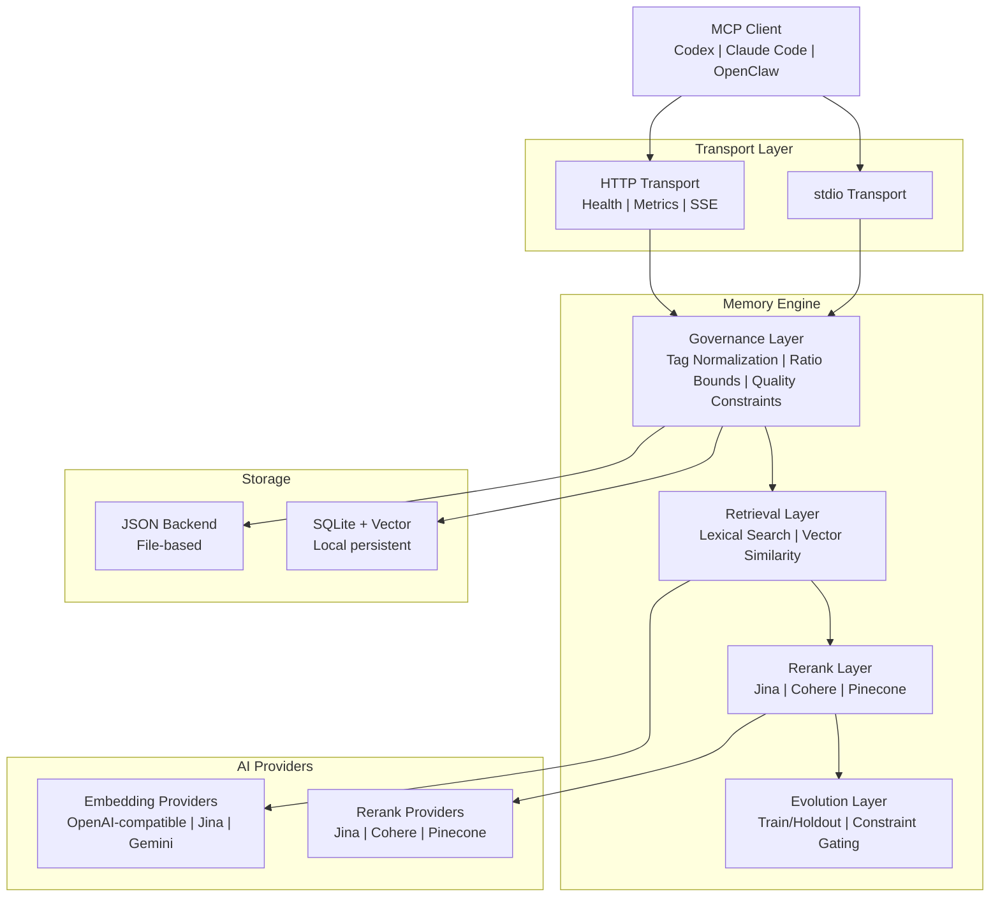

# PRX-Memory

**PRX-Memory** is a local-first semantic memory engine designed for coding agents. It combines embedding-based retrieval, reranking, governance controls, and measurable evolution into a single MCP-compatible component. PRX-Memory ships as a standalone daemon (`prx-memoryd`) that communicates over stdio or HTTP, making it compatible with Codex, Claude Code, OpenClaw, OpenPRX, and any other MCP client.

PRX-Memory focuses on **reusable engineering knowledge**, not raw logs. The system stores structured memories with tags, scopes, and importance scores, then retrieves them using a combination of lexical search, vector similarity, and optional reranking -- all governed by quality and safety constraints.

## Why PRX-Memory?

Most coding agents treat memory as an afterthought -- flat files, unstructured logs, or vendor-locked cloud services. PRX-Memory takes a different approach:

- **Local-first.** All data stays on your machine. No cloud dependency, no telemetry, no data leaving your network.
- **Structured and governed.** Every memory entry follows a standardized format with tags, scopes, categories, and quality constraints. Tag normalization and ratio bounds prevent drift.
- **Semantic retrieval.** Combine lexical matching with vector similarity and optional reranking to find the most relevant memories for a given context.
- **Measurable evolution.** The `memory_evolve` tool uses train/holdout splits and constraint gating to accept or reject candidate improvements -- no guesswork.
- **MCP native.** First-class support for the Model Context Protocol over stdio and HTTP transports, with resource templates, skill manifests, and streaming sessions.

## Key Features

<div class="vp-features">

- **Multi-Provider Embedding** -- Supports OpenAI-compatible, Jina, and Gemini embedding providers through a unified adapter interface. Switch providers by changing an environment variable.

- **Reranking Pipeline** -- Optional second-stage reranking using Jina, Cohere, or Pinecone rerankers to improve retrieval precision beyond raw vector similarity.

- **Governance Controls** -- Structured memory format with tag normalization, ratio bounds, periodic maintenance, and quality constraints ensure memory quality stays high over time.

- **Memory Evolution** -- The `memory_evolve` tool evaluates candidate changes using train/holdout acceptance testing and constraint gating, providing measurable improvement guarantees.

- **Dual Transport MCP Server** -- Run as a stdio server for direct integration or as an HTTP server with health checks, Prometheus metrics, and streaming sessions.

- **Skill Distribution** -- Built-in governance skill packages discoverable through MCP resource and tool protocols, with payload templates for standardized memory operations.

- **Observability** -- Prometheus metrics endpoint, Grafana dashboard templates, configurable alert thresholds, and cardinality controls for production deployments.

</div>

## Architecture



## Quick Start

Build and run the memory daemon:

```bash
cargo build -p prx-memory-mcp --bin prx-memoryd

PRX_MEMORYD_TRANSPORT=stdio \
PRX_MEMORY_DB=./data/memory-db.json \
./target/debug/prx-memoryd
```

Or install via Cargo:

```bash
cargo install prx-memory-mcp
```

See the [Installation Guide](./getting-started/installation) for all methods and configuration options.

## Workspace Crates

| Crate | Description |
|-------|-------------|
| `prx-memory-core` | Core scoring and evolution domain primitives |
| `prx-memory-embed` | Embedding provider abstraction and adapters |
| `prx-memory-rerank` | Rerank provider abstraction and adapters |
| `prx-memory-ai` | Unified provider abstraction for embeddings and rerank |
| `prx-memory-skill` | Built-in governance skill payloads |
| `prx-memory-storage` | Local persistent storage engine (JSON, SQLite, LanceDB) |
| `prx-memory-mcp` | MCP server surface with stdio and HTTP transports |

## Documentation Sections

| Section | Description |
|---------|-------------|
| [Installation](./getting-started/installation) | Build from source or install via Cargo |
| [Quick Start](./getting-started/quickstart) | Get PRX-Memory running in 5 minutes |
| [Embedding Engine](./embedding/) | Embedding providers and batch processing |
| [Supported Models](./embedding/models) | OpenAI-compatible, Jina, Gemini models |
| [Reranking Engine](./reranking/) | Second-stage reranking pipeline |
| [Storage Backends](./storage/) | JSON, SQLite, and vector search |
| [MCP Integration](./mcp/) | MCP protocol, tools, resources, and templates |
| [Rust API Reference](./api/) | Library API for embedding PRX-Memory in Rust projects |
| [Configuration](./configuration/) | All environment variables and profiles |
| [Troubleshooting](./troubleshooting/) | Common issues and solutions |

## Project Info

- **License:** MIT OR Apache-2.0
- **Language:** Rust (2024 edition)
- **Repository:** [github.com/openprx/prx-memory](https://github.com/openprx/prx-memory)
- **Minimum Rust:** stable toolchain
- **Transports:** stdio, HTTP
