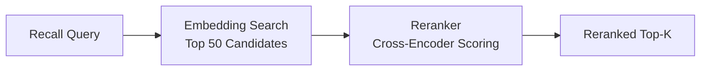

# Reranking Engine

Reranking is an optional second-stage retrieval step that reorders candidate results using a dedicated cross-encoder model. While embedding-based retrieval is fast, it operates on pre-computed vectors that may not capture fine-grained relevance. Reranking applies a more powerful model to a smaller candidate set, significantly improving precision.

## How It Works

1. **First stage (retrieval):** Vector similarity search returns a broad set of candidates (e.g., top 50).
2. **Second stage (reranking):** A cross-encoder model scores each candidate against the query, producing a refined ranking.
3. **Final result:** The top-k reranked results are returned to the caller.



## Why Reranking Matters

| Metric | Without Reranking | With Reranking |
|--------|-------------------|----------------|
| Recall coverage | High (broad retrieval) | Same (unchanged) |
| Precision at top-5 | Moderate | Significantly improved |
| Latency | Lower (~50ms) | Higher (~150ms additional) |
| API cost | Embedding only | Embedding + reranking |

Reranking is most valuable when:

- Your memory database is large (1000+ entries).
- Queries are ambiguous or natural language.
- Precision at the top of the result list matters more than latency.

## Supported Providers

| Provider | Config Value | Description |
|----------|-------------|-------------|
| Jina | `PRX_RERANK_PROVIDER=jina` | Jina AI reranker models |
| Cohere | `PRX_RERANK_PROVIDER=cohere` | Cohere rerank API |
| Pinecone | `PRX_RERANK_PROVIDER=pinecone` | Pinecone rerank service |
| Pinecone-compatible | `PRX_RERANK_PROVIDER=pinecone-compatible` | Custom Pinecone-compatible endpoints |
| None | `PRX_RERANK_PROVIDER=none` | Disable reranking |

## Configuration

```bash
PRX_RERANK_PROVIDER=cohere
PRX_RERANK_API_KEY=your_cohere_key
PRX_RERANK_MODEL=rerank-v3.5
```

::: tip Provider Fallback Keys
If `PRX_RERANK_API_KEY` is not set, the system falls back to provider-specific keys:
- Jina: `JINA_API_KEY`
- Cohere: `COHERE_API_KEY`
- Pinecone: `PINECONE_API_KEY`
:::

## Disabling Reranking

To run without reranking, either omit the `PRX_RERANK_PROVIDER` variable or set it explicitly:

```bash
PRX_RERANK_PROVIDER=none
```

Recall still functions using lexical matching and vector similarity without the reranking stage.

## Next Steps

- [Reranking Models](./models) -- Detailed model comparison
- [Embedding Engine](../embedding/) -- First-stage retrieval
- [Configuration Reference](../configuration/) -- All environment variables
