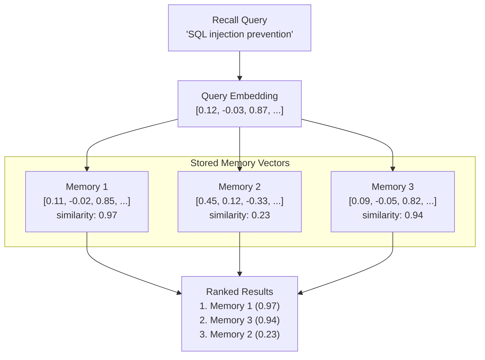

# Vector Search

Vector search is the core mechanism that enables semantic memory retrieval in PRX-Memory. Instead of matching keywords, vector search compares the mathematical similarity between query and memory embeddings to find conceptually related results.

## How It Works

1. **Query embedding:** The recall query is sent to the configured embedding provider, producing a vector.
2. **Similarity computation:** The query vector is compared against all stored memory vectors using cosine similarity.
3. **Scoring:** Each memory receives a similarity score between -1.0 and 1.0 (higher is more similar).
4. **Ranking:** Results are sorted by score and combined with other signals (lexical match, importance, recency).



## Cosine Similarity

PRX-Memory uses cosine similarity as the distance metric. Cosine similarity measures the angle between two vectors, ignoring magnitude:

```
similarity(A, B) = (A . B) / (|A| * |B|)
```

| Score | Meaning |
|-------|---------|
| 0.95--1.0 | Near-identical meaning |
| 0.80--0.95 | Highly related |
| 0.60--0.80 | Somewhat related |
| < 0.60 | Likely unrelated |

## Combined Ranking

Vector similarity is one signal in PRX-Memory's multi-signal ranking. The final score combines:

| Signal | Weight | Description |
|--------|--------|-------------|
| Vector similarity | High | Semantic relevance from embedding comparison |
| Lexical match | Medium | Keyword overlap between query and memory text |
| Importance score | Medium | User-assigned or system-computed importance |
| Recency | Low | More recent memories get a small boost |

The exact weighting depends on the recall configuration and whether embeddings and reranking are enabled.

## Performance

The 100k-entry benchmark shows:

| Metric | Value |
|--------|-------|
| Dataset size | 100,000 entries |
| p95 latency | 122.683ms |
| Threshold | < 300ms |
| Method | Lexical + importance + recency (without network calls) |

::: info
This benchmark measures the retrieval ranking path only, without network embedding or rerank calls. End-to-end latency depends on provider response times.
:::

## Scaling Considerations

| Dataset Size | Recommended Approach |
|-------------|---------------------|
| < 10,000 | Brute-force cosine similarity (JSON or SQLite backend) |
| 10,000--100,000 | SQLite with in-memory vector scan |
| > 100,000 | LanceDB with ANN indexing |

For datasets exceeding 100,000 entries, enable the LanceDB backend for approximate nearest neighbor (ANN) search, which provides sub-linear query time.

## Next Steps

- [Embedding Engine](../embedding/) -- How vectors are generated
- [Reranking](../reranking/) -- Second-stage precision improvement
- [Storage Backends](./index) -- Choose the right storage backend
