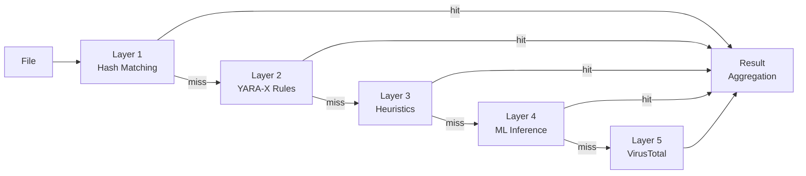

# Detection Engine

PRX-SD uses a multi-layer detection pipeline to identify malware. Each layer uses a different technique, and they execute in sequence from fastest to most thorough. This defense-in-depth approach ensures that even if one layer misses a threat, subsequent layers can catch it.

## Pipeline Overview

The detection pipeline processes each file through up to five layers:



## Layer Summary

| Layer | Engine | Speed | Coverage | Required |
|-------|--------|-------|----------|----------|
| **Layer 1** | LMDB Hash Matching | ~1 microsecond/file | Known malware (exact match) | Yes (default) |
| **Layer 2** | YARA-X Rule Scan | ~0.3 ms/file | Pattern-based (38,800+ rules) | Yes (default) |
| **Layer 3** | Heuristic Analysis | ~1-5 ms/file | Behavioral indicators by file type | Yes (default) |
| **Layer 4** | ONNX ML Inference | ~10-50 ms/file | Novel/polymorphic malware | Optional (`--features ml`) |
| **Layer 5** | VirusTotal API | ~200-500 ms/file | 70+ vendor consensus | Optional (`--features virustotal`) |

## Layer 1: Hash Matching

The fastest layer. PRX-SD computes the SHA-256 hash of each file and looks it up in an LMDB database containing known-malicious hashes. LMDB provides O(1) lookup time with memory-mapped I/O, making this layer essentially free in terms of performance.

**Data sources:**
- abuse.ch MalwareBazaar (last 48 hours, updated every 5 minutes)
- abuse.ch URLhaus (hourly updates)
- abuse.ch Feodo Tracker (Emotet/Dridex/TrickBot, every 5 minutes)
- abuse.ch ThreatFox (IOC sharing platform)
- VirusShare (20M+ MD5 hashes, optional `--full` update)
- Built-in blocklist (EICAR, WannaCry, NotPetya, Emotet, and more)

A hash match results in an immediate `MALICIOUS` verdict. The remaining layers are skipped for that file.

See [Hash Matching](./hash-matching) for details.

## Layer 2: YARA-X Rules

If no hash match is found, the file is scanned against 38,800+ YARA rules using the YARA-X engine (the next-generation Rust rewrite of YARA). Rules detect malware by matching byte patterns, strings, and structural conditions within file contents.

**Rule sources:**
- 64 built-in rules (ransomware, trojans, backdoors, rootkits, miners, webshells)
- Yara-Rules/rules (community-maintained, GitHub)
- Neo23x0/signature-base (high-quality APT and commodity malware rules)
- ReversingLabs YARA (commercial-grade open-source rules)
- ESET IOC (advanced persistent threat tracking)
- InQuest (document malware: OLE, DDE, malicious macros)

A YARA rule match results in a `MALICIOUS` verdict with the rule name included in the report.

See [YARA Rules](./yara-rules) for details.

## Layer 3: Heuristic Analysis

Files that pass hash and YARA checks are analyzed using file-type-aware heuristics. PRX-SD identifies the file type via magic number detection and applies targeted checks:

| File Type | Heuristic Checks |
|-----------|-----------------|
| PE (Windows) | Section entropy, suspicious API imports, packer detection, timestamp anomalies |
| ELF (Linux) | Section entropy, LD_PRELOAD references, cron/systemd persistence, SSH backdoor patterns |
| Mach-O (macOS) | Section entropy, dylib injection, LaunchAgent persistence, Keychain access |
| Office (docx/xlsx) | VBA macros, DDE fields, external template links, auto-execute triggers |
| PDF | Embedded JavaScript, Launch actions, URI actions, obfuscated streams |

Each check contributes to a cumulative score:

| Score | Verdict |
|-------|---------|
| 0 - 29 | **Clean** |
| 30 - 59 | **Suspicious** -- manual review recommended |
| 60 - 100 | **Malicious** -- high-confidence threat |

See [Heuristic Analysis](./heuristics) for details.

## Layer 4: ML Inference (Optional)

When compiled with the `ml` feature, PRX-SD can run files through an ONNX machine learning model trained on millions of malware samples. This layer is particularly effective at detecting novel and polymorphic malware that evades signature-based detection.

```bash
# Build with ML support
cargo build --release --features ml
```

The ML model runs locally using ONNX Runtime. No cloud connection is required.

::: tip When to Use ML
ML inference adds latency (~10-50 ms per file). Enable it for targeted scans of suspicious files or directories, rather than full-disk scans where the first three layers provide sufficient coverage.
:::

## Layer 5: VirusTotal (Optional)

When compiled with the `virustotal` feature and configured with an API key, PRX-SD can submit file hashes to VirusTotal for consensus from 70+ antivirus vendors.

```bash
# Build with VirusTotal support
cargo build --release --features virustotal

# Configure API key
sd config set virustotal.api_key "YOUR_API_KEY"
```

::: warning Rate Limits
The free VirusTotal API allows 4 requests per minute and 500 per day. PRX-SD respects these limits automatically. This layer is best used as a final confirmation step, not for bulk scanning.
:::

## Result Aggregation

When a file is scanned through multiple layers, the final verdict is determined by the **highest severity** found across all layers:

```
MALICIOUS > SUSPICIOUS > CLEAN
```

If Layer 1 returns `MALICIOUS`, the file is reported as malicious regardless of what other layers might say. If Layer 3 returns `SUSPICIOUS` and no other layer returns `MALICIOUS`, the file is reported as suspicious.

The scan report includes details from every layer that produced a finding, giving the analyst full context.

## Disabling Layers

For specialized use cases, individual layers can be disabled:

```bash
# Hash-only scan (fastest, known threats only)
sd scan /path --no-yara --no-heuristics

# Skip heuristics (hash + YARA only)
sd scan /path --no-heuristics
```

## Next Steps

- [Hash Matching](./hash-matching) -- Deep dive into LMDB hash database
- [YARA Rules](./yara-rules) -- Rule sources and custom rule management
- [Heuristic Analysis](./heuristics) -- File-type-aware behavioral checks
- [Supported File Types](./file-types) -- File format matrix and magic detection
