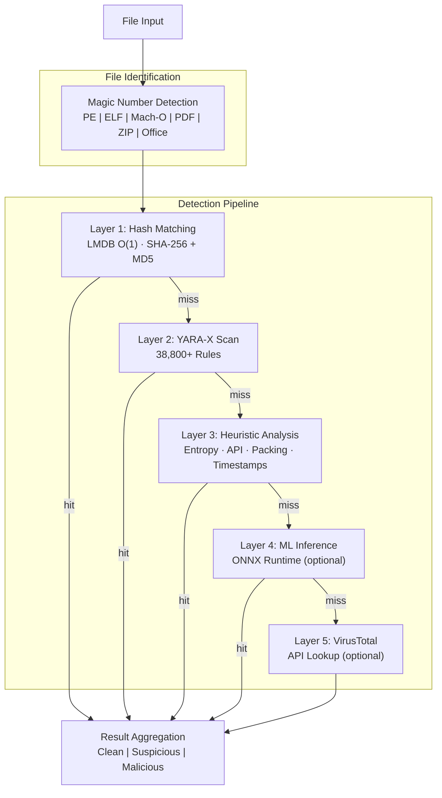

# PRX-SD

**PRX-SD** is a high-performance, open-source antivirus engine written in Rust. It combines hash-based signature matching, 38,800+ YARA rules, file-type-aware heuristic analysis, and optional ML inference into a single multi-layer detection pipeline. PRX-SD ships as a command-line tool (`sd`), a system daemon for real-time protection, and a Tauri + Vue 3 desktop GUI.

PRX-SD is designed for security engineers, system administrators, and incident responders who need a fast, transparent, and extensible malware detection engine -- one that can scan millions of files, monitor directories in real time, detect rootkits, and integrate with external threat intelligence feeds -- all without relying on opaque commercial black boxes.

## Why PRX-SD?

Traditional antivirus products are closed-source, resource-heavy, and difficult to customize. PRX-SD takes a different approach:

- **Open and auditable.** Every detection rule, heuristic check, and scoring threshold is visible in source code. No hidden telemetry, no cloud dependency required.
- **Multi-layer defense.** Five independent detection layers ensure that if one method misses a threat, the next catches it.
- **Rust-first performance.** Zero-copy I/O, LMDB O(1) hash lookups, and parallel scanning deliver throughput that rivals commercial engines on commodity hardware.
- **Extensible by design.** WASM plugins, custom YARA rules, and a modular architecture make PRX-SD easy to adapt to specialized environments.

## Key Features

<div class="vp-features">

- **Multi-Layer Detection Pipeline** -- Hash matching, YARA-X rules, heuristic analysis, optional ML inference, and optional VirusTotal integration work in sequence to maximize detection rates.

- **Real-Time Protection** -- The `sd monitor` daemon watches directories using inotify (Linux) / FSEvents (macOS) and scans new or modified files instantly.

- **Ransomware Defense** -- Dedicated YARA rules and heuristics detect ransomware families including WannaCry, LockBit, Conti, REvil, BlackCat, and more.

- **38,800+ YARA Rules** -- Aggregated from 8 community and commercial-grade sources: Yara-Rules, Neo23x0 signature-base, ReversingLabs, ESET IOC, InQuest, and 64 built-in rules.

- **LMDB Hash Database** -- SHA-256 and MD5 hashes from abuse.ch MalwareBazaar, URLhaus, Feodo Tracker, ThreatFox, VirusShare (20M+), and a built-in blocklist are stored in LMDB for O(1) lookups.

- **Cross-Platform** -- Linux (x86_64, aarch64), macOS (Apple Silicon, Intel), and Windows (WSL2). Native file-type detection for PE, ELF, Mach-O, PDF, Office, and archive formats.

- **Linux-Exclusive Security** -- Process memory scanning, kernel rootkit detection, eBPF syscall tracing, and fanotify pre-execution blocking provide deep system-level protection on Linux.

- **WASM Plugin System** -- Extend detection logic, add custom scanners, or integrate proprietary threat feeds through WebAssembly plugins.

</div>

## Architecture



## Quick Install

```bash
curl -fsSL https://raw.githubusercontent.com/openprx/prx-sd/main/install.sh | bash
```

```bash
# macOS / Linux (Homebrew)
brew install openprx/tap/sd

# Windows (Scoop)
scoop bucket add openprx https://github.com/openprx/scoop-bucket
scoop install sd
```

Or install via Cargo:

```bash
cargo install prx-sd
```

Then update the signature database:

```bash
sd update
```

See the [Installation Guide](./getting-started/installation) for all methods including Docker and building from source.

## Documentation Sections

| Section | Description |
|---------|-------------|
| [Installation](./getting-started/installation) | Install PRX-SD on Linux, macOS, or Windows WSL2 |
| [Quick Start](./getting-started/quickstart) | Get PRX-SD scanning in 5 minutes |
| [File & Directory Scanning](./scanning/file-scan) | Full reference for the `sd scan` command |
| [Memory Scanning](./scanning/memory-scan) | Scan running process memory for threats |
| [Rootkit Detection](./scanning/rootkit) | Detect kernel and userspace rootkits |
| [USB Scanning](./scanning/usb-scan) | Scan removable media automatically |
| [Detection Engine](./detection/) | How the multi-layer pipeline works |
| [Hash Matching](./detection/hash-matching) | LMDB hash database and data sources |
| [YARA Rules](./detection/yara-rules) | 38,800+ rules from 8 sources |
| [Heuristic Analysis](./detection/heuristics) | File-type-aware behavioral analysis |
| [Supported File Types](./detection/file-types) | File format matrix and magic detection |
| [Real-Time Monitoring](./realtime/monitor) | Watch directories for changes |
| [Daemon Mode](./realtime/daemon) | Run as background service |
| [Quarantine](./quarantine/) | Encrypted quarantine vault |
| [Configuration](./configuration/) | Engine settings reference |
| [Alerting](./alerts/webhook) | Webhook and email alerts |

## Project Info

- **License:** MIT OR Apache-2.0
- **Language:** Rust (2024 edition)
- **Repository:** [github.com/openprx/prx-sd](https://github.com/openprx/prx-sd)
- **Minimum Rust:** 1.85.0
- **GUI:** Tauri 2 + Vue 3
