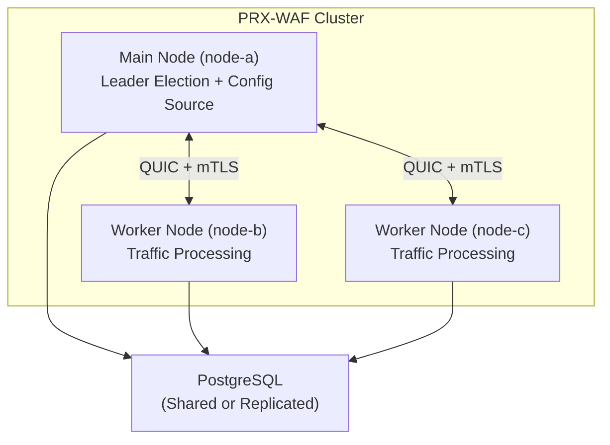

# Cluster Mode

PRX-WAF supports multi-node cluster deployments for horizontal scaling and high availability. Cluster mode uses QUIC-based inter-node communication, Raft-inspired leader election, and automatic synchronization of rules, configuration, and security events across all nodes.

::: info
Cluster mode is fully opt-in. By default, PRX-WAF runs in standalone mode with zero cluster overhead. Enable it by adding a `[cluster]` section to your configuration.
:::

## Architecture

A PRX-WAF cluster consists of one **main** node and one or more **worker** nodes:



### Node Roles

| Role | Description |
|------|-------------|
| `main` | Holds the authoritative configuration and rule set. Pushes updates to workers. Participates in leader election. |
| `worker` | Processes traffic and applies the WAF pipeline. Receives configuration and rule updates from the main node. Pushes security events back to main. |
| `auto` | Participates in Raft-inspired leader election. Any node can become the main. |

## What Gets Synchronized

| Data | Direction | Interval |
|------|-----------|----------|
| Rules | Main to Workers | Every 10s (configurable) |
| Configuration | Main to Workers | Every 30s (configurable) |
| Security Events | Workers to Main | Every 5s or 100 events (whichever comes first) |
| Statistics | Workers to Main | Every 10s |

## Inter-Node Communication

All cluster communication uses QUIC (via Quinn) over UDP with mutual TLS (mTLS):

- **Port:** `16851` (default)
- **Encryption:** mTLS with auto-generated or pre-provisioned certificates
- **Protocol:** Custom binary protocol over QUIC streams
- **Connection:** Persistent with automatic reconnection

## Leader Election

When `role = "auto"` is configured, nodes use a Raft-inspired election protocol:

| Parameter | Default | Description |
|-----------|---------|-------------|
| `timeout_min_ms` | `150` | Minimum election timeout (random range) |
| `timeout_max_ms` | `300` | Maximum election timeout (random range) |
| `heartbeat_interval_ms` | `50` | Main to worker heartbeat interval |
| `phi_suspect` | `8.0` | Phi accrual failure detector suspect threshold |
| `phi_dead` | `12.0` | Phi accrual failure detector dead threshold |

When the main node becomes unreachable, workers wait for a random timeout within the configured range before initiating an election. The first node to receive a majority of votes becomes the new main.

## Health Monitoring

The cluster health checker runs on every node and monitors peer connectivity:

```toml
[cluster.health]
check_interval_secs   = 5    # Health check frequency
max_missed_heartbeats = 3    # Mark peer as unhealthy after N misses
```

Unhealthy nodes are excluded from the cluster until they recover and re-synchronize.

## Certificate Management

Cluster nodes authenticate each other using mTLS certificates:

- **Auto-generate mode:** The main node generates a CA certificate and signs node certificates automatically on first startup. Worker nodes receive their certificates during the join process.
- **Pre-provisioned mode:** Certificates are generated offline and distributed to each node before startup.

```toml
[cluster.crypto]
ca_cert        = "/certs/cluster-ca.pem"
node_cert      = "/certs/node-a.pem"
node_key       = "/certs/node-a.key"
auto_generate  = true
ca_validity_days    = 3650   # 10 years
node_validity_days  = 365    # 1 year
renewal_before_days = 7      # Auto-renew 7 days before expiry
```

## Next Steps

- [Cluster Deployment](./deployment) -- Step-by-step multi-node setup guide
- [Configuration Reference](../configuration/reference) -- All cluster configuration keys
- [Troubleshooting](../troubleshooting/) -- Common cluster issues
