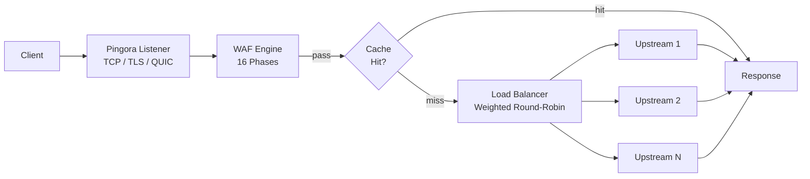

# Gateway

PRX-WAF is built on [Pingora](https://github.com/cloudflare/pingora), Cloudflare's Rust HTTP proxy library. The gateway handles all inbound traffic, routes requests to upstream backends, and applies the WAF detection pipeline before forwarding.

## Protocol Support

| Protocol | Status | Notes |
|----------|--------|-------|
| HTTP/1.1 | Supported | Default |
| HTTP/2 | Supported | Automatic upgrade via ALPN |
| HTTP/3 (QUIC) | Optional | Via Quinn library, requires `[http3]` config |
| WebSocket | Supported | Full duplex proxying |

## Key Features

### Load Balancing

PRX-WAF distributes traffic across upstream backends using weighted round-robin load balancing. Each host entry can specify multiple upstream servers with relative weights:

```toml
[[hosts]]
host        = "example.com"
port        = 80
remote_host = "10.0.0.1"
remote_port = 8080
guard_status = true
```

Hosts can also be managed via the admin UI or the REST API at `/api/hosts`.

### Response Caching

The gateway includes a moka-based LRU in-memory cache to reduce load on upstream servers:

```toml
[cache]
enabled          = true
max_size_mb      = 256       # Maximum cache size
default_ttl_secs = 60        # Default TTL for cached responses
max_ttl_secs     = 3600      # Maximum TTL cap
```

The cache respects standard HTTP cache headers (`Cache-Control`, `Expires`, `ETag`, `Last-Modified`) and supports cache invalidation via the admin API.

### Reverse Tunnels

PRX-WAF can create WebSocket-based reverse tunnels (similar to Cloudflare Tunnels) for exposing internal services without opening inbound firewall ports:

```bash
# List active tunnels
curl -H "Authorization: Bearer $TOKEN" http://localhost:9527/api/tunnels

# Create a tunnel
curl -X POST -H "Authorization: Bearer $TOKEN" \
  -H "Content-Type: application/json" \
  -d '{"name":"internal-api","target":"http://192.168.1.10:3000"}' \
  http://localhost:9527/api/tunnels
```

### Anti-Hotlinking

The gateway supports Referer-based hotlink protection per host. When enabled, requests without a valid Referer header from the configured domain are blocked. This is configured per host in the admin UI or via the API.

## Architecture



## Next Steps

- [Reverse Proxy](./reverse-proxy) -- Detailed backend routing and load balancing configuration
- [SSL/TLS](./ssl-tls) -- HTTPS, Let's Encrypt, and HTTP/3 setup
- [Configuration Reference](../configuration/reference) -- All gateway configuration keys
