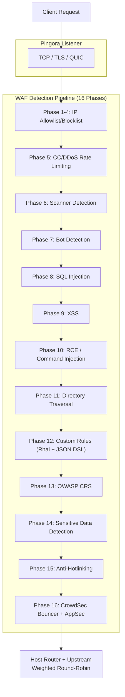

# PRX-WAF

**PRX-WAF** is a production-ready Web Application Firewall proxy built on [Pingora](https://github.com/cloudflare/pingora) (Cloudflare's Rust HTTP proxy library). It combines a 16-phase attack detection pipeline, a Rhai scripting engine, OWASP CRS support, ModSecurity rule import, CrowdSec integration, WASM plugins, and a Vue 3 admin UI into a single deployable binary.

PRX-WAF is designed for DevOps engineers, security teams, and platform operators who need a fast, transparent, and extensible WAF -- one that can proxy millions of requests, detect OWASP Top 10 attacks, auto-renew TLS certificates, scale horizontally with cluster mode, and integrate with external threat intelligence feeds -- all without relying on proprietary cloud WAF services.

## Why PRX-WAF?

Traditional WAF products are proprietary, expensive, and difficult to customize. PRX-WAF takes a different approach:

- **Open and auditable.** Every detection rule, threshold, and scoring mechanism is visible in source code. No hidden data collection, no vendor lock-in.
- **Multi-phase defense.** 16 sequential detection phases ensure that if one check misses an attack, subsequent phases catch it.
- **Rust-first performance.** Built on Pingora, PRX-WAF achieves near line-rate throughput with minimal latency overhead on commodity hardware.
- **Extensible by design.** YAML rules, Rhai scripts, WASM plugins, and ModSecurity rule import make PRX-WAF easy to adapt to any application stack.

## Key Features

<div class="vp-features">

- **Pingora Reverse Proxy** -- HTTP/1.1, HTTP/2, and HTTP/3 via QUIC (Quinn). Weighted round-robin load balancing across upstream backends.

- **16-Phase Detection Pipeline** -- IP allowlist/blocklist, CC/DDoS rate limiting, scanner detection, bot detection, SQLi, XSS, RCE, directory traversal, custom rules, OWASP CRS, sensitive data detection, anti-hotlinking, and CrowdSec integration.

- **YAML Rule Engine** -- Declarative YAML rules with 11 operators, 12 request fields, paranoia levels 1-4, and hot-reload without downtime.

- **OWASP CRS Support** -- 310+ rules converted from the OWASP ModSecurity Core Rule Set v4, covering SQLi, XSS, RCE, LFI, RFI, scanner detection, and more.

- **CrowdSec Integration** -- Bouncer mode (decision cache from LAPI), AppSec mode (remote HTTP inspection), and log pusher for community threat intelligence.

- **Cluster Mode** -- QUIC-based inter-node communication, Raft-inspired leader election, automatic rule/config/event synchronization, and mTLS certificate management.

- **Vue 3 Admin UI** -- JWT + TOTP authentication, real-time WebSocket monitoring, host management, rule management, and security event dashboards.

- **SSL/TLS Automation** -- Let's Encrypt via ACME v2 (instant-acme), automatic certificate renewal, and HTTP/3 QUIC support.

</div>

## Architecture

PRX-WAF is organized as a 7-crate Cargo workspace:

| Crate | Role |
|-------|------|
| `prx-waf` | Binary: CLI entry point, server bootstrap |
| `gateway` | Pingora proxy, HTTP/3, SSL automation, caching, tunnels |
| `waf-engine` | Detection pipeline, rules engine, checks, plugins, CrowdSec |
| `waf-storage` | PostgreSQL layer (sqlx), migrations, models |
| `waf-api` | Axum REST API, JWT/TOTP auth, WebSocket, static UI |
| `waf-common` | Shared types: RequestCtx, WafDecision, HostConfig, config |
| `waf-cluster` | Cluster consensus, QUIC transport, rule sync, certificate management |

### Request Flow



## Quick Install

```bash
git clone https://github.com/openprx/prx-waf
cd prx-waf
docker compose up -d
```

Admin UI: `http://localhost:9527` (default credentials: `admin` / `admin`)

See the [Installation Guide](./getting-started/installation) for all methods including Cargo install and building from source.

## Documentation Sections

| Section | Description |
|---------|-------------|
| [Installation](./getting-started/installation) | Install PRX-WAF via Docker, Cargo, or source build |
| [Quick Start](./getting-started/quickstart) | Get PRX-WAF protecting your app in 5 minutes |
| [Rule Engine](./rules/) | How the YAML rule engine works |
| [YAML Syntax](./rules/yaml-syntax) | Complete YAML rule schema reference |
| [Built-in Rules](./rules/builtin-rules) | OWASP CRS, ModSecurity, CVE patches |
| [Custom Rules](./rules/custom-rules) | Write your own detection rules |
| [Gateway](./gateway/) | Pingora reverse proxy overview |
| [Reverse Proxy](./gateway/reverse-proxy) | Backend routing and load balancing |
| [SSL/TLS](./gateway/ssl-tls) | HTTPS, Let's Encrypt, HTTP/3 |
| [Cluster Mode](./cluster/) | Multi-node deployment overview |
| [Cluster Deployment](./cluster/deployment) | Step-by-step cluster setup |
| [Admin UI](./admin-ui/) | Vue 3 management dashboard |
| [Configuration](./configuration/) | Configuration overview |
| [Configuration Reference](./configuration/reference) | Every TOML key documented |
| [CLI Reference](./cli/) | All CLI commands and subcommands |
| [Troubleshooting](./troubleshooting/) | Common issues and solutions |

## Project Info

- **License:** MIT OR Apache-2.0
- **Language:** Rust (2024 edition)
- **Repository:** [github.com/openprx/prx-waf](https://github.com/openprx/prx-waf)
- **Minimum Rust:** 1.82.0
- **Admin UI:** Vue 3 + Tailwind CSS
- **Database:** PostgreSQL 16+
