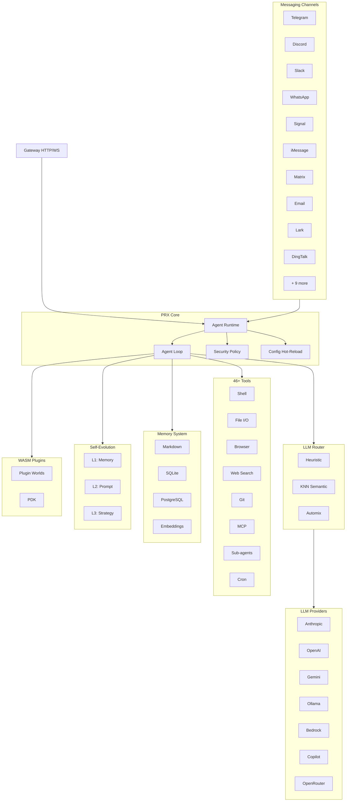

# PRX

**PRX** is a high-performance, self-evolving AI agent runtime written in Rust. It connects large language models to 19 messaging platforms, provides 46+ built-in tools, supports WASM plugin extensions, and autonomously improves its own behavior through a 3-layer self-evolution system.

PRX is designed for developers and teams who need a single, unified agent that works across every messaging platform they use -- from Telegram and Discord to Slack, WhatsApp, Signal, iMessage, DingTalk, Lark, and more -- while maintaining production-grade security, observability, and reliability.

## Why PRX?

Most AI agent frameworks focus on a single integration point or require extensive glue code to connect different services. PRX takes a different approach:

- **One binary, every channel.** A single `prx` binary connects to all 19 messaging platforms simultaneously. No separate bots, no microservice sprawl.
- **Self-evolving.** PRX autonomously refines its memory, prompts, and strategies based on interaction feedback -- with safety rollback at every layer.
- **Rust-first performance.** 177K lines of Rust deliver low latency, minimal memory footprint, and zero-GC pauses. The daemon runs comfortably on a Raspberry Pi.
- **Extensible by design.** WASM plugins, MCP tool integration, and a trait-based architecture make PRX easy to extend without forking.

## Key Features

<div class="vp-features">

- **19 Messaging Channels** -- Telegram, Discord, Slack, WhatsApp, Signal, iMessage, Matrix, Email, Lark, DingTalk, QQ, IRC, Mattermost, Nextcloud Talk, LINQ, CLI, and more.

- **9 LLM Providers** -- Anthropic Claude, OpenAI, Google Gemini, GitHub Copilot, Ollama, AWS Bedrock, GLM (Zhipu), OpenAI Codex, OpenRouter, plus any OpenAI-compatible endpoint.

- **46+ Built-in Tools** -- Shell execution, file I/O, browser automation, web search, HTTP requests, git operations, memory management, cron scheduling, MCP integration, sub-agents, and more.

- **3-Layer Self-Evolution** -- L1 memory evolution, L2 prompt evolution, L3 strategy evolution -- each with safety bounds and automatic rollback.

- **WASM Plugin System** -- Extend PRX with WebAssembly components across 6 plugin worlds: tool, middleware, hook, cron, provider, and storage. Full PDK with 47 host functions.

- **LLM Router** -- Intelligent model selection via heuristic scoring (capability, Elo, cost, latency), KNN semantic routing, and Automix confidence-based escalation.

- **Production Security** -- 4-level autonomy control, policy engine, sandbox isolation (Docker/Firejail/Bubblewrap/Landlock), ChaCha20 secret store, pairing authentication.

- **Observability** -- OpenTelemetry tracing, Prometheus metrics, structured logging, and a built-in web console.

</div>

## Architecture



## Quick Install

```bash
curl -fsSL https://openprx.dev/install.sh | bash
```

Or install via Cargo:

```bash
cargo install openprx
```

Then run the onboarding wizard:

```bash
prx onboard
```

See the [Installation Guide](./getting-started/installation) for all methods including Docker and building from source.

## Documentation Sections

| Section | Description |
|---------|-------------|
| [Installation](./getting-started/installation) | Install PRX on Linux, macOS, or Windows WSL2 |
| [Quick Start](./getting-started/quickstart) | Get PRX running in 5 minutes |
| [Onboarding Wizard](./getting-started/onboarding) | Configure your LLM provider and initial settings |
| [Channels](./channels/) | Connect to Telegram, Discord, Slack, and 16 more platforms |
| [Providers](./providers/) | Configure Anthropic, OpenAI, Gemini, Ollama, and more |
| [Tools](./tools/) | 46+ built-in tools for shell, browser, git, memory, and more |
| [Self-Evolution](./self-evolution/) | L1/L2/L3 autonomous improvement system |
| [Plugins (WASM)](./plugins/) | Extend PRX with WebAssembly components |
| [Configuration](./config/) | Full config reference and hot-reload |
| [Security](./security/) | Policy engine, sandbox, secrets, threat model |
| [CLI Reference](./cli/) | Complete command reference for the `prx` binary |

## Project Info

- **License:** MIT OR Apache-2.0
- **Language:** Rust (2024 edition)
- **Repository:** [github.com/openprx/prx](https://github.com/openprx/prx)
- **Minimum Rust:** 1.92.0
