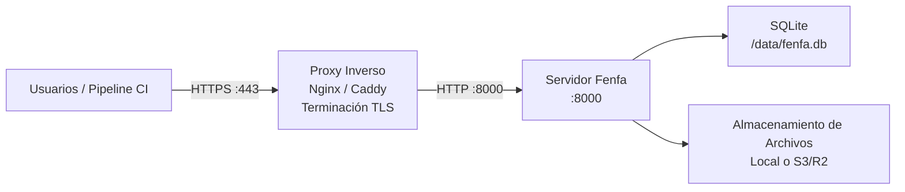

# Despliegue en Producción

Esta guía cubre todo lo necesario para ejecutar Fenfa en un entorno de producción: proxy inverso con TLS, configuración segura de tokens, estrategia de copias de seguridad y monitoreo.

## Arquitectura



## Configuración del Proxy Inverso

### Caddy (Recomendado)

Caddy obtiene y renueva automáticamente los certificados TLS de Let's Encrypt:

```
dist.example.com {
    reverse_proxy localhost:8000
}
```

Eso es todo. Caddy maneja HTTPS, HTTP/2 y la gestión de certificados automáticamente.

### Nginx

```nginx
server {
    listen 443 ssl http2;
    server_name dist.example.com;

    ssl_certificate /etc/letsencrypt/live/dist.example.com/fullchain.pem;
    ssl_certificate_key /etc/letsencrypt/live/dist.example.com/privkey.pem;

    client_max_body_size 2G;

    location / {
        proxy_pass http://127.0.0.1:8000;
        proxy_set_header Host $host;
        proxy_set_header X-Real-IP $remote_addr;
        proxy_set_header X-Forwarded-For $proxy_add_x_forwarded_for;
        proxy_set_header X-Forwarded-Proto $scheme;

        # Large file uploads
        proxy_request_buffering off;
        proxy_read_timeout 600s;
    }
}

server {
    listen 80;
    server_name dist.example.com;
    return 301 https://$host$request_uri;
}
```

::: warning client_max_body_size
Establece `client_max_body_size` lo suficientemente grande para tus builds más grandes. Los archivos IPA y APK pueden tener cientos de megabytes. El ejemplo anterior permite hasta 2 GB.
:::

### Obtener Certificado TLS

Usando Certbot con Nginx:

```bash
sudo certbot --nginx -d dist.example.com
```

Usando Certbot standalone:

```bash
sudo certbot certonly --standalone -d dist.example.com
```

## Lista de Verificación de Seguridad

### 1. Cambiar Tokens Predeterminados

Genera tokens aleatorios seguros:

```bash
# Generate a random 32-character token
openssl rand -hex 16
```

Configúralos via variables de entorno o en el archivo de configuración:

```bash
FENFA_ADMIN_TOKEN=$(openssl rand -hex 16)
FENFA_UPLOAD_TOKEN=$(openssl rand -hex 16)
```

### 2. Vincular a Localhost

Solo expone Fenfa a través del proxy inverso:

```yaml
ports:
  - "127.0.0.1:8000:8000"  # Not 0.0.0.0:8000
```

### 3. Configurar el Dominio Principal

Configura el dominio público correcto para los manifiestos y callbacks de iOS:

```bash
FENFA_PRIMARY_DOMAIN=https://dist.example.com
```

::: danger Manifiestos iOS
Si `primary_domain` es incorrecto, la instalación OTA de iOS fallará. El manifest plist contiene URLs de descarga que iOS usa para obtener el archivo IPA. Estas URLs deben ser accesibles desde el dispositivo del usuario.
:::

### 4. Tokens de Subida Separados

Emite diferentes tokens de subida para diferentes pipelines de CI/CD o miembros del equipo:

```json
{
  "auth": {
    "upload_tokens": [
      "token-for-ios-pipeline",
      "token-for-android-pipeline",
      "token-for-desktop-pipeline"
    ],
    "admin_tokens": [
      "admin-token-for-ops-team"
    ]
  }
}
```

Esto permite revocar tokens individuales sin interrumpir otros pipelines.

## Estrategia de Copias de Seguridad

### Qué Respaldar

| Componente | Ruta | Tamaño | Frecuencia |
|------------|------|--------|------------|
| Base de datos SQLite | `/data/fenfa.db` | Pequeño (< 100 MB típicamente) | Diario |
| Archivos subidos | `/app/uploads/` | Puede ser grande | Después de cada subida (o usar S3) |
| Archivo de configuración | `config.json` | Mínimo | Al cambiar |

### Copia de Seguridad SQLite

```bash
# Copy the database file (safe while Fenfa is running -- SQLite uses WAL mode)
cp /data/fenfa.db /backups/fenfa-$(date +%Y%m%d).db
```

### Script de Copia de Seguridad Automatizado

```bash
#!/bin/bash
BACKUP_DIR="/backups/fenfa"
DATE=$(date +%Y%m%d-%H%M)

mkdir -p "$BACKUP_DIR"

# Database
cp /path/to/data/fenfa.db "$BACKUP_DIR/fenfa-$DATE.db"

# Uploads (if using local storage)
tar czf "$BACKUP_DIR/uploads-$DATE.tar.gz" /path/to/uploads/

# Cleanup old backups (keep 30 days)
find "$BACKUP_DIR" -name "*.db" -mtime +30 -delete
find "$BACKUP_DIR" -name "*.tar.gz" -mtime +30 -delete
```

::: tip Almacenamiento S3
Si usas almacenamiento compatible con S3 (R2, AWS S3, MinIO), los archivos subidos ya están en un backend de almacenamiento redundante. Solo necesitas respaldar la base de datos SQLite.
:::

## Monitoreo

### Comprobación de Salud

Monitorea el endpoint `/healthz`:

```bash
curl -sf http://localhost:8000/healthz || echo "Fenfa is down"
```

### Con Monitoreo de Disponibilidad

Apunta tu servicio de monitoreo de disponibilidad (UptimeRobot, Hetrix, etc.) a:

```
https://dist.example.com/healthz
```

Respuesta esperada: `{"ok": true}` con HTTP 200.

### Monitoreo de Logs

Fenfa escribe logs en stdout. Usa el driver de logs de tu runtime de contenedor para reenviar logs a tu sistema de agregación:

```yaml
services:
  fenfa:
    logging:
      driver: "json-file"
      options:
        max-size: "10m"
        max-file: "3"
```

## Docker Compose Completo para Producción

```yaml
version: "3.8"

services:
  fenfa:
    image: fenfa/fenfa:latest
    container_name: fenfa
    restart: unless-stopped
    ports:
      - "127.0.0.1:8000:8000"
    environment:
      FENFA_ADMIN_TOKEN: ${FENFA_ADMIN_TOKEN}
      FENFA_UPLOAD_TOKEN: ${FENFA_UPLOAD_TOKEN}
      FENFA_PRIMARY_DOMAIN: https://dist.example.com
    volumes:
      - fenfa-data:/data
      - fenfa-uploads:/app/uploads
    healthcheck:
      test: ["CMD", "wget", "-q", "--spider", "http://localhost:8000/healthz"]
      interval: 30s
      timeout: 5s
      retries: 3
      start_period: 10s
    logging:
      driver: "json-file"
      options:
        max-size: "10m"
        max-file: "3"
    deploy:
      resources:
        limits:
          memory: 512M

volumes:
  fenfa-data:
  fenfa-uploads:
```

## Siguientes Pasos

- [Despliegue con Docker](./docker) -- Conceptos básicos de Docker y configuración
- [Referencia de Configuración](../configuration/) -- Todos los ajustes
- [Resolución de Problemas](../troubleshooting/) -- Problemas comunes de producción
