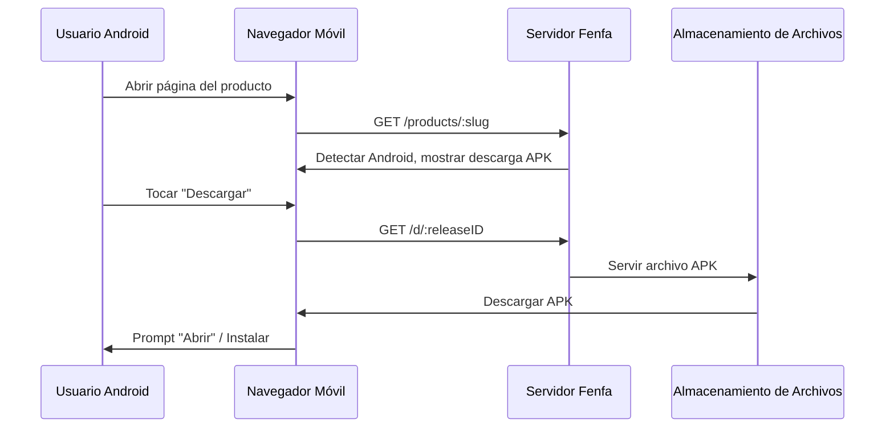

# Distribución Android

La distribución de Android en Fenfa es sencilla: sube un archivo APK y los usuarios lo descargan directamente desde la página del producto. Fenfa detecta automáticamente los dispositivos Android y muestra el botón de descarga apropiado.

## Cómo Funciona



A diferencia de iOS, Android no requiere un protocolo especial para la instalación. El archivo APK se descarga directamente via HTTP(S), y el usuario lo instala usando el instalador de paquetes del sistema.

## Configurar una Variante Android

Crea una variante Android para tu producto:

```bash
curl -X POST http://localhost:8000/admin/api/products/prd_abc123/variants \
  -H "X-Auth-Token: YOUR_ADMIN_TOKEN" \
  -H "Content-Type: application/json" \
  -d '{
    "platform": "android",
    "display_name": "Android",
    "identifier": "com.example.myapp",
    "arch": "universal",
    "installer_type": "apk"
  }'
```

::: tip Variantes por Arquitectura
Si compilas APKs separados por arquitectura, crea múltiples variantes:
- `Android ARM64` (arch: `arm64-v8a`)
- `Android ARM` (arch: `armeabi-v7a`)
- `Android x86_64` (arch: `x86_64`)

Si distribuyes un APK universal o AAB, una única variante con arquitectura `universal` es suficiente.
:::

## Subir Archivos APK

### Subida Estándar

```bash
curl -X POST http://localhost:8000/upload \
  -H "X-Auth-Token: YOUR_UPLOAD_TOKEN" \
  -F "variant_id=var_android" \
  -F "app_file=@app-release.apk" \
  -F "version=2.1.0" \
  -F "build=210" \
  -F "changelog=Added dark mode support"
```

### Subida Inteligente

La subida inteligente extrae automáticamente los metadatos de los archivos APK:

```bash
curl -X POST http://localhost:8000/admin/api/smart-upload \
  -H "X-Auth-Token: YOUR_ADMIN_TOKEN" \
  -F "variant_id=var_android" \
  -F "app_file=@app-release.apk"
```

Los metadatos extraídos incluyen:
- Nombre del paquete (`com.example.myapp`)
- Nombre de versión (`2.1.0`)
- Código de versión (`210`)
- Icono de la app
- Versión mínima del SDK

## Instalación por el Usuario

Cuando un usuario visita la página del producto en un dispositivo Android:

1. La página detecta automáticamente la plataforma Android.
2. El usuario toca el botón **Descargar**.
3. El navegador descarga el archivo APK.
4. Android solicita al usuario que instale el APK.

::: warning Fuentes Desconocidas
Los usuarios deben habilitar "Instalar desde fuentes desconocidas" (o "Instalar apps desconocidas" en versiones más nuevas de Android) en los ajustes de su dispositivo antes de instalar APKs de Fenfa. Este es un requisito estándar de Android para apps cargadas manualmente.
:::

## Enlace de Descarga Directa

Cada versión tiene una URL de descarga directa que funciona con cualquier cliente HTTP:

```bash
# Download via curl
curl -LO http://localhost:8000/d/rel_xxx

# Download via wget
wget http://localhost:8000/d/rel_xxx
```

Esta URL soporta solicitudes HTTP Range para descargas reanudables en conexiones lentas.

## Siguientes Pasos

- [Distribución de Escritorio](./desktop) -- Distribución de macOS, Windows y Linux
- [Gestión de Versiones](../products/releases) -- Versiona y gestiona tus versiones de APK
- [API de Subida](../api/upload) -- Automatiza subidas de APK desde CI/CD
