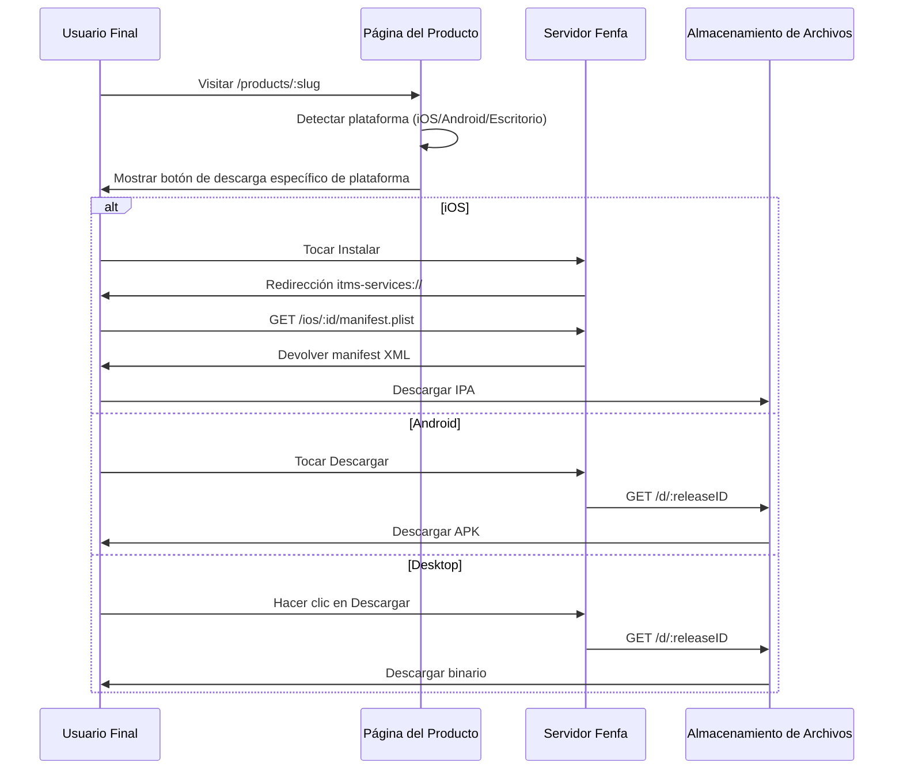

# Descripción General de Distribución

Fenfa proporciona una experiencia de distribución unificada para todas las plataformas. Cada producto obtiene una página de descarga pública que detecta automáticamente la plataforma del visitante y muestra el botón de descarga apropiado.

## Cómo Funciona la Distribución



## Página de Descarga del Producto

Cada producto publicado tiene una página pública en `/products/:slug`. La página incluye:

- **Icono y nombre de la app** de la configuración del producto
- **Detección de plataforma** -- La página usa el User-Agent del navegador para mostrar el botón de descarga correcto primero
- **Código QR** -- Generado automáticamente para escaneo móvil fácil
- **Historial de versiones** -- Todas las versiones de la variante seleccionada, las más recientes primero
- **Changelogs** -- Notas por versión mostradas en línea
- **Múltiples variantes** -- Si un producto tiene variantes para múltiples plataformas, los usuarios pueden cambiar entre ellas

## Distribución Específica por Plataforma

| Plataforma | Método | Detalles |
|------------|--------|---------|
| iOS | OTA via `itms-services://` | Manifest plist + descarga directa de IPA. Requiere HTTPS. |
| Android | Descarga directa de APK | El navegador descarga el APK. El usuario habilita "Instalar desde fuentes desconocidas". |
| macOS | Descarga directa | Archivos DMG, PKG o ZIP descargados via navegador. |
| Windows | Descarga directa | Archivos EXE, MSI o ZIP descargados via navegador. |
| Linux | Descarga directa | Archivos DEB, RPM, AppImage o tar.gz descargados via navegador. |

## Enlaces de Descarga Directa

Cada versión tiene una URL de descarga directa:

```
https://your-domain.com/d/:releaseID
```

Esta URL:
- Devuelve el archivo binario con los encabezados `Content-Type` y `Content-Disposition` correctos
- Soporta solicitudes HTTP Range para descargas reanudables
- Incrementa el contador de descargas
- Funciona con cualquier cliente HTTP (curl, wget, navegadores)

## Seguimiento de Eventos

Fenfa rastrea tres tipos de eventos:

| Evento | Disparador | Datos Rastreados |
|--------|-----------|-----------------|
| `visit` | El usuario abre la página del producto | IP, User-Agent, variante |
| `click` | El usuario hace clic en un botón de descarga | IP, User-Agent, ID de versión |
| `download` | El archivo se descarga efectivamente | IP, User-Agent, ID de versión |

Los eventos pueden verse en el panel de administración o exportarse como CSV:

```bash
curl -o events.csv http://localhost:8000/admin/exports/events.csv \
  -H "X-Auth-Token: YOUR_ADMIN_TOKEN"
```

## Requisito de HTTPS

::: warning iOS Requiere HTTPS
La instalación OTA de iOS via `itms-services://` requiere que el servidor use HTTPS con un certificado TLS válido. Para pruebas locales, puedes usar herramientas como `ngrok` o `mkcert`. Para producción, usa un proxy inverso con Let's Encrypt. Ver [Despliegue en Producción](../deployment/production).
:::

## Guías de Plataforma

- [Distribución iOS](./ios) -- Instalación OTA, generación de manifiestos, vinculación UDID de dispositivos
- [Distribución Android](./android) -- Distribución e instalación de APK
- [Distribución de Escritorio](./desktop) -- Distribución de macOS, Windows y Linux
