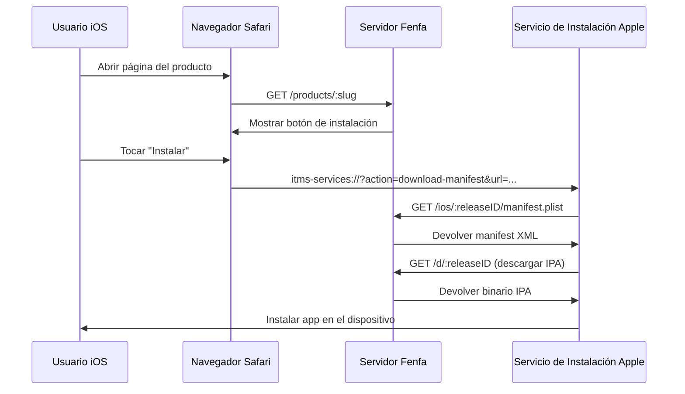
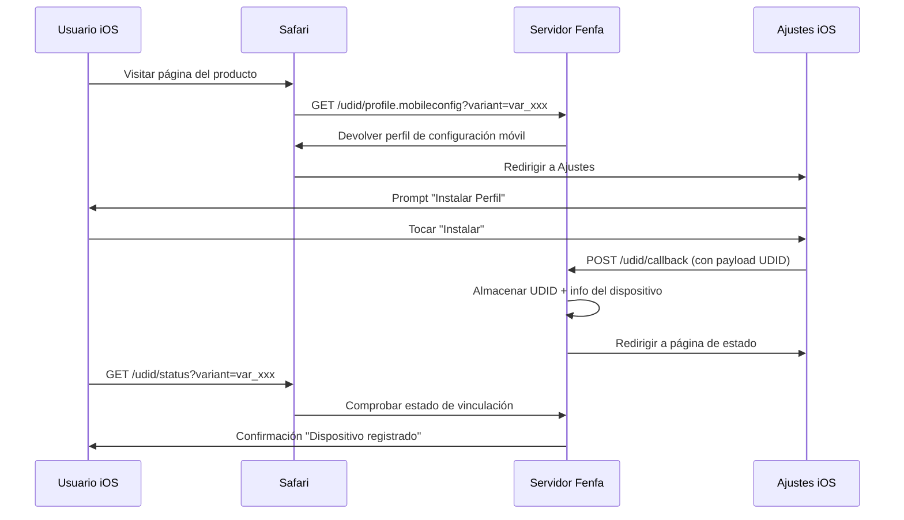

# Distribución iOS

Fenfa proporciona soporte completo de distribución OTA (Over-The-Air) para iOS, incluyendo generación de manifiestos `itms-services://`, vinculación UDID de dispositivos para aprovisionamiento ad-hoc e integración opcional con la API de Apple Developer para registro automático de dispositivos.

## Cómo Funciona el OTA de iOS



iOS usa el protocolo `itms-services://` para instalar apps directamente desde una página web. Cuando un usuario toca el botón de instalación, Safari entrega el control al instalador del sistema, que:

1. Obtiene el manifest plist de Fenfa
2. Descarga el archivo IPA
3. Instala la app en el dispositivo

::: warning HTTPS Requerido
La instalación OTA de iOS requiere HTTPS con un certificado TLS válido. Los certificados autofirmados no funcionan. Para pruebas locales, usa `ngrok` para crear un túnel HTTPS temporal.
:::

## Generación de Manifiestos

Fenfa genera automáticamente el archivo `manifest.plist` para cada versión de iOS. El manifiesto se sirve en:

```
GET /ios/:releaseID/manifest.plist
```

El manifiesto contiene:
- Identificador de bundle (del campo identificador de la variante)
- Versión del bundle (de la versión de la versión)
- URL de descarga (apuntando a `/d/:releaseID`)
- Título de la app

El enlace de instalación `itms-services://` es:

```
itms-services://?action=download-manifest&url=https://your-domain.com/ios/rel_xxx/manifest.plist
```

Este enlace se incluye automáticamente en la respuesta de la API de subida y se muestra en la página del producto.

## Vinculación UDID de Dispositivos

Para distribución ad-hoc, los dispositivos iOS deben estar registrados en el perfil de aprovisionamiento de la app. Fenfa proporciona un flujo de vinculación UDID que recopila identificadores de dispositivos de los usuarios.

### Cómo Funciona la Vinculación UDID



### Endpoints UDID

| Endpoint | Método | Descripción |
|----------|--------|-------------|
| `/udid/profile.mobileconfig?variant=:variantID` | GET | Descargar el perfil de configuración móvil |
| `/udid/callback` | POST | Callback de iOS después de la instalación del perfil (contiene UDID) |
| `/udid/status?variant=:variantID` | GET | Comprobar si el dispositivo actual está vinculado |

### Seguridad

El flujo de vinculación UDID usa nonces de un solo uso para prevenir ataques de repetición:
- Cada descarga de perfil genera un nonce único
- El nonce se incrusta en la URL de callback
- Una vez usado, el nonce no puede reutilizarse
- Los nonces expiran después de un timeout configurable

## Integración con la API de Apple Developer

Fenfa puede registrar automáticamente dispositivos en tu cuenta de Apple Developer, eliminando el paso manual de agregar UDIDs en el Portal de Apple Developer.

### Configuración

1. Ve a **Panel de Administración > Ajustes > API de Apple Developer**.
2. Introduce tus credenciales de la API de App Store Connect:

| Campo | Descripción |
|-------|-------------|
| Key ID | ID de clave API (ej. "ABC123DEF4") |
| Issuer ID | ID del emisor (formato UUID) |
| Private Key | Contenido de la clave privada en formato PEM |
| Team ID | ID de tu equipo de Apple Developer |

::: tip Crear Claves API
En el [Portal de Apple Developer](https://developer.apple.com/account/resources/authkeys/list), crea una clave API con permiso de "Devices". Descarga el archivo de clave privada `.p8` -- solo puede descargarse una vez.
:::

### Registrar Dispositivos

Una vez configurado, puedes registrar dispositivos con Apple desde el panel de administración:

**Dispositivo individual:**

```bash
curl -X POST http://localhost:8000/admin/api/devices/DEVICE_ID/register-apple \
  -H "X-Auth-Token: YOUR_ADMIN_TOKEN"
```

**Registro en lote:**

```bash
curl -X POST http://localhost:8000/admin/api/devices/register-apple \
  -H "X-Auth-Token: YOUR_ADMIN_TOKEN"
```

### Comprobar Estado de la API de Apple

```bash
curl http://localhost:8000/admin/api/apple/status \
  -H "X-Auth-Token: YOUR_ADMIN_TOKEN"
```

### Listar Dispositivos Registrados en Apple

```bash
curl http://localhost:8000/admin/api/apple/devices \
  -H "X-Auth-Token: YOUR_ADMIN_TOKEN"
```

## Flujo de Trabajo de Distribución Ad-Hoc

El flujo de trabajo completo para distribución ad-hoc de iOS:

1. **El usuario vincula su dispositivo** -- Visita la página del producto, instala el perfil mobileconfig, se captura el UDID.
2. **El admin registra el dispositivo** -- En el panel de administración, registra el dispositivo con Apple (o usa el registro en lote).
3. **El desarrollador re-firma el IPA** -- Actualiza el perfil de aprovisionamiento para incluir el nuevo dispositivo, re-firma el IPA.
4. **Sube el nuevo build** -- Sube el IPA re-firmado a Fenfa.
5. **El usuario instala** -- El usuario ya puede instalar la app via la página del producto.

::: info Distribución Empresarial
Si tienes una cuenta de Apple Developer Empresarial, puedes omitir la vinculación UDID por completo. Los perfiles empresariales permiten la instalación en cualquier dispositivo. Configura la variante apropiadamente y sube IPAs firmados empresarialmente.
:::

## Gestionar Dispositivos iOS

Ve todos los dispositivos vinculados en el panel de administración o via API:

```bash
curl http://localhost:8000/admin/api/ios_devices \
  -H "X-Auth-Token: YOUR_ADMIN_TOKEN"
```

Exporta dispositivos como CSV:

```bash
curl -o devices.csv http://localhost:8000/admin/exports/ios_devices.csv \
  -H "X-Auth-Token: YOUR_ADMIN_TOKEN"
```

## Siguientes Pasos

- [Distribución Android](./android) -- Distribución de APK para Android
- [API de Subida](../api/upload) -- Automatiza subidas de iOS desde CI/CD
- [Despliegue en Producción](../deployment/production) -- Configura HTTPS para OTA de iOS
