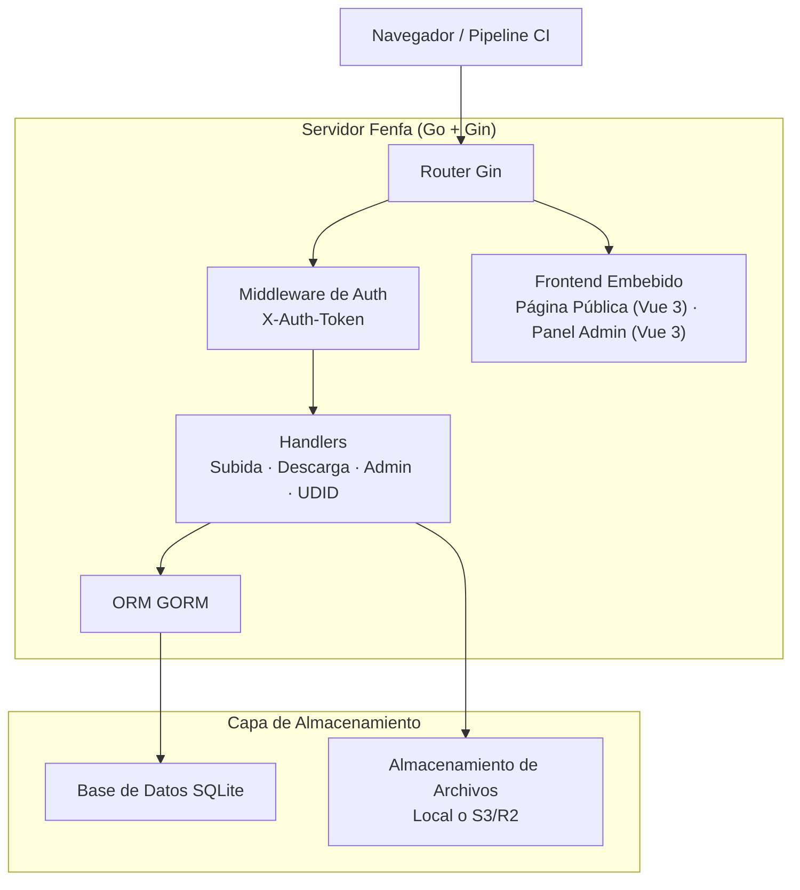
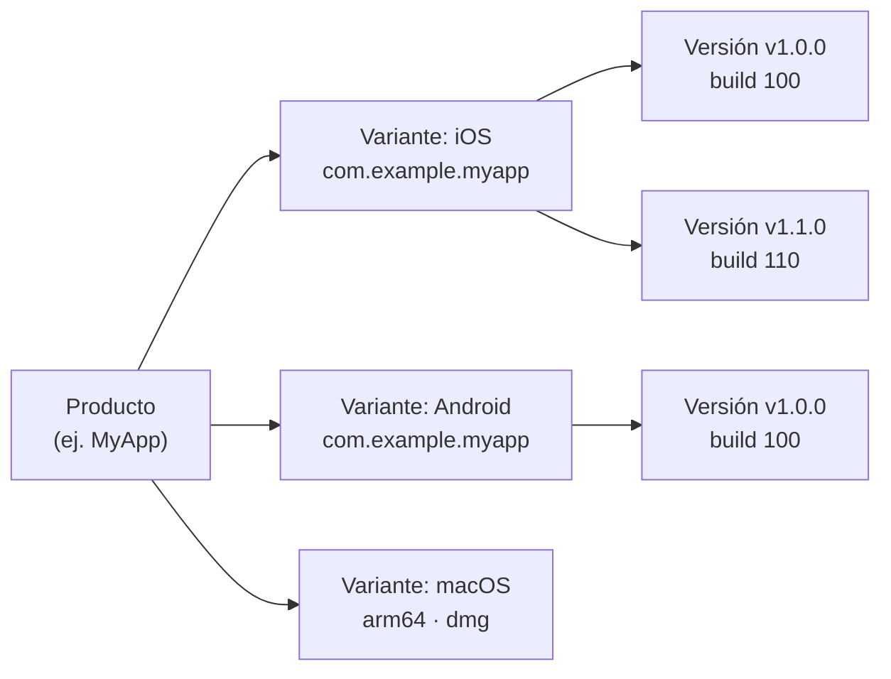

# Fenfa

**Fenfa** (分发, "distribuir" en chino) es una plataforma de distribución de aplicaciones auto-alojada para iOS, Android, macOS, Windows y Linux. Sube builds, obtén páginas de instalación con códigos QR y gestiona versiones a través de un panel de administración limpio -- todo desde un único binario Go con frontend embebido y almacenamiento SQLite.

Fenfa está diseñado para equipos de desarrollo, ingenieros de QA y departamentos de TI empresariales que necesitan un canal de distribución de aplicaciones privado y controlable -- uno que maneje la instalación OTA de iOS, distribución de APK para Android y entrega de aplicaciones de escritorio sin depender de tiendas de aplicaciones públicas o servicios de terceros.

## ¿Por Qué Fenfa?

Las tiendas de aplicaciones públicas imponen retrasos de revisión, restricciones de contenido y problemas de privacidad. Los servicios de distribución de terceros cobran tarifas por descarga y controlan tus datos. Fenfa te da control total:

- **Auto-alojado.** Tus builds, tu servidor, tus datos. Sin bloqueo de proveedor, sin tarifas por descarga.
- **Multi-plataforma.** Una sola página de producto sirve builds de iOS, Android, macOS, Windows y Linux con detección automática de plataforma.
- **Sin dependencias.** Un único binario Go con SQLite embebido. Sin Redis, sin PostgreSQL, sin cola de mensajes.
- **Distribución OTA de iOS.** Soporte completo para generación de manifiestos `itms-services://`, vinculación de dispositivos UDID e integración con la API de Apple Developer para aprovisionamiento ad-hoc.

## Características Principales

- **Subida Inteligente** -- Detecta automáticamente los metadatos de la app (bundle ID, versión, icono) de paquetes IPA y APK. Solo sube el archivo y Fenfa se encarga del resto.

- **Páginas de Producto** -- Páginas de descarga públicas con códigos QR, detección de plataforma y changelogs por versión. Comparte una única URL para todas las plataformas.

- **Vinculación UDID de iOS** -- Flujo de registro de dispositivos para distribución ad-hoc. Los usuarios vinculan su UDID del dispositivo a través de un perfil de configuración móvil guiado, y los admins pueden registrar dispositivos automáticamente vía la API de Apple Developer.

- **Almacenamiento S3/R2** -- Almacenamiento de objetos compatible con S3 opcional (Cloudflare R2, AWS S3, MinIO) para alojamiento escalable de archivos. El almacenamiento local funciona de inmediato.

- **Panel de Administración** -- Panel de administración Vue 3 con todas las funciones para gestionar productos, variantes, versiones, dispositivos y ajustes del sistema. Soporta interfaz en chino e inglés.

- **Autenticación por Token** -- Ámbitos de token separados para subida y administración. Los pipelines CI/CD usan tokens de subida; los administradores usan tokens de admin para control total.

- **Seguimiento de Eventos** -- Rastrea visitas a páginas, clics de descarga y descargas de archivos por versión. Exporta eventos como CSV para análisis.

## Arquitectura



## Modelo de Datos



- **Producto**: Una app lógica con nombre, slug, icono y descripción. Una sola página de producto sirve todas las plataformas.
- **Variante**: Un objetivo de build específico de plataforma (iOS, Android, macOS, Windows, Linux) con su propio identificador, arquitectura y tipo de instalador.
- **Versión**: Un build subido específico con versión, número de build, changelog y archivo binario.

## Instalación Rápida

```bash
docker run -d --name fenfa -p 8000:8000 fenfa/fenfa:latest
```

Visita `http://localhost:8000/admin` e inicia sesión con el token `dev-admin-token`.

Consulta la [Guía de Instalación](./getting-started/installation) para Docker Compose, compilaciones desde el código fuente y configuración de producción.

## Secciones de Documentación

| Sección | Descripción |
|---------|-------------|
| [Instalación](./getting-started/installation) | Instala Fenfa con Docker o compila desde el código fuente |
| [Inicio Rápido](./getting-started/quickstart) | Pon Fenfa en marcha y sube tu primer build en 5 minutos |
| [Gestión de Productos](./products/) | Crea y gestiona productos multi-plataforma |
| [Variantes de Plataforma](./products/variants) | Configura variantes iOS, Android y de escritorio |
| [Gestión de Versiones](./products/releases) | Sube, versiona y gestiona versiones |
| [Descripción General de Distribución](./distribution/) | Cómo Fenfa distribuye apps a los usuarios finales |
| [Distribución iOS](./distribution/ios) | Instalación OTA de iOS, generación de manifiestos, vinculación UDID |
| [Distribución Android](./distribution/android) | Distribución de APK para Android |
| [Distribución de Escritorio](./distribution/desktop) | Distribución de macOS, Windows y Linux |
| [Descripción General de API](./api/) | Referencia de la API REST |
| [API de Subida](./api/upload) | Sube builds vía API o CI/CD |
| [API de Administración](./api/admin) | Referencia completa de la API de administración |
| [Configuración](./configuration/) | Todas las opciones de configuración |
| [Despliegue con Docker](./deployment/docker) | Despliegue con Docker y Docker Compose |
| [Despliegue en Producción](./deployment/production) | Proxy inverso, TLS, copias de seguridad y monitoreo |
| [Resolución de Problemas](./troubleshooting/) | Problemas comunes y soluciones |

## Información del Proyecto

- **Licencia:** MIT
- **Lenguaje:** Go 1.25+ (backend), Vue 3 + Vite (frontend)
- **Base de Datos:** SQLite (via GORM)
- **Repositorio:** [github.com/openprx/fenfa](https://github.com/openprx/fenfa)
- **Organización:** [OpenPRX](https://github.com/openprx)
