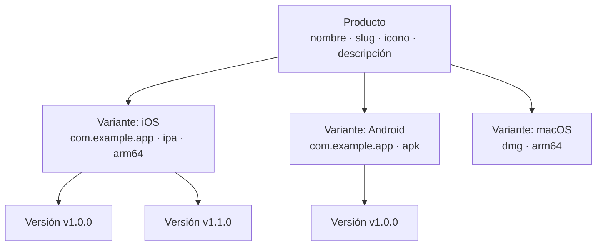

# Gestión de Productos

Los productos son la unidad organizativa de nivel superior en Fenfa. Cada producto representa una única aplicación y puede contener múltiples variantes de plataforma (iOS, Android, macOS, Windows, Linux). Un producto tiene su propia página de descarga pública, icono y URL con slug.

## Conceptos



- **Producto**: La aplicación lógica. Tiene un slug único que se convierte en la URL de la página de descarga (`/products/:slug`).
- **Variante**: Un objetivo de build específico de plataforma bajo un producto. Ver [Variantes de Plataforma](./variants).
- **Versión**: Un build específico subido bajo una variante. Ver [Gestión de Versiones](./releases).

## Crear un Producto

### Via Panel de Administración

1. Navega a **Productos** en la barra lateral.
2. Haz clic en **Crear Producto**.
3. Rellena los campos:

| Campo | Requerido | Descripción |
|-------|-----------|-------------|
| Nombre | Sí | Nombre de visualización (ej. "MyApp") |
| Slug | Sí | Identificador URL (ej. "myapp"). Debe ser único. |
| Descripción | No | Breve descripción de la app mostrada en la página de descarga |
| Icono | No | Icono de la app (subido como archivo de imagen) |

4. Haz clic en **Guardar**.

### Via API

```bash
curl -X POST http://localhost:8000/admin/api/products \
  -H "X-Auth-Token: YOUR_ADMIN_TOKEN" \
  -H "Content-Type: application/json" \
  -d '{
    "name": "MyApp",
    "slug": "myapp",
    "description": "A cross-platform mobile app"
  }'
```

## Listar Productos

### Via Panel de Administración

La página de **Productos** en el panel de administración muestra todos los productos con su número de variantes y descargas totales.

### Via API

```bash
curl http://localhost:8000/admin/api/products \
  -H "X-Auth-Token: YOUR_ADMIN_TOKEN"
```

Respuesta:

```json
{
  "ok": true,
  "data": [
    {
      "id": "prd_abc123",
      "name": "MyApp",
      "slug": "myapp",
      "description": "A cross-platform mobile app",
      "published": true,
      "created_at": "2025-01-15T10:30:00Z"
    }
  ]
}
```

## Actualizar un Producto

```bash
curl -X PUT http://localhost:8000/admin/api/products/prd_abc123 \
  -H "X-Auth-Token: YOUR_ADMIN_TOKEN" \
  -H "Content-Type: application/json" \
  -d '{
    "name": "MyApp Pro",
    "description": "Updated description"
  }'
```

## Eliminar un Producto

::: danger Eliminación en Cascada
Eliminar un producto elimina permanentemente todas sus variantes, versiones y archivos subidos.
:::

```bash
curl -X DELETE http://localhost:8000/admin/api/products/prd_abc123 \
  -H "X-Auth-Token: YOUR_ADMIN_TOKEN"
```

## Publicar y Despublicar

Los productos pueden publicarse o despublicarse. Los productos despublicados devuelven un 404 en su página de descarga pública.

```bash
# Unpublish
curl -X PUT http://localhost:8000/admin/api/apps/prd_abc123/unpublish \
  -H "X-Auth-Token: YOUR_ADMIN_TOKEN"

# Publish
curl -X PUT http://localhost:8000/admin/api/apps/prd_abc123/publish \
  -H "X-Auth-Token: YOUR_ADMIN_TOKEN"
```

## Página de Descarga Pública

Cada producto publicado tiene una página de descarga pública en:

```
https://your-domain.com/products/:slug
```

La página incluye:
- Icono, nombre y descripción de la app
- Botones de descarga específicos de plataforma (detectados automáticamente según el dispositivo del visitante)
- Código QR para escanear desde móvil
- Historial de versiones con números de versión y changelogs
- Enlaces `itms-services://` de iOS para instalación OTA

## Formato de ID

Los IDs de producto usan el prefijo `prd_` seguido de una cadena aleatoria (ej. `prd_abc123`). Los IDs se generan automáticamente y no pueden modificarse.

## Siguientes Pasos

- [Variantes de Plataforma](./variants) -- Agrega variantes iOS, Android y de escritorio a tu producto
- [Gestión de Versiones](./releases) -- Sube y gestiona builds
- [Descripción General de Distribución](../distribution/) -- Cómo los usuarios finales instalan tus apps
