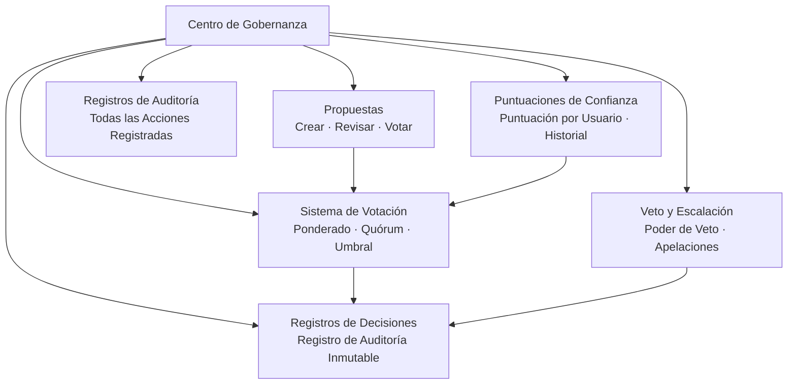

# Centro de Gobernanza

El centro de gobernanza es un módulo central en OpenPR que trae toma de decisiones transparente y estructurada a la gestión de proyectos. Proporciona propuestas, votación, registros de decisiones, puntuaciones de confianza, mecanismos de veto y registros de auditoría completos.

## ¿Por Qué Gobernanza?

Las herramientas tradicionales de gestión de proyectos se centran en el seguimiento de tareas pero dejan la toma de decisiones sin estructurar. El centro de gobernanza de OpenPR garantiza que:

- **Las decisiones están documentadas.** Cada propuesta, voto y decisión se registra con registros de auditoría completos.
- **Los procesos son transparentes.** Los umbrales de votación, las reglas de quórum y las puntuaciones de confianza son visibles para todos los miembros.
- **El poder está distribuido.** Los mecanismos de veto y las vías de escalación previenen decisiones unilaterales.
- **La historia se preserva.** Los registros de decisiones crean un registro inmutable de qué se decidió, por quién y por qué.

## Módulos de Gobernanza

| Módulo | Descripción |
|--------|-------------|
| [Propuestas](./proposals) | Crear, revisar y votar en propuestas |
| [Votación y Decisiones](./voting) | Votación ponderada con reglas de quórum y umbral |
| [Puntuaciones de Confianza](./trust-scores) | Puntuación de reputación por usuario con historial |
| Veto y Escalación | Poder de veto con votación de escalación y apelaciones |
| Dominios de Decisión | Categorizar decisiones por dominio |
| Revisiones de Impacto | Evaluar el impacto de propuestas con métricas |
| Registros de Auditoría | Registro completo de todas las acciones de gobernanza |

## Esquema de Base de Datos

El módulo de gobernanza usa 20 tablas dedicadas:

| Tabla | Propósito |
|-------|---------|
| `proposals` | Registros de propuestas |
| `proposal_templates` | Plantillas de propuestas reutilizables |
| `proposal_comments` | Discusión sobre propuestas |
| `proposal_issue_links` | Vincular propuestas a incidencias relacionadas |
| `votes` | Registros de votos individuales |
| `decisions` | Registros de decisiones finalizadas |
| `decision_domains` | Dominios de categorización de decisiones |
| `decision_audit_reports` | Informes de auditoría sobre decisiones |
| `governance_configs` | Configuraciones de gobernanza del espacio de trabajo |
| `governance_audit_logs` | Todos los registros de acciones de gobernanza |
| `vetoers` | Usuarios con poder de veto |
| `veto_events` | Registros de acciones de veto |
| `appeals` | Apelaciones contra decisiones o vetos |
| `trust_scores` | Puntuaciones de confianza actuales por usuario |
| `trust_score_logs` | Historial de cambios en puntuaciones de confianza |
| `impact_reviews` | Evaluaciones de impacto de propuestas |
| `impact_metrics` | Medidas de impacto cuantitativas |
| `review_participants` | Registros de asignación de revisiones |
| `feedback_loop_links` | Conexiones de bucle de retroalimentación |

## Endpoints de API

| Categoría | Ruta Base | Operaciones |
|-----------|-----------|------------|
| Propuestas | `/api/proposals/*` | Crear, votar, enviar, archivar |
| Gobernanza | `/api/governance/*` | Configuración, registros de auditoría |
| Decisiones | `/api/decisions/*` | Registros de decisiones |
| Puntuaciones de Confianza | `/api/trust-scores/*` | Puntuaciones, historial, apelaciones |
| Veto | `/api/veto/*` | Veto, escalación, votación |

## Herramientas MCP

| Herramienta | Params | Descripción |
|-------------|--------|-------------|
| `proposals.list` | `project_id` | Listar propuestas con filtro de estado opcional |
| `proposals.get` | `proposal_id` | Obtener detalles de la propuesta |
| `proposals.create` | `project_id`, `title`, `description` | Crear una propuesta de gobernanza |

## Próximos Pasos

- [Propuestas](./proposals) -- Crear y gestionar propuestas de gobernanza
- [Votación y Decisiones](./voting) -- Configurar reglas de votación y ver decisiones
- [Puntuaciones de Confianza](./trust-scores) -- Entender el mecanismo de puntuación de confianza
