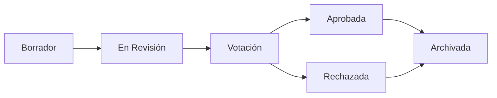

# Propuestas

Las propuestas son el punto de entrada para las decisiones de gobernanza en OpenPR. Una propuesta describe un cambio, mejora o decisión que necesita la opinión del equipo, y sigue un ciclo de vida estructurado desde la creación hasta la votación hasta una decisión final.

## Ciclo de Vida de una Propuesta



1. **Borrador** -- El autor crea la propuesta con título, descripción y contexto.
2. **En Revisión** -- Los miembros del equipo discuten y proporcionan retroalimentación a través de comentarios.
3. **Votación** -- Se abre el período de votación. Los miembros emiten votos según las reglas de gobernanza.
4. **Aprobada/Rechazada** -- Cierra la votación. El resultado se determina por umbral y quórum.
5. **Archivada** -- La decisión se registra y la propuesta se archiva.

## Crear una Propuesta

### Mediante la Interfaz Web

1. Navega a tu proyecto.
2. Ve a **Gobernanza** > **Propuestas**.
3. Haz clic en **Nueva Propuesta**.
4. Completa el título, descripción y cualquier incidencia vinculada.
5. Haz clic en **Crear**.

### Mediante la API

```bash
curl -X POST http://localhost:8080/api/proposals \
  -H "Content-Type: application/json" \
  -H "Authorization: Bearer <token>" \
  -d '{
    "project_id": "<project_uuid>",
    "title": "Adopt TypeScript for frontend modules",
    "description": "Proposal to migrate frontend modules from JavaScript to TypeScript for better type safety."
  }'
```

### Mediante MCP

```json
{
  "method": "tools/call",
  "params": {
    "name": "proposals.create",
    "arguments": {
      "project_id": "<project_uuid>",
      "title": "Adopt TypeScript for frontend modules",
      "description": "Proposal to migrate frontend modules from JavaScript to TypeScript."
    }
  }
}
```

## Plantillas de Propuestas

Los administradores del espacio de trabajo pueden crear plantillas de propuestas para estandarizar el formato de las propuestas. Las plantillas definen:

- Patrón de título
- Secciones requeridas en la descripción
- Parámetros de votación predeterminados

Las plantillas se gestionan en **Configuración del Espacio de Trabajo** > **Gobernanza** > **Plantillas**.

## Vincular Propuestas a Incidencias

Las propuestas pueden vincularse a incidencias relacionadas a través de la tabla `proposal_issue_links`. Esto crea una referencia bidireccional:

- Desde la propuesta, puedes ver qué incidencias están afectadas.
- Desde una incidencia, puedes ver qué propuestas la referencian.

## Comentarios de Propuestas

Cada propuesta tiene su propio hilo de discusión, separado de los comentarios de incidencias. Los comentarios de propuestas soportan formato markdown y son visibles para todos los miembros del espacio de trabajo.

## Herramientas MCP

| Herramienta | Params | Descripción |
|-------------|--------|-------------|
| `proposals.list` | `project_id` | Listar propuestas, filtro de `status` opcional |
| `proposals.get` | `proposal_id` | Obtener detalles completos de la propuesta |
| `proposals.create` | `project_id`, `title`, `description` | Crear una nueva propuesta |

## Próximos Pasos

- [Votación y Decisiones](./voting) -- Cómo se emiten los votos y se toman las decisiones
- [Puntuaciones de Confianza](./trust-scores) -- Cómo afectan las puntuaciones de confianza al peso de los votos
- [Descripción General de Gobernanza](./index) -- Referencia completa del módulo de gobernanza
