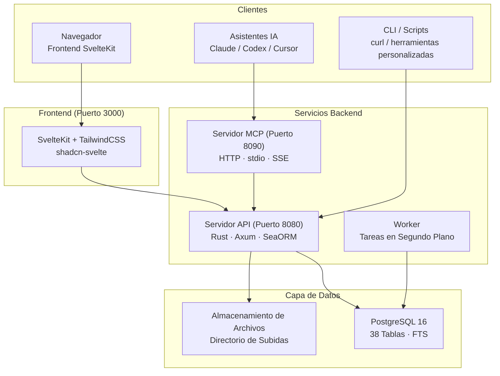

# OpenPR

**OpenPR** es una plataforma de gestión de proyectos de código abierto diseñada para equipos que necesitan gobernanza transparente, flujos de trabajo asistidos por IA y control total sobre sus datos de proyecto. Combina seguimiento de incidencias, planificación de sprints, tableros kanban y un centro de gobernanza completo -- propuestas, votación, puntuaciones de confianza, mecanismos de veto -- en una única plataforma autoalojada.

OpenPR está construida con **Rust** (Axum + SeaORM) en el backend y **SvelteKit** en el frontend, respaldada por **PostgreSQL**. Expone una API REST y un servidor MCP integrado con 34 herramientas en tres protocolos de transporte, convirtiéndola en un proveedor de herramientas de primera clase para asistentes de IA como Claude, Codex y otros clientes compatibles con MCP.

## ¿Por Qué OpenPR?

La mayoría de las herramientas de gestión de proyectos son plataformas SaaS de código cerrado con personalización limitada, o alternativas de código abierto que carecen de funciones de gobernanza. OpenPR adopta un enfoque diferente:

- **Autoalojada y auditable.** Tus datos de proyecto permanecen en tu infraestructura. Cada función, cada registro de decisión, cada registro de auditoría está bajo tu control.
- **Gobernanza integrada.** Las propuestas, votación, puntuaciones de confianza, poder de veto y escalación no son un añadido -- son módulos centrales con soporte completo de API.
- **Nativa para IA.** Un servidor MCP integrado convierte OpenPR en un proveedor de herramientas para agentes de IA. Tokens de bot, asignación de tareas a IA y callbacks de webhook permiten flujos de trabajo completamente automatizados.
- **Rendimiento de Rust.** El backend maneja miles de solicitudes concurrentes con un uso mínimo de recursos. La búsqueda de texto completo de PostgreSQL impulsa búsquedas instantáneas en todas las entidades.

## Características Principales

| Categoría | Características |
|-----------|----------------|
| **Gestión de Proyectos** | Espacios de trabajo, proyectos, incidencias, tablero kanban, sprints, etiquetas, comentarios, archivos adjuntos, feed de actividad, notificaciones, búsqueda de texto completo |
| **Centro de Gobernanza** | Propuestas, votación con quórum, registros de decisiones, veto y escalación, puntuaciones de confianza con historial y apelaciones, plantillas de propuestas, revisiones de impacto, registros de auditoría |
| **Integración IA** | Tokens de bot (prefijo `opr_`), registro de agentes de IA, asignación de tareas a IA con seguimiento de progreso, revisión de IA en propuestas, servidor MCP (34 herramientas, 3 transportes), callbacks de webhook |
| **Autenticación** | JWT (tokens de acceso + actualización), autenticación con token de bot, control de acceso basado en roles (admin/user), permisos con ámbito de espacio de trabajo (owner/admin/member) |
| **Despliegue** | Docker Compose, Podman, proxy inverso Caddy/Nginx, PostgreSQL 15+ |

## Arquitectura



## Stack Tecnológico

| Capa | Tecnología |
|------|-----------|
| **Backend** | Rust, Axum, SeaORM, PostgreSQL |
| **Frontend** | SvelteKit, TailwindCSS, shadcn-svelte |
| **MCP** | JSON-RPC 2.0 (HTTP + stdio + SSE) |
| **Autenticación** | JWT (acceso + actualización) + Tokens de Bot (`opr_`) |
| **Despliegue** | Docker Compose, Podman, Caddy, Nginx |

## Inicio Rápido

```bash
git clone https://github.com/openprx/openpr.git
cd openpr
cp .env.example .env
docker-compose up -d
```

Los servicios se inician en:
- **Frontend**: http://localhost:3000
- **API**: http://localhost:8080
- **Servidor MCP**: http://localhost:8090

El primer usuario registrado se convierte automáticamente en administrador.

Consulta la [Guía de Instalación](./getting-started/installation) para todos los métodos de despliegue, o el [Inicio Rápido](./getting-started/quickstart) para ponerse en marcha en 5 minutos.

## Secciones de Documentación

| Sección | Descripción |
|---------|-------------|
| [Instalación](./getting-started/installation) | Docker Compose, compilación desde fuente y opciones de despliegue |
| [Inicio Rápido](./getting-started/quickstart) | Pon OpenPR en marcha en 5 minutos |
| [Gestión de Espacios de Trabajo](./workspace/) | Espacios de trabajo, proyectos y roles de miembros |
| [Incidencias y Seguimiento](./issues/) | Incidencias, estados del flujo de trabajo, sprints y etiquetas |
| [Centro de Gobernanza](./governance/) | Propuestas, votación, decisiones y puntuaciones de confianza |
| [API REST](./api/) | Autenticación, endpoints y formatos de respuesta |
| [Servidor MCP](./mcp-server/) | Integración IA con 34 herramientas y 3 transportes |
| [Configuración](./configuration/) | Variables de entorno y ajustes |
| [Despliegue](./deployment/docker) | Guías de despliegue con Docker y producción |
| [Resolución de Problemas](./troubleshooting/) | Problemas comunes y soluciones |

## Proyectos Relacionados

| Repositorio | Descripción |
|-------------|-------------|
| [openpr](https://github.com/openprx/openpr) | Plataforma central (este proyecto) |
| [openpr-webhook](https://github.com/openprx/openpr-webhook) | Receptor de webhooks para integraciones externas |
| [prx](https://github.com/openprx/prx) | Marco de trabajo de asistente IA con MCP OpenPR integrado |
| [prx-memory](https://github.com/openprx/prx-memory) | Memoria MCP local para agentes de codificación |

## Información del Proyecto

- **Licencia:** MIT OR Apache-2.0
- **Lenguaje:** Rust (edición 2024)
- **Repositorio:** [github.com/openprx/openpr](https://github.com/openprx/openpr)
- **Rust Mínimo:** 1.75.0
- **Frontend:** SvelteKit
