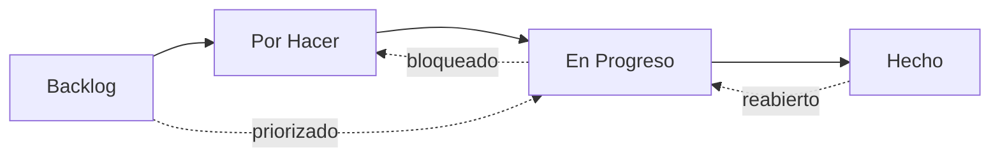
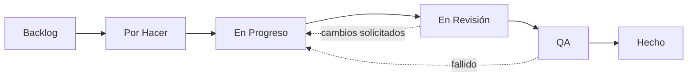

# Estados del Flujo de Trabajo

Cada incidencia en OpenPR tiene un **estado** que representa su posición en el flujo de trabajo. Las columnas del tablero kanban se mapean directamente a estos estados.

OpenPR viene con cuatro estados predeterminados, pero soporta **estados de flujo de trabajo completamente personalizados** a través de un sistema de resolución de 3 niveles. Puedes definir diferentes flujos de trabajo por proyecto, por espacio de trabajo, o depender de los valores predeterminados del sistema.

## Estados Predeterminados



| Estado | Valor | Descripción |
|--------|-------|-------------|
| **Backlog** | `backlog` | Ideas, trabajo futuro y elementos no planificados. Aún no programados. |
| **Por Hacer** | `todo` | Planificado y priorizado. Listo para ser tomado. |
| **En Progreso** | `in_progress` | Siendo trabajado activamente por un responsable. |
| **Hecho** | `done` | Completado y verificado. |

Estos son los estados integrados con los que comienza cada nuevo espacio de trabajo. Puedes personalizarlos o añadir estados adicionales como se describe en [Flujos de Trabajo Personalizados](#flujos-de-trabajo-personalizados) a continuación.

## Transiciones de Estado

OpenPR permite transiciones de estado flexibles. No hay restricciones forzadas -- cualquier estado puede transicionar a cualquier otro estado. Los patrones comunes incluyen:

| Transición | Desencadenante | Ejemplo |
|-----------|----------------|---------|
| Backlog -> Por Hacer | Planificación de sprint, priorización | Incidencia incluida en el próximo sprint |
| Por Hacer -> En Progreso | El desarrollador toma el trabajo | El responsable comienza la implementación |
| En Progreso -> Hecho | Trabajo completado | Pull request fusionado |
| En Progreso -> Por Hacer | Trabajo bloqueado o pausado | Esperando dependencia externa |
| Hecho -> En Progreso | Incidencia reabierta | Regresión de error descubierta |
| Backlog -> En Progreso | Hotfix urgente | Problema crítico de producción |

## Flujos de Trabajo Personalizados

OpenPR soporta estados de flujo de trabajo personalizados a través de un sistema de **resolución de 3 niveles**. Cuando la API valida un estado para un elemento de trabajo, resuelve el flujo de trabajo efectivo verificando tres niveles en orden:

```
Flujo de trabajo del proyecto  >  Flujo de trabajo del espacio de trabajo  >  Valores predeterminados del sistema
```

Si un proyecto define su propio flujo de trabajo, ese tiene precedencia. En caso contrario, se usa el flujo de trabajo a nivel de espacio de trabajo. Si no existe ninguno, se aplican los cuatro estados predeterminados del sistema.

### Esquema de Base de Datos

Los flujos de trabajo personalizados se almacenan en dos tablas (introducidas en la migración `0024_workflow_config.sql`):

- **`workflows`** -- Define un flujo de trabajo nombrado adjunto a un proyecto o espacio de trabajo.
- **`workflow_states`** -- Los estados individuales dentro de un flujo de trabajo.

Cada estado tiene las siguientes propiedades:

| Campo | Tipo | Descripción |
|-------|------|-------------|
| `key` | string | Identificador legible por máquina (p. ej., `in_review`) |
| `display_name` | string | Nombre legible (p. ej., "En Revisión") |
| `category` | string | Categoría de agrupación para el estado |
| `position` | integer | Orden de visualización en el tablero kanban |
| `color` | string | Código de color hexadecimal para la insignia del estado |
| `is_initial` | boolean | Si este es el estado predeterminado para nuevas incidencias |
| `is_terminal` | boolean | Si este estado representa la finalización |

### Crear un Flujo de Trabajo Personalizado mediante API

**Paso 1 -- Crear un flujo de trabajo para un proyecto:**

```bash
curl -X POST http://localhost:8080/api/workflows \
  -H "Content-Type: application/json" \
  -H "Authorization: Bearer <token>" \
  -d '{
    "name": "Engineering Flow",
    "project_id": "<project_uuid>"
  }'
```

**Paso 2 -- Añadir estados al flujo de trabajo:**

```bash
curl -X POST http://localhost:8080/api/workflows/<workflow_id>/states \
  -H "Content-Type: application/json" \
  -H "Authorization: Bearer <token>" \
  -d '{
    "key": "in_review",
    "display_name": "In Review",
    "category": "active",
    "position": 3,
    "color": "#f59e0b",
    "is_initial": false,
    "is_terminal": false
  }'
```

### Ejemplo: Flujo de Trabajo de Ingeniería de 6 Estados



| Estado | Clave | Categoría | Inicial | Terminal |
|--------|-------|-----------|---------|----------|
| Backlog | `backlog` | backlog | sí | no |
| Por Hacer | `todo` | planned | no | no |
| En Progreso | `in_progress` | active | no | no |
| En Revisión | `in_review` | active | no | no |
| QA | `qa` | active | no | no |
| Hecho | `done` | completed | no | sí |

### Validación Dinámica

Cuando se actualiza el estado de un elemento de trabajo, la API valida el nuevo estado contra el **flujo de trabajo efectivo** para ese proyecto. Si estableces una clave de estado que no existe en el flujo de trabajo resuelto, la API devuelve un error `422 Unprocessable Entity`. Los estados no están codificados fijos -- se buscan dinámicamente en el momento de la solicitud.

## Tablero Kanban

La vista de tablero muestra las incidencias como tarjetas en columnas correspondientes a los estados del flujo de trabajo. Arrastra y suelta una tarjeta entre columnas para cambiar su estado. Cuando los flujos de trabajo personalizados están activos, el tablero refleja automáticamente los estados personalizados y su orden configurado.

Cada tarjeta muestra:
- Identificador de incidencia (p. ej., `API-42`)
- Título
- Indicador de prioridad
- Avatar del responsable
- Insignias de etiquetas

## Actualizar Estado mediante API

```bash
# Move issue to "in_progress"
curl -X PATCH http://localhost:8080/api/issues/<issue_id> \
  -H "Content-Type: application/json" \
  -H "Authorization: Bearer <token>" \
  -d '{"state": "in_progress"}'
```

## Actualizar Estado mediante MCP

```json
{
  "method": "tools/call",
  "params": {
    "name": "work_items.update",
    "arguments": {
      "work_item_id": "<issue_uuid>",
      "state": "in_progress"
    }
  }
}
```

## Niveles de Prioridad

Además de los estados, cada incidencia puede tener un nivel de prioridad:

| Prioridad | Valor | Descripción |
|-----------|-------|-------------|
| Baja | `low` | Agradable tener, sin presión de tiempo |
| Media | `medium` | Prioridad estándar, trabajo planificado |
| Alta | `high` | Importante, debería abordarse pronto |
| Urgente | `urgent` | Crítico, necesita atención inmediata |

## Seguimiento de Actividad

Cada cambio de estado se registra en el feed de actividad de la incidencia con el actor, marca de tiempo y valores antiguos/nuevos. Esto proporciona un registro de auditoría completo.

## Próximos Pasos

- [Planificación de Sprints](./sprints) -- Organizar incidencias en iteraciones con tiempo limitado
- [Etiquetas](./labels) -- Añadir categorización a las incidencias
- [Descripción General de Incidencias](./index) -- Referencia completa de campos de incidencias
