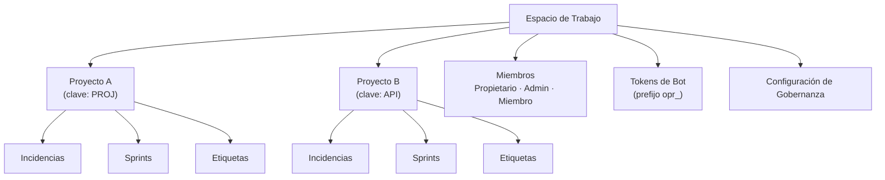

# Gestión de Espacios de Trabajo

Un **espacio de trabajo** es la unidad organizativa de nivel superior en OpenPR. Proporciona aislamiento multi-tenant -- cada espacio de trabajo tiene sus propios proyectos, miembros, etiquetas, tokens de bot y configuraciones de gobernanza. Los usuarios pueden pertenecer a múltiples espacios de trabajo.

## Crear un Espacio de Trabajo

Después de iniciar sesión, haz clic en **Crear Espacio de Trabajo** en el panel o navega a **Configuración** > **Espacios de Trabajo** > **Nuevo**.

Proporciona:

| Campo | Requerido | Descripción |
|-------|----------|-------------|
| Nombre | Sí | Nombre para mostrar (p. ej., "Equipo de Ingeniería") |
| Slug | Sí | Identificador amigable para URL (p. ej., "ingenieria") |

El usuario creador recibe automáticamente el rol de **Propietario**.

## Estructura del Espacio de Trabajo



## Configuración del Espacio de Trabajo

Accede a la configuración del espacio de trabajo a través del icono de engranaje o **Configuración** en la barra lateral:

- **General** -- Actualiza el nombre, slug y descripción del espacio de trabajo.
- **Miembros** -- Invita usuarios, cambia roles, elimina miembros. Ver [Miembros](./members).
- **Tokens de Bot** -- Crea y gestiona tokens de bot MCP.
- **Gobernanza** -- Configura umbrales de votación, plantillas de propuestas y reglas de puntuación de confianza. Ver [Gobernanza](../governance/).
- **Webhooks** -- Configura endpoints de webhook para integraciones externas.

## Acceso por API

```bash
# List workspaces
curl -H "Authorization: Bearer <token>" \
  http://localhost:8080/api/workspaces

# Get workspace details
curl -H "Authorization: Bearer <token>" \
  http://localhost:8080/api/workspaces/<workspace_id>
```

## Acceso por MCP

A través del servidor MCP, los asistentes de IA operan dentro del espacio de trabajo especificado por la variable de entorno `OPENPR_WORKSPACE_ID`. Todas las herramientas MCP limitan automáticamente las operaciones a ese espacio de trabajo.

## Próximos Pasos

- [Proyectos](./projects) -- Crea y gestiona proyectos dentro de un espacio de trabajo
- [Miembros y Permisos](./members) -- Invita usuarios y configura roles
