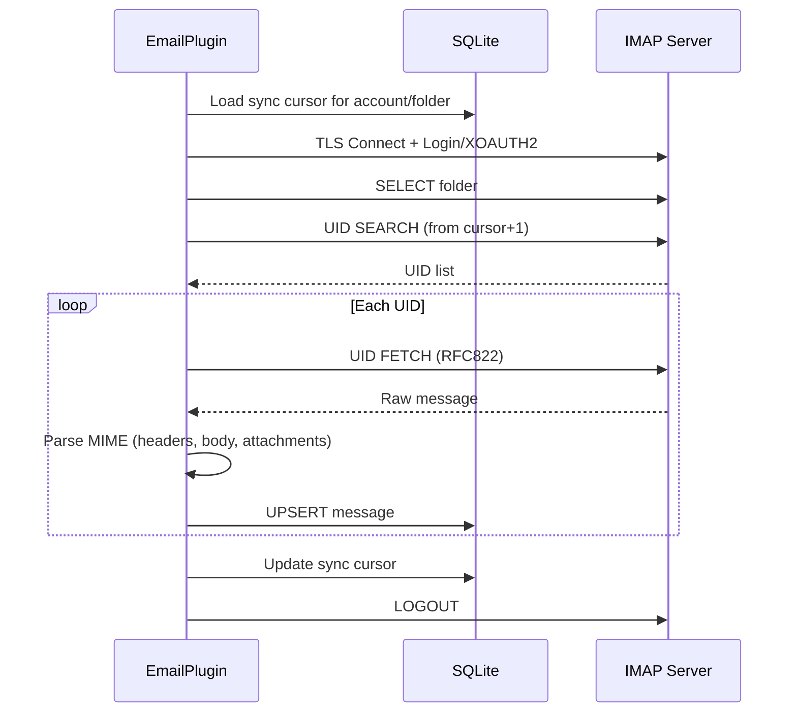

# Configuración IMAP

PRX-Email se conecta a servidores IMAP sobre TLS usando la biblioteca `rustls`. Soporta autenticación por contraseña y XOAUTH2 para Gmail y Outlook. La sincronización de bandeja de entrada es basada en UID e incremental, con persistencia de cursor en la base de datos SQLite.

## Configuración IMAP Básica

```rust
use prx_email::plugin::{ImapConfig, AuthConfig};

let imap = ImapConfig {
    host: "imap.example.com".to_string(),
    port: 993,
    user: "you@example.com".to_string(),
    auth: AuthConfig {
        password: Some("your-app-password".to_string()),
        oauth_token: None,
    },
};
```

### Campos de Configuración

| Campo | Tipo | Requerido | Descripción |
|-------|------|-----------|-------------|
| `host` | `String` | Sí | Nombre de host del servidor IMAP (no debe estar vacío) |
| `port` | `u16` | Sí | Puerto del servidor IMAP (típicamente 993 para TLS) |
| `user` | `String` | Sí | Nombre de usuario IMAP (generalmente la dirección de email) |
| `auth.password` | `Option<String>` | Uno de | Contraseña de app para IMAP LOGIN |
| `auth.oauth_token` | `Option<String>` | Uno de | Token de acceso OAuth para XOAUTH2 |

::: warning Autenticación
Exactamente uno de `password` u `oauth_token` debe estar establecido. Establecer ambos o ninguno resultará en un error de validación.
:::

## Ajustes Comunes de Proveedores

| Proveedor | Host | Puerto | Método de Auth |
|-----------|------|--------|----------------|
| Gmail | `imap.gmail.com` | 993 | Contraseña de app o XOAUTH2 |
| Outlook / Office 365 | `outlook.office365.com` | 993 | XOAUTH2 (recomendado) |
| Yahoo | `imap.mail.yahoo.com` | 993 | Contraseña de app |
| Fastmail | `imap.fastmail.com` | 993 | Contraseña de app |
| ProtonMail Bridge | `127.0.0.1` | 1143 | Contraseña del bridge |

## Sincronizar la Bandeja de Entrada

El método `sync` se conecta al servidor IMAP, selecciona una carpeta, obtiene nuevos mensajes por UID y los almacena en SQLite:

```rust
use prx_email::plugin::SyncRequest;

plugin.sync(SyncRequest {
    account_id: 1,
    folder: Some("INBOX".to_string()),
    cursor: None,        // Resume from last saved cursor
    now_ts: now,
    max_messages: 100,   // Fetch at most 100 messages per sync
})?;
```

### Flujo de Sincronización



### Sincronización Incremental

PRX-Email usa cursores basados en UID para evitar re-obtener mensajes. Después de cada sincronización:

1. El UID más alto visto se guarda como cursor
2. La siguiente sincronización empieza desde `cursor + 1`
3. Los mensajes con pares `(account_id, message_id)` existentes se actualizan (UPSERT)

El cursor se almacena en la tabla `sync_state` con la clave compuesta `(account_id, folder_id)`.

## Sincronización Multi-Carpeta

Sincroniza múltiples carpetas para la misma cuenta:

```rust
for folder in &["INBOX", "Sent", "Drafts", "Archive"] {
    plugin.sync(SyncRequest {
        account_id,
        folder: Some(folder.to_string()),
        cursor: None,
        now_ts: now,
        max_messages: 100,
    })?;
}
```

## Programador de Sincronización

Para sincronización periódica, usa el runner de sincronización integrado:

```rust
use prx_email::plugin::{SyncJob, SyncRunnerConfig};

let jobs = vec![
    SyncJob { account_id: 1, folder: "INBOX".into(), max_messages: 100 },
    SyncJob { account_id: 1, folder: "Sent".into(), max_messages: 50 },
    SyncJob { account_id: 2, folder: "INBOX".into(), max_messages: 100 },
];

let config = SyncRunnerConfig {
    max_concurrency: 4,         // Max jobs per runner tick
    base_backoff_seconds: 10,   // Initial backoff on failure
    max_backoff_seconds: 300,   // Maximum backoff (5 minutes)
};

let report = plugin.run_sync_runner(&jobs, now, &config);
println!(
    "Run {}: attempted={}, succeeded={}, failed={}",
    report.run_id, report.attempted, report.succeeded, report.failed
);
```

### Comportamiento del Programador

- **Límite de concurrencia**: Como máximo `max_concurrency` trabajos se ejecutan por ciclo
- **Retroceso por fallo**: Retroceso exponencial con fórmula `base * 2^fallos`, limitado en `max_backoff_seconds`
- **Verificación de vencimiento**: Los trabajos se omiten si su ventana de retroceso no ha transcurrido
- **Seguimiento de estado**: Por clave `cuenta::carpeta`, rastrea `(next_allowed_at, failure_count)`

## Análisis de Mensajes

Los mensajes entrantes se analizan usando el crate `mail-parser` con la siguiente extracción:

| Campo | Fuente | Notas |
|-------|--------|-------|
| `message_id` | Encabezado `Message-ID` | Recurre a SHA-256 de bytes raw |
| `subject` | Encabezado `Subject` | |
| `sender` | Primera dirección del encabezado `From` | |
| `recipients` | Todas las direcciones del encabezado `To` | Separadas por comas |
| `body_text` | Primera parte `text/plain` | |
| `body_html` | Primera parte `text/html` | Respaldo: extracción de sección raw |
| `snippet` | Primeros 120 caracteres de body_text o body_html | |
| `references_header` | Encabezado `References` | Para threading |
| `attachments` | Partes MIME de adjuntos | Metadatos serializados JSON |

## TLS

Todas las conexiones IMAP usan TLS vía `rustls` con el bundle de certificados `webpki-roots`. No hay opción para deshabilitar TLS o usar STARTTLS -- las conexiones siempre están cifradas desde el inicio.

## Siguientes Pasos

- [Configuración SMTP](./smtp) -- Configura el envío de email
- [Autenticación OAuth](./oauth) -- Configura XOAUTH2 para Gmail y Outlook
- [Almacenamiento SQLite](../storage/) -- Entiende el esquema de base de datos
