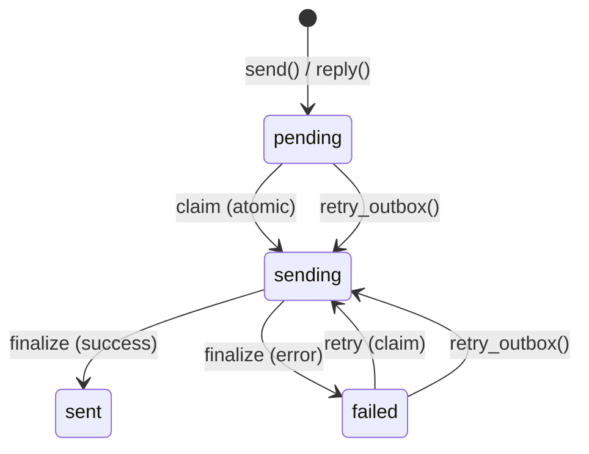

# Configuración SMTP

PRX-Email envía email a través de SMTP usando el crate `lettre` con TLS `rustls`. El pipeline de buzón de salida usa un flujo de trabajo atómico de reclamación-envío-finalización para prevenir envíos duplicados, con reintento de retroceso exponencial y claves de idempotencia deterministas de Message-ID.

## Configuración SMTP Básica

```rust
use prx_email::plugin::{SmtpConfig, AuthConfig};

let smtp = SmtpConfig {
    host: "smtp.example.com".to_string(),
    port: 465,
    user: "you@example.com".to_string(),
    auth: AuthConfig {
        password: Some("your-app-password".to_string()),
        oauth_token: None,
    },
};
```

### Campos de Configuración

| Campo | Tipo | Requerido | Descripción |
|-------|------|-----------|-------------|
| `host` | `String` | Sí | Nombre de host del servidor SMTP (no debe estar vacío) |
| `port` | `u16` | Sí | Puerto del servidor SMTP (465 para TLS implícito, 587 para STARTTLS) |
| `user` | `String` | Sí | Nombre de usuario SMTP (generalmente la dirección de email) |
| `auth.password` | `Option<String>` | Uno de | Contraseña para SMTP AUTH PLAIN/LOGIN |
| `auth.oauth_token` | `Option<String>` | Uno de | Token de acceso OAuth para XOAUTH2 |

## Ajustes Comunes de Proveedores

| Proveedor | Host | Puerto | Método de Auth |
|-----------|------|--------|----------------|
| Gmail | `smtp.gmail.com` | 465 | Contraseña de app o XOAUTH2 |
| Outlook / Office 365 | `smtp.office365.com` | 587 | XOAUTH2 |
| Yahoo | `smtp.mail.yahoo.com` | 465 | Contraseña de app |
| Fastmail | `smtp.fastmail.com` | 465 | Contraseña de app |

## Enviar Email

### Envío Básico

```rust
use prx_email::plugin::SendEmailRequest;

let response = plugin.send(SendEmailRequest {
    account_id: 1,
    to: "recipient@example.com".to_string(),
    subject: "Hello".to_string(),
    body_text: "Message body here.".to_string(),
    now_ts: now,
    attachment: None,
    failure_mode: None,
});
```

### Responder a un Mensaje

```rust
use prx_email::plugin::ReplyEmailRequest;

let response = plugin.reply(ReplyEmailRequest {
    account_id: 1,
    in_reply_to_message_id: "<original-msg-id@example.com>".to_string(),
    body_text: "Thanks for your message!".to_string(),
    now_ts: now,
    attachment: None,
    failure_mode: None,
});
```

Las respuestas automáticamente:
- Establecen el encabezado `In-Reply-To`
- Construyen la cadena `References` del mensaje padre
- Derivan el destinatario del remitente del mensaje padre
- Prefijan el asunto con `Re:`

## Pipeline de Buzón de Salida

El pipeline de buzón de salida asegura la entrega confiable de emails a través de una máquina de estados atómica:



### Reglas de la Máquina de Estados

| Transición | Condición | Guarda |
|-----------|-----------|--------|
| `pending` -> `sending` | `claim_outbox_for_send()` | `status IN ('pending','failed') AND next_attempt_at <= now` |
| `sending` -> `sent` | Proveedor aceptó | `update_outbox_status_if_current(status='sending')` |
| `sending` -> `failed` | Proveedor rechazó o error de red | `update_outbox_status_if_current(status='sending')` |
| `failed` -> `sending` | `retry_outbox()` | `status IN ('pending','failed') AND next_attempt_at <= now` |

### Idempotencia

Cada mensaje del buzón de salida obtiene un Message-ID determinista:

```
<outbox-{id}-{retries}@prx-email.local>
```

Esto asegura que los reintentos sean distinguibles del envío original, y los proveedores que de-duplican por Message-ID aceptarán cada reintento.

### Retroceso de Reintento

Los envíos fallidos usan retroceso exponencial:

```
next_attempt_at = now + base_backoff * 2^retries
```

Con un retroceso base de 5 segundos:

| Reintento | Retroceso |
|-----------|-----------|
| 1 | 10s |
| 2 | 20s |
| 3 | 40s |
| 4 | 80s |
| 5 | 160s |
| 6 | 320s |
| 7 | 640s |
| 10 | 5,120s (~85 min) |

### Reintento Manual

```rust
use prx_email::plugin::RetryOutboxRequest;

let response = plugin.retry_outbox(RetryOutboxRequest {
    outbox_id: 42,
    now_ts: now,
    failure_mode: None,
});
```

El reintento se rechaza si:
- El estado del buzón de salida es `sent` o `sending` (no reintenatable)
- El `next_attempt_at` aún no ha sido alcanzado (`retry_not_due`)

## Adjuntos

### Enviar con un Adjunto

```rust
use prx_email::plugin::{SendEmailRequest, AttachmentInput};

let response = plugin.send(SendEmailRequest {
    account_id: 1,
    to: "recipient@example.com".to_string(),
    subject: "Report attached".to_string(),
    body_text: "Please find the report attached.".to_string(),
    now_ts: now,
    attachment: Some(AttachmentInput {
        filename: "report.pdf".to_string(),
        content_type: "application/pdf".to_string(),
        base64: Some(base64_encoded_content),
        path: None,
    }),
    failure_mode: None,
});
```

### Política de Adjuntos

El `AttachmentPolicy` aplica restricciones de tamaño y tipo MIME:

```rust
use prx_email::plugin::AttachmentPolicy;

let policy = AttachmentPolicy {
    max_size_bytes: 25 * 1024 * 1024,  // 25 MiB
    allowed_content_types: [
        "application/pdf",
        "image/jpeg",
        "image/png",
        "text/plain",
        "application/zip",
    ].into_iter().map(String::from).collect(),
};
```

| Regla | Comportamiento |
|-------|---------------|
| El tamaño supera `max_size_bytes` | Rechazado con `attachment exceeds size limit` |
| El tipo MIME no está en `allowed_content_types` | Rechazado con `attachment content type is not allowed` |
| Adjunto basado en ruta sin `attachment_store` | Rechazado con `attachment store not configured` |
| La ruta escapa de la raíz de almacenamiento (`../` traversal) | Rechazado con `attachment path escapes storage root` |

### Adjuntos Basados en Ruta

Para adjuntos almacenados en disco, configura el almacén de adjuntos:

```rust
use prx_email::plugin::AttachmentStoreConfig;

let store = AttachmentStoreConfig {
    enabled: true,
    dir: "/var/lib/prx-email/attachments".to_string(),
};
```

La resolución de rutas incluye protecciones contra traversal de directorios -- cualquier ruta que se resuelva fuera de la raíz de almacenamiento configurada se rechaza, incluyendo escapes basados en symlinks.

## Formato de Respuesta de API

Todas las operaciones de envío devuelven un `ApiResponse<SendResult>`:

```rust
pub struct SendResult {
    pub outbox_id: i64,
    pub status: String,          // "sent" or "failed"
    pub retries: i64,
    pub provider_message_id: Option<String>,
    pub next_attempt_at: i64,
}
```

## Siguientes Pasos

- [Autenticación OAuth](./oauth) -- Configura XOAUTH2 para proveedores que lo requieren
- [Referencia de Configuración](../configuration/) -- Todos los ajustes y variables de entorno
- [Resolución de Problemas](../troubleshooting/) -- Problemas comunes de SMTP y soluciones
