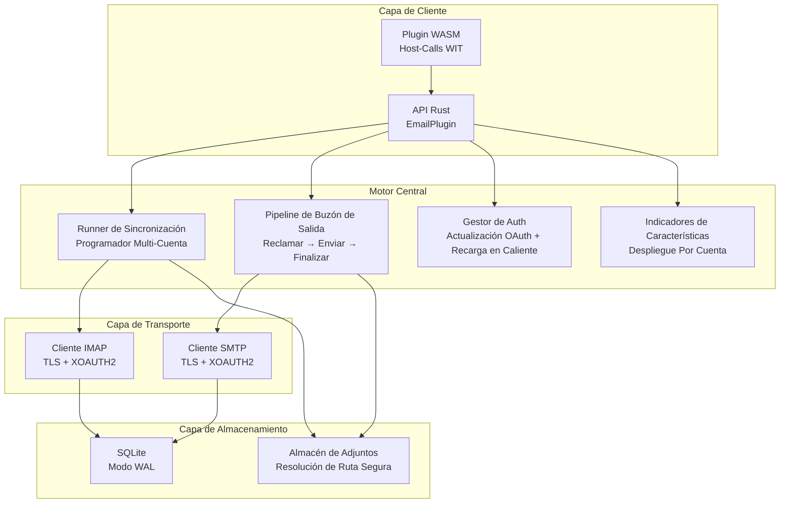

# PRX-Email

**PRX-Email** es un plugin de cliente de email auto-alojado escrito en Rust con persistencia SQLite y primitivos robustecidos para producción. Proporciona sincronización de bandeja de entrada IMAP, envío SMTP con un pipeline de buzón de salida atómico, autenticación OAuth 2.0 para Gmail y Outlook, gobernanza de adjuntos y una interfaz de plugin WASM para integración en el ecosistema PRX.

PRX-Email está diseñado para desarrolladores y equipos que necesitan un backend de email confiable y embebible -- uno que maneje la planificación de sincronización de múltiples cuentas, entrega segura en el buzón de salida con reintento y retroceso, gestión del ciclo de vida de tokens OAuth, y despliegue de indicadores de características -- todo sin depender de APIs de email SaaS de terceros.

## ¿Por Qué PRX-Email?

La mayoría de las integraciones de email dependen de APIs específicas de proveedores o envolturas IMAP/SMTP frágiles que ignoran las preocupaciones de producción como envíos duplicados, expiración de tokens e inseguridad de adjuntos. PRX-Email adopta un enfoque diferente:

- **Buzón de salida robustecido para producción.** La máquina de estados atómica de reclamación-y-finalización previene envíos duplicados. El retroceso exponencial y las claves de idempotencia deterministas de Message-ID aseguran reintentos seguros.
- **Autenticación OAuth-first.** Soporte XOAUTH2 nativo tanto para IMAP como para SMTP con seguimiento de expiración de tokens, proveedores de actualización conectables y recarga en caliente desde variables de entorno.
- **Almacenamiento nativo en SQLite.** Modo WAL, puntos de control acotados y consultas parametrizadas proporcionan persistencia local rápida y confiable sin dependencias de base de datos externas.
- **Extensible via WASM.** El plugin compila a WebAssembly y expone operaciones de email a través de host-calls WIT, con un interruptor de seguridad de red que deshabilita IMAP/SMTP real por defecto.

## Características Principales

- **Sincronización de Bandeja de Entrada IMAP** -- Conéctate a cualquier servidor IMAP con TLS. Sincroniza múltiples cuentas y carpetas con obtención incremental basada en UID y persistencia de cursor.

- **Pipeline de Buzón de Salida SMTP** -- El flujo de trabajo atómico de reclamación-envío-finalización previene envíos duplicados. Los mensajes fallidos se reintentan con retroceso exponencial y límites configurables.

- **Autenticación OAuth 2.0** -- XOAUTH2 para Gmail y Outlook. Seguimiento de expiración de tokens, proveedores de actualización conectables y recarga en caliente desde entorno sin reinicios.

- **Programador de Sincronización Multi-Cuenta** -- Sondeo periódico por cuenta y carpeta con concurrencia configurable, retroceso por fallo y límites máximos por ejecución.

- **Persistencia SQLite** -- Modo WAL, synchronous NORMAL, timeout de espera ocupada de 5s. Esquema completo con cuentas, carpetas, mensajes, buzón de salida, estado de sincronización e indicadores de características.

- **Gobernanza de Adjuntos** -- Límites de tamaño máximo, aplicación de lista blanca MIME y protecciones contra traversal de directorios protegen contra adjuntos de gran tamaño o maliciosos.

- **Despliegue de Indicadores de Características** -- Indicadores de características por cuenta con despliegue basado en porcentaje. Controla la lectura de bandeja de entrada, búsqueda, envío, respuesta y capacidades de reintento de forma independiente.

- **Interfaz de Plugin WASM** -- Compila a WebAssembly para ejecución en sandbox en el runtime de PRX. Los host-calls proporcionan operaciones email.sync, list, get, search, send y reply.

- **Observabilidad** -- Métricas de runtime en memoria (intentos/éxito/fallos de sincronización, fallos de envío, contador de reintentos) y payloads de log estructurados con account, folder, message_id, run_id y error_code.

## Arquitectura



## Instalación Rápida

Clona el repositorio y compila:

```bash
git clone https://github.com/openprx/prx_email.git
cd prx_email
cargo build --release
```

O añade como dependencia en tu `Cargo.toml`:

```toml
[dependencies]
prx_email = { git = "https://github.com/openprx/prx_email.git" }
```

Consulta la [Guía de Instalación](./getting-started/installation) para instrucciones completas de configuración incluyendo la compilación del plugin WASM.

## Secciones de Documentación

| Sección | Descripción |
|---------|-------------|
| [Instalación](./getting-started/installation) | Instala PRX-Email, configura dependencias y compila el plugin WASM |
| [Inicio Rápido](./getting-started/quickstart) | Configura tu primera cuenta y envía un email en 5 minutos |
| [Gestión de Cuentas](./accounts/) | Añade, configura y gestiona cuentas de email |
| [Configuración IMAP](./accounts/imap) | Ajustes del servidor IMAP, TLS y sincronización de carpetas |
| [Configuración SMTP](./accounts/smtp) | Ajustes del servidor SMTP, TLS y pipeline de envío |
| [Autenticación OAuth](./accounts/oauth) | Configuración OAuth 2.0 para Gmail y Outlook |
| [Almacenamiento SQLite](./storage/) | Esquema de base de datos, modo WAL, ajuste de rendimiento y mantenimiento |
| [Plugins WASM](./plugins/) | Compila y despliega el plugin WASM con host-calls WIT |
| [Referencia de Configuración](./configuration/) | Todas las variables de entorno, ajustes de runtime y opciones de política |
| [Resolución de Problemas](./troubleshooting/) | Problemas comunes y soluciones |

## Información del Proyecto

- **Licencia:** MIT OR Apache-2.0
- **Lenguaje:** Rust (edición 2024)
- **Repositorio:** [github.com/openprx/prx_email](https://github.com/openprx/prx_email)
- **Almacenamiento:** SQLite (rusqlite con característica bundled)
- **IMAP:** crate `imap` con TLS rustls
- **SMTP:** crate `lettre` con TLS rustls
