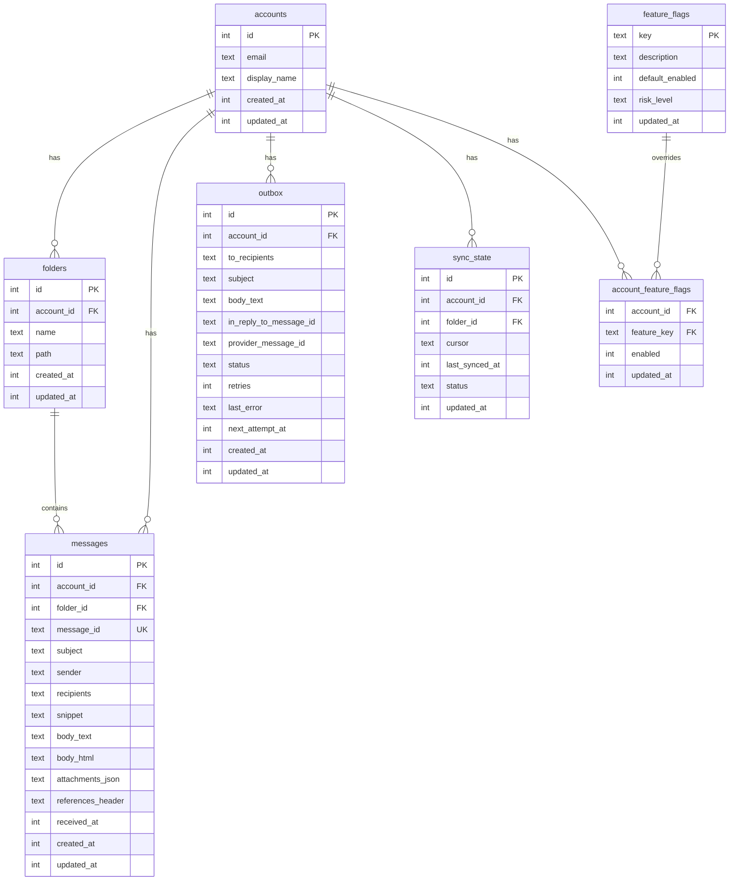

# Almacenamiento SQLite

PRX-Email usa SQLite como su único backend de almacenamiento, accedido a través del crate `rusqlite` con la compilación SQLite bundled. La base de datos se ejecuta en modo WAL con claves foráneas habilitadas, proporcionando lecturas concurrentes rápidas y aislamiento confiable de escritura.

## Configuración de la Base de Datos

### Ajustes por Defecto

| Ajuste | Valor | Descripción |
|--------|-------|-------------|
| `journal_mode` | WAL | Write-Ahead Logging para lecturas concurrentes |
| `synchronous` | NORMAL | Durabilidad/rendimiento equilibrado |
| `foreign_keys` | ON | Aplicar integridad referencial |
| `busy_timeout` | 5000ms | Tiempo de espera para base de datos bloqueada |
| `wal_autocheckpoint` | 1000 páginas | Umbral de punto de control WAL automático |

### Configuración Personalizada

```rust
use prx_email::db::{EmailStore, StoreConfig, SynchronousMode};

let config = StoreConfig {
    enable_wal: true,
    busy_timeout_ms: 5_000,
    wal_autocheckpoint_pages: 1_000,
    synchronous: SynchronousMode::Normal,
};

let store = EmailStore::open_with_config("./email.db", &config)?;
```

### Modos de Sincronización

| Modo | Durabilidad | Rendimiento | Caso de Uso |
|------|-------------|-------------|-------------|
| `Full` | Máxima | Escrituras más lentas | Cargas de trabajo financieras o de cumplimiento |
| `Normal` | Buena (predeterminado) | Equilibrado | Uso general en producción |
| `Off` | Mínima | Escrituras más rápidas | Solo desarrollo y pruebas |

### Base de Datos en Memoria

Para pruebas, usa una base de datos en memoria:

```rust
let store = EmailStore::open_in_memory()?;
store.migrate()?;
```

## Esquema

El esquema de la base de datos se aplica a través de migraciones incrementales. Ejecutar `store.migrate()` aplica todas las migraciones pendientes.

### Tablas



### Índices

| Tabla | Índice | Propósito |
|-------|--------|-----------|
| `messages` | `(account_id)` | Filtrar mensajes por cuenta |
| `messages` | `(folder_id)` | Filtrar mensajes por carpeta |
| `messages` | `(subject)` | Búsqueda LIKE en asuntos |
| `messages` | `(account_id, message_id)` | Restricción única para UPSERT |
| `outbox` | `(account_id)` | Filtrar buzón de salida por cuenta |
| `outbox` | `(status, next_attempt_at)` | Reclamar registros elegibles del buzón de salida |
| `sync_state` | `(account_id, folder_id)` | Restricción única para UPSERT |
| `account_feature_flags` | `(account_id)` | Búsquedas de indicadores de características |

## Migraciones

Las migraciones están embebidas en el binario y se aplican en orden:

| Migración | Descripción |
|-----------|-------------|
| `0001_init.sql` | Tablas de cuentas, carpetas, mensajes, sync_state |
| `0002_outbox.sql` | Tabla de buzón de salida para pipeline de envío |
| `0003_rollout.sql` | Indicadores de características y indicadores de características por cuenta |
| `0005_m41.sql` | Refinamientos de esquema M4.1 |
| `0006_m42_perf.sql` | Índices de rendimiento M4.2 |

Las columnas adicionales (`body_html`, `attachments_json`, `references_header`) se añaden via `ALTER TABLE` si no están presentes.

## Ajuste de Rendimiento

### Cargas de Trabajo de Lectura Intensiva

Para aplicaciones que leen mucho más de lo que escriben (clientes de email típicos):

```rust
let config = StoreConfig {
    enable_wal: true,              // Concurrent reads
    busy_timeout_ms: 10_000,       // Higher timeout for contention
    wal_autocheckpoint_pages: 2_000, // Less frequent checkpoints
    synchronous: SynchronousMode::Normal,
};
```

### Cargas de Trabajo de Escritura Intensiva

Para operaciones de sincronización de alto volumen:

```rust
let config = StoreConfig {
    enable_wal: true,
    busy_timeout_ms: 5_000,
    wal_autocheckpoint_pages: 500, // More frequent checkpoints
    synchronous: SynchronousMode::Normal,
};
```

### Análisis del Plan de Consulta

Comprueba consultas lentas con `EXPLAIN QUERY PLAN`:

```sql
EXPLAIN QUERY PLAN
SELECT * FROM messages
WHERE account_id = 1 AND subject LIKE '%invoice%'
ORDER BY received_at DESC LIMIT 50;
```

## Planificación de Capacidad

### Factores de Crecimiento

| Tabla | Patrón de Crecimiento | Estrategia de Retención |
|-------|----------------------|------------------------|
| `messages` | Tabla dominante; crece con cada sincronización | Purgar mensajes antiguos periódicamente |
| `outbox` | Acumula historial enviado + fallido | Eliminar registros enviados antiguos |
| Archivo WAL | Picos durante ráfagas de escritura | Punto de control automático |

### Umbrales de Monitoreo

- Rastrea el tamaño del archivo de BD y el tamaño de WAL de forma independiente
- Alerta cuando el WAL sigue siendo grande después de múltiples puntos de control
- Alerta cuando el backlog fallido del buzón de salida supera el SLO operacional

## Mantenimiento de Datos

### Ayudantes de Limpieza

```rust
// Delete sent outbox records older than 30 days
let cutoff = now - 30 * 86400;
let deleted = repo.delete_sent_outbox_before(cutoff)?;
println!("Deleted {} old sent records", deleted);

// Delete messages older than 90 days
let cutoff = now - 90 * 86400;
let deleted = repo.delete_old_messages_before(cutoff)?;
println!("Deleted {} old messages", deleted);
```

### SQL de Mantenimiento

Comprobar la distribución de estados del buzón de salida:

```sql
SELECT status, COUNT(*) FROM outbox GROUP BY status;
```

Distribución por antigüedad de mensajes:

```sql
SELECT
  CASE
    WHEN received_at >= strftime('%s','now') - 86400 THEN 'lt_1d'
    WHEN received_at >= strftime('%s','now') - 604800 THEN 'lt_7d'
    ELSE 'ge_7d'
  END AS age_bucket,
  COUNT(*)
FROM messages
GROUP BY age_bucket;
```

Punto de control WAL y compactación:

```sql
PRAGMA wal_checkpoint(TRUNCATE);
VACUUM;
```

::: warning VACUUM
`VACUUM` reconstruye el archivo de base de datos completo y requiere espacio libre en disco igual al tamaño de la base de datos. Ejecútalo en una ventana de mantenimiento después de grandes eliminaciones.
:::

## Seguridad SQL

Todas las consultas de base de datos usan sentencias parametrizadas para prevenir inyección SQL:

```rust
// Safe: parameterized query
conn.execute(
    "SELECT * FROM messages WHERE account_id = ?1 AND message_id = ?2",
    params![account_id, message_id],
)?;
```

Los identificadores dinámicos (nombres de tablas, nombres de columnas) se validan contra `^[a-zA-Z_][a-zA-Z0-9_]{0,62}$` antes de usarlos en cadenas SQL.

## Siguientes Pasos

- [Referencia de Configuración](../configuration/) -- Todos los ajustes de runtime
- [Resolución de Problemas](../troubleshooting/) -- Problemas relacionados con la base de datos
- [Configuración IMAP](../accounts/imap) -- Entender el flujo de datos de sincronización
