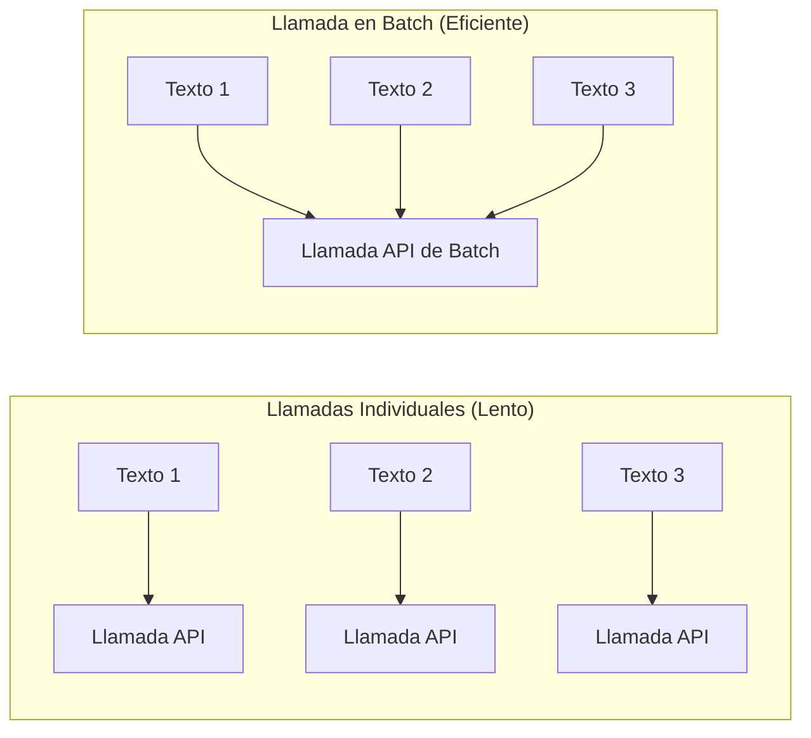

# Procesamiento en Batch

El procesamiento en batch agrupa múltiples textos en una sola solicitud de API de embedding, reduciendo la latencia y los costos de API en comparación con embeber cada texto individualmente.

## Individual vs. Batch



## Casos de Uso

### Importación Inicial

Cuando importas una gran cantidad de memorias existentes, el procesamiento en batch reduce significativamente el tiempo total:

```json
{
  "jsonrpc": "2.0",
  "id": 1,
  "method": "tools/call",
  "params": {
    "name": "memory_import",
    "arguments": {
      "data": [...]
    }
  }
}
```

`memory_import` embebe automáticamente en batch todas las entradas importadas usando el proveedor configurado.

### Cambio de Modelo (Re-embedding)

Cuando cambias a un nuevo modelo de embedding, usa `memory_reembed` para re-procesar todas las entradas existentes en batch:

```json
{
  "jsonrpc": "2.0",
  "id": 2,
  "method": "tools/call",
  "params": {
    "name": "memory_reembed",
    "arguments": {}
  }
}
```

### Compactación

`memory_compact` puede incluir re-embedding de entradas que tienen embeddings desactualizados o faltantes:

```json
{
  "jsonrpc": "2.0",
  "id": 3,
  "method": "tools/call",
  "params": {
    "name": "memory_compact",
    "arguments": {}
  }
}
```

## Consejos de Rendimiento

| Consejo | Detalle |
|---------|---------|
| Usa el backend SQLite | El backend JSON carga todo el archivo en memoria; SQLite es más eficiente para grandes conjuntos de datos |
| Establece límites de rate apropiados | Los proveedores de embedding tienen límites de rate; el sistema reintenta automáticamente |
| Pre-agrupa entradas relacionadas | Las entradas con etiquetas o alcances similares se benefician de la vecindad semántica |
| Monitorea las métricas de API | Usa `/metrics/summary` para ver conteos de solicitudes de embedding |

## Manejo de Rate Limiting

El motor de embedding maneja el rate limiting con retroceso exponencial automático. Si el proveedor devuelve un error de rate limit (HTTP 429), el sistema espera e intenta de nuevo automáticamente.

Para operaciones de importación masiva, considera ejecutar la operación durante horas de menor tráfico si tu plan de API tiene límites estrictos por minuto.

## Siguientes Pasos

- [Modelos de Embedding](./models) -- Elegir el modelo correcto
- [Motor de Reranking](../reranking/) -- Segunda etapa de recuperación
- [Backends de Almacenamiento](../storage/) -- Configuración del almacenamiento para grandes conjuntos de datos
