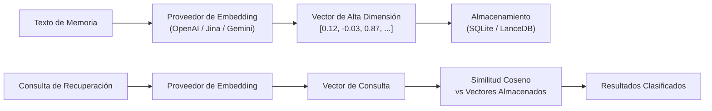

# Motor de Embedding

El motor de embedding convierte el texto de las memorias en vectores numéricos de alta dimensión que capturan el significado semántico. Esto permite la búsqueda por similitud conceptual en lugar de solo coincidencia de palabras clave.

## Pipeline de Embedding



## Proveedores Soportados

| Proveedor | Valor de Configuración | Descripción |
|-----------|----------------------|-------------|
| OpenAI-compatible | `PRX_EMBED_PROVIDER=openai-compatible` | Cualquier API compatible con OpenAI |
| Jina AI | `PRX_EMBED_PROVIDER=jina` | Modelos de embedding Jina |
| Google Gemini | `PRX_EMBED_PROVIDER=gemini` | API de embedding de Google Gemini |

## Configuración

```bash
# Jina AI
PRX_EMBED_PROVIDER=jina
PRX_EMBED_API_KEY=your_jina_key
PRX_EMBED_MODEL=jina-embeddings-v3

# OpenAI-compatible
PRX_EMBED_PROVIDER=openai-compatible
PRX_EMBED_API_KEY=your_openai_key
PRX_EMBED_MODEL=text-embedding-3-small

# Gemini
PRX_EMBED_PROVIDER=gemini
PRX_EMBED_API_KEY=your_gemini_key
PRX_EMBED_MODEL=text-embedding-004
```

### Claves de Respaldo de Proveedor

Si `PRX_EMBED_API_KEY` no está establecido, el sistema verifica claves específicas del proveedor:

- Jina: `JINA_API_KEY`
- Gemini: `GEMINI_API_KEY`

## Cuándo Habilitar

| Caso de Uso | Embedding Necesario |
|-------------|---------------------|
| Búsqueda por palabras clave exactas | No |
| Búsqueda semántica / lenguaje natural | Sí |
| Base de datos de memoria < 500 entradas | Opcional |
| Base de datos de memoria > 500 entradas | Recomendado |
| Alta precisión en recuperación requerida | Sí (+ reranking) |

## Sin Embedding

PRX-Memory funciona sin un proveedor de embedding usando coincidencia léxica solamente. Los resultados son correctos pero no capturan similitud semántica.

```bash
# Works without embedding
PRX_MEMORYD_TRANSPORT=stdio \
PRX_MEMORY_DB=./data/memory-db.json \
prx-memoryd
```

## Características de Rendimiento

- **Latencia de embedding**: 50--200ms por solicitud de API (dependiendo del proveedor)
- **Benchmark de 100k entradas**: p95 < 123ms (solo path de ranking, sin llamadas de red)
- **Soporte de batch**: Embebe múltiples textos en una sola llamada de API (ver [Procesamiento en Batch](./batch-processing))

## Siguientes Pasos

- [Modelos de Embedding](./models) -- Comparación de modelos por proveedor
- [Procesamiento en Batch](./batch-processing) -- Embeber grandes conjuntos de datos eficientemente
- [Motor de Reranking](../reranking/) -- Precisión de segunda etapa
