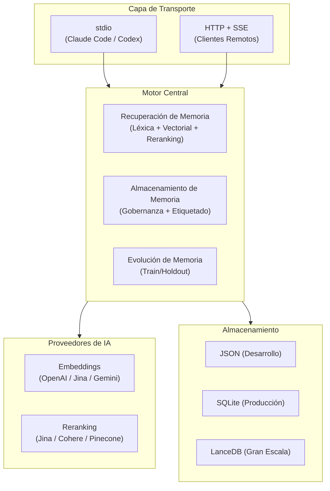

# PRX-Memory

PRX-Memory es un motor de memoria semántica local-first diseñado para agentes de codificación. Permite que los agentes almacenen, recuperen y evolucionen conocimiento persistente a través de sesiones usando coincidencia léxica, búsqueda vectorial y una pipeline de reranking de segunda etapa.

## Arquitectura



## Workspace de Crates

PRX-Memory está organizado como un workspace de Rust con 7 crates:

| Crate | Descripción |
|-------|-------------|
| `prx-memory-core` | Primitivos de dominio, puntuación y tipos de evolución |
| `prx-memory-embed` | Abstracción de proveedores de embedding y adaptadores |
| `prx-memory-rerank` | Abstracción de proveedores de reranking y adaptadores |
| `prx-memory-ai` | Punto de entrada unificado para embedding + reranking |
| `prx-memory-skill` | Payloads de habilidades de gobernanza para distribución MCP |
| `prx-memory-storage` | Motor de almacenamiento persistente local |
| `prx-memory-mcp` | Servidor MCP que compone todos los demás crates |

## Características Principales

**Embeddings Multi-Proveedor**
Soporta OpenAI-compatible, Jina AI y Google Gemini para recuperación semántica. Los proveedores son intercambiables sin cambios en el código.

**Pipeline de Reranking**
Recuperación de segunda etapa usando modelos cross-encoder de Jina, Cohere o Pinecone. Mejora significativamente la precisión en la cima de los resultados.

**Controles de Gobernanza**
Normalización de etiquetas, validación de razones de importancia y restricciones de perfil de estandarización para asegurar calidad y consistencia en la base de datos de memoria.

**Evolución de Memoria**
División train/holdout con pruebas de aceptación para verificar que las actualizaciones de memoria mejoran los resultados de recuperación antes de ser promovidas.

**Transporte MCP Dual**
Modo stdio para integración directa con clientes MCP (Claude Code, Codex, OpenClaw). Modo HTTP con SSE para casos de uso de red y supervisión operacional.

**Distribución de Habilidades**
Las habilidades de gobernanza se empaquetan como recursos MCP y plantillas, descubribles a través del protocolo de recursos MCP.

**Observabilidad**
Métricas Prometheus integradas, resumen JSON de métricas y controles de cardinalidad. Umbrales de alerta configurables para ratios de error de herramientas.

## Inicio Rápido

```bash
# Build
cargo build --release -p prx-memory-mcp --bin prx-memoryd

# Start with stdio transport (for MCP clients)
PRX_MEMORYD_TRANSPORT=stdio \
PRX_MEMORY_DB=./data/memory-db.json \
./target/release/prx-memoryd
```

## Siguientes Pasos

- [Instalación](./getting-started/installation) -- Compilar e instalar PRX-Memory
- [Inicio Rápido](./getting-started/quickstart) -- Primeras operaciones de almacenamiento y recuperación
- [Motor de Embedding](./embedding/) -- Configurar embeddings semánticos
- [Motor de Reranking](./reranking/) -- Configurar reranking de segunda etapa
- [Backends de Almacenamiento](./storage/) -- Elegir el backend correcto
- [Integración MCP](./mcp/) -- Configurar tu cliente MCP
- [Referencia de Configuración](./configuration/) -- Todas las variables de entorno
