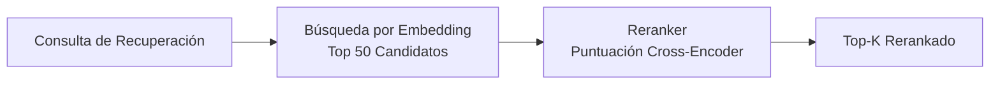

# Motor de Reranking

El reranking es un paso opcional de recuperación de segunda etapa que reordena los resultados candidatos usando un modelo cross-encoder dedicado. Mientras que la recuperación basada en embedding es rápida, opera sobre vectores pre-calculados que pueden no capturar relevancia de grano fino. El reranking aplica un modelo más potente a un conjunto candidato más pequeño, mejorando significativamente la precisión.

## Cómo Funciona

1. **Primera etapa (recuperación):** La búsqueda por similitud vectorial devuelve un amplio conjunto de candidatos (p. ej., top 50).
2. **Segunda etapa (reranking):** Un modelo cross-encoder puntúa cada candidato contra la consulta, produciendo un ranking refinado.
3. **Resultado final:** Los resultados rerankeados top-k se devuelven al llamador.



## Por Qué el Reranking es Importante

| Métrica | Sin Reranking | Con Reranking |
|---------|---------------|----------------|
| Cobertura de recall | Alta (recuperación amplia) | Igual (sin cambios) |
| Precisión en top-5 | Moderada | Significativamente mejorada |
| Latencia | Menor (~50ms) | Mayor (~150ms adicional) |
| Costo de API | Solo embedding | Embedding + reranking |

El reranking es más valioso cuando:

- Tu base de datos de memorias es grande (1000+ entradas).
- Las consultas son ambiguas o en lenguaje natural.
- La precisión en la cima de la lista de resultados importa más que la latencia.

## Proveedores Soportados

| Proveedor | Valor de Configuración | Descripción |
|-----------|----------------------|-------------|
| Jina | `PRX_RERANK_PROVIDER=jina` | Modelos reranker de Jina AI |
| Cohere | `PRX_RERANK_PROVIDER=cohere` | API de rerank de Cohere |
| Pinecone | `PRX_RERANK_PROVIDER=pinecone` | Servicio de rerank de Pinecone |
| Pinecone-compatible | `PRX_RERANK_PROVIDER=pinecone-compatible` | Endpoints personalizados compatibles con Pinecone |
| None | `PRX_RERANK_PROVIDER=none` | Deshabilitar reranking |

## Configuración

```bash
PRX_RERANK_PROVIDER=cohere
PRX_RERANK_API_KEY=your_cohere_key
PRX_RERANK_MODEL=rerank-v3.5
```

::: tip Claves de Respaldo de Proveedor
Si `PRX_RERANK_API_KEY` no está establecido, el sistema recurre a claves específicas del proveedor:
- Jina: `JINA_API_KEY`
- Cohere: `COHERE_API_KEY`
- Pinecone: `PINECONE_API_KEY`
:::

## Deshabilitar el Reranking

Para ejecutar sin reranking, omite la variable `PRX_RERANK_PROVIDER` o establécela explícitamente:

```bash
PRX_RERANK_PROVIDER=none
```

El recall sigue funcionando usando coincidencia léxica y similitud vectorial sin la etapa de reranking.

## Siguientes Pasos

- [Modelos de Reranking](./models) -- Comparación detallada de modelos
- [Motor de Embedding](../embedding/) -- Recuperación de primera etapa
- [Referencia de Configuración](../configuration/) -- Todas las variables de entorno
