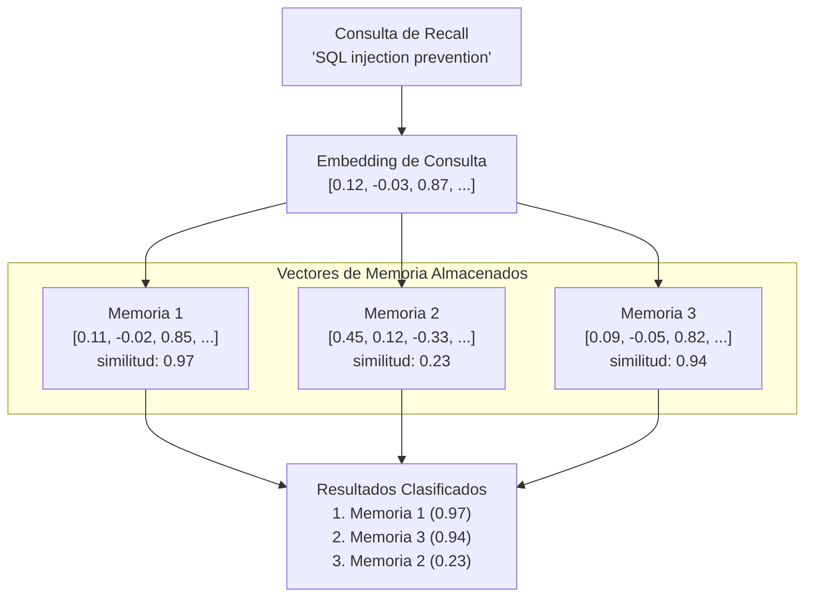

# Búsqueda Vectorial

La búsqueda vectorial es el mecanismo central que habilita la recuperación semántica de memorias en PRX-Memory. En lugar de hacer coincidir palabras clave, la búsqueda vectorial compara la similitud matemática entre los embeddings de la consulta y la memoria para encontrar resultados conceptualmente relacionados.

## Cómo Funciona

1. **Embedding de la consulta:** La consulta de recall se envía al proveedor de embedding configurado, produciendo un vector.
2. **Cálculo de similitud:** El vector de consulta se compara contra todos los vectores de memoria almacenados usando similitud coseno.
3. **Puntuación:** Cada memoria recibe una puntuación de similitud entre -1.0 y 1.0 (mayor significa más similar).
4. **Clasificación:** Los resultados se ordenan por puntuación y se combinan con otras señales (coincidencia léxica, importancia, recencia).



## Similitud Coseno

PRX-Memory usa la similitud coseno como métrica de distancia. La similitud coseno mide el ángulo entre dos vectores, ignorando la magnitud:

```
similarity(A, B) = (A . B) / (|A| * |B|)
```

| Puntuación | Significado |
|------------|-------------|
| 0.95--1.0 | Significado casi idéntico |
| 0.80--0.95 | Altamente relacionado |
| 0.60--0.80 | Algo relacionado |
| < 0.60 | Probablemente no relacionado |

## Clasificación Combinada

La similitud vectorial es una señal en la clasificación multi-señal de PRX-Memory. La puntuación final combina:

| Señal | Peso | Descripción |
|-------|------|-------------|
| Similitud vectorial | Alto | Relevancia semántica de la comparación de embeddings |
| Coincidencia léxica | Medio | Superposición de palabras clave entre la consulta y el texto de memoria |
| Puntuación de importancia | Medio | Importancia asignada por el usuario o calculada por el sistema |
| Recencia | Bajo | Las memorias más recientes reciben un pequeño impulso |

La ponderación exacta depende de la configuración de recall y de si los embeddings y el reranking están habilitados.

## Rendimiento

El benchmark de 100k entradas muestra:

| Métrica | Valor |
|---------|-------|
| Tamaño del conjunto de datos | 100,000 entradas |
| Latencia p95 | 122.683ms |
| Umbral | < 300ms |
| Método | Léxico + importancia + recencia (sin llamadas de red) |

::: info
Este benchmark mide solo el path de clasificación de recuperación, sin llamadas de red de embedding o reranking. La latencia de extremo a extremo depende de los tiempos de respuesta del proveedor.
:::

## Consideraciones de Escalado

| Tamaño del Conjunto de Datos | Enfoque Recomendado |
|------------------------------|---------------------|
| < 10,000 | Similitud coseno de fuerza bruta (backend JSON o SQLite) |
| 10,000--100,000 | SQLite con escaneo vectorial en memoria |
| > 100,000 | LanceDB con indexación ANN |

Para conjuntos de datos que superan las 100,000 entradas, habilita el backend LanceDB para búsqueda de vecino más cercano aproximado (ANN), que proporciona tiempo de consulta sub-lineal.

## Siguientes Pasos

- [Motor de Embedding](../embedding/) -- Cómo se generan los vectores
- [Reranking](../reranking/) -- Mejora de precisión de segunda etapa
- [Backends de Almacenamiento](./index) -- Elegir el backend de almacenamiento correcto
