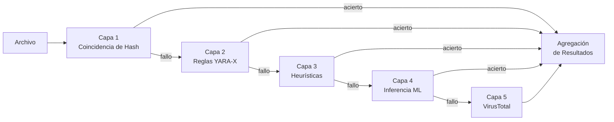

# Motor de Detección

PRX-SD usa un pipeline de detección multicapa para identificar malware. Cada capa usa una técnica diferente y se ejecutan en secuencia de más rápida a más exhaustiva. Este enfoque de defensa en profundidad garantiza que incluso si una capa no detecta una amenaza, las capas posteriores puedan atraparla.

## Descripción General del Pipeline

El pipeline de detección procesa cada archivo a través de hasta cinco capas:



## Resumen de Capas

| Capa | Motor | Velocidad | Cobertura | Requerida |
|------|-------|-----------|-----------|-----------|
| **Capa 1** | Coincidencia de Hash LMDB | ~1 microsegundo/archivo | Malware conocido (coincidencia exacta) | Sí (predeterminado) |
| **Capa 2** | Escaneo de Reglas YARA-X | ~0,3 ms/archivo | Basado en patrones (más de 38.800 reglas) | Sí (predeterminado) |
| **Capa 3** | Análisis Heurístico | ~1-5 ms/archivo | Indicadores conductuales por tipo de archivo | Sí (predeterminado) |
| **Capa 4** | Inferencia ML ONNX | ~10-50 ms/archivo | Malware nuevo/polimórfico | Opcional (`--features ml`) |
| **Capa 5** | API VirusTotal | ~200-500 ms/archivo | Consenso de 70+ proveedores | Opcional (`--features virustotal`) |

## Capa 1: Coincidencia de Hash

La capa más rápida. PRX-SD calcula el hash SHA-256 de cada archivo y lo busca en una base de datos LMDB que contiene hashes conocidos de malware. LMDB proporciona tiempo de búsqueda O(1) con I/O mapeado en memoria, haciendo que esta capa sea prácticamente gratuita en términos de rendimiento.

**Fuentes de datos:**
- abuse.ch MalwareBazaar (últimas 48 horas, actualizado cada 5 minutos)
- abuse.ch URLhaus (actualizaciones por hora)
- abuse.ch Feodo Tracker (Emotet/Dridex/TrickBot, cada 5 minutos)
- abuse.ch ThreatFox (plataforma de compartición de IOC)
- VirusShare (más de 20M de hashes MD5, actualización opcional `--full`)
- Lista de bloqueo integrada (EICAR, WannaCry, NotPetya, Emotet y más)

Una coincidencia de hash resulta en un veredicto inmediato de `MALICIOUS`. Las capas restantes se omiten para ese archivo.

Consulta [Coincidencia de Hash](./hash-matching) para más detalles.

## Capa 2: Reglas YARA-X

Si no se encuentra ninguna coincidencia de hash, el archivo se escanea contra más de 38.800 reglas YARA usando el motor YARA-X (la reescritura en Rust de nueva generación de YARA). Las reglas detectan malware haciendo coincidir patrones de bytes, cadenas y condiciones estructurales dentro del contenido de los archivos.

**Fuentes de reglas:**
- 64 reglas integradas (ransomware, troyanos, puertas traseras, rootkits, mineros, webshells)
- Yara-Rules/rules (mantenido por la comunidad, GitHub)
- Neo23x0/signature-base (reglas de alta calidad para APT y malware común)
- ReversingLabs YARA (reglas de código abierto de calidad comercial)
- ESET IOC (seguimiento de amenazas persistentes avanzadas)
- InQuest (malware en documentos: OLE, DDE, macros maliciosas)

Una coincidencia de regla YARA resulta en un veredicto `MALICIOUS` con el nombre de la regla incluido en el informe.

Consulta [Reglas YARA](./yara-rules) para más detalles.

## Capa 3: Análisis Heurístico

Los archivos que pasan las verificaciones de hash y YARA se analizan usando heurísticas conscientes del tipo de archivo. PRX-SD identifica el tipo de archivo mediante detección de número mágico y aplica verificaciones específicas:

| Tipo de Archivo | Verificaciones Heurísticas |
|----------------|--------------------------|
| PE (Windows) | Entropía de secciones, importaciones de API sospechosas, detección de empaquetadores, anomalías de marcas de tiempo |
| ELF (Linux) | Entropía de secciones, referencias a LD_PRELOAD, persistencia en cron/systemd, patrones de backdoor SSH |
| Mach-O (macOS) | Entropía de secciones, inyección de dylib, persistencia en LaunchAgent, acceso a Keychain |
| Office (docx/xlsx) | Macros VBA, campos DDE, enlaces de plantilla externa, activadores de ejecución automática |
| PDF | JavaScript incrustado, acciones Launch, acciones URI, flujos ofuscados |

Cada verificación contribuye a una puntuación acumulativa:

| Puntuación | Veredicto |
|------------|-----------|
| 0 - 29 | **Limpio** |
| 30 - 59 | **Sospechoso** -- revisión manual recomendada |
| 60 - 100 | **Malicioso** -- amenaza de alta confianza |

Consulta [Análisis Heurístico](./heuristics) para más detalles.

## Capa 4: Inferencia ML (Opcional)

Cuando se compila con la característica `ml`, PRX-SD puede ejecutar archivos a través de un modelo de aprendizaje automático ONNX entrenado en millones de muestras de malware. Esta capa es particularmente efectiva para detectar malware nuevo y polimórfico que evade la detección basada en firmas.

```bash
# Build with ML support
cargo build --release --features ml
```

El modelo ML se ejecuta localmente usando ONNX Runtime. No se requiere conexión a la nube.

::: tip Cuándo Usar ML
La inferencia ML agrega latencia (~10-50 ms por archivo). Habilítala para escaneos específicos de archivos o directorios sospechosos, en lugar de escaneos de disco completo donde las primeras tres capas proporcionan cobertura suficiente.
:::

## Capa 5: VirusTotal (Opcional)

Cuando se compila con la característica `virustotal` y se configura con una clave API, PRX-SD puede enviar hashes de archivos a VirusTotal para obtener consenso de más de 70 proveedores de antivirus.

```bash
# Build with VirusTotal support
cargo build --release --features virustotal

# Configure API key
sd config set virustotal.api_key "YOUR_API_KEY"
```

::: warning Límites de Tasa
La API gratuita de VirusTotal permite 4 solicitudes por minuto y 500 por día. PRX-SD respeta estos límites automáticamente. Esta capa es mejor usarla como paso de confirmación final, no para escaneo masivo.
:::

## Agregación de Resultados

Cuando un archivo se escanea a través de múltiples capas, el veredicto final se determina por la **severidad más alta** encontrada en todas las capas:

```
MALICIOUS > SUSPICIOUS > CLEAN
```

Si la Capa 1 devuelve `MALICIOUS`, el archivo se reporta como malicioso independientemente de lo que otras capas puedan decir. Si la Capa 3 devuelve `SUSPICIOUS` y ninguna otra capa devuelve `MALICIOUS`, el archivo se reporta como sospechoso.

El informe de escaneo incluye detalles de cada capa que produjo un hallazgo, dando al analista contexto completo.

## Deshabilitar Capas

Para casos de uso especializados, se pueden deshabilitar capas individuales:

```bash
# Hash-only scan (fastest, known threats only)
sd scan /path --no-yara --no-heuristics

# Skip heuristics (hash + YARA only)
sd scan /path --no-heuristics
```

## Próximos Pasos

- [Coincidencia de Hash](./hash-matching) -- Análisis profundo de la base de datos de hashes LMDB
- [Reglas YARA](./yara-rules) -- Fuentes de reglas y gestión de reglas personalizadas
- [Análisis Heurístico](./heuristics) -- Verificaciones conductuales conscientes del tipo de archivo
- [Tipos de Archivo Admitidos](./file-types) -- Matriz de formatos de archivo y detección mágica
